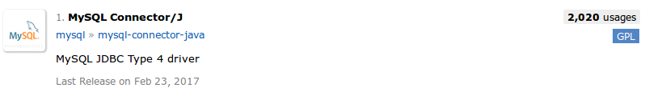
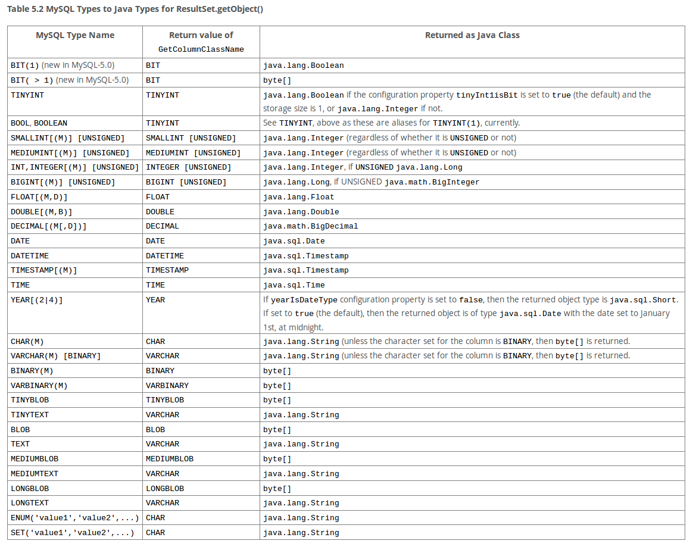

# JDBC数据库接口

JDBC是Java访问数据库的标准API，类似于微软的ODBC标准，后者为C语言访问数据库提供了一套编程接口。使用JDBC，数据库厂商需要提供一个数据库驱动程序（和硬件的驱动程序含义类似），加载到JDBC驱动管理器，和数据库通信由JDBC驱动管理器负责，程序员不需要针对特定数据库编写特定的Java代码，而是统一使用JDBC提供的API即可。

本篇笔记我们使用MySQL数据库服务器作为例子。有关MySQL的知识可以参考`/数据库系统/MySQL数据库管理系统`。

## 驱动程序种类

JDBC规范将数据库驱动程序归为了几类：

1. 第一类：驱动程序将JDBC翻译为ODBC，使用ODBC驱动程序和数据库通信。这种驱动程序需要对ODBC进行正确的部署和配置，比较麻烦。
2. 第二类：由Java和部分本地代码组成的程序，用于和数据库客户端API进行通讯。这种驱动程序不仅要求安装Java类库，还要安装平台相关的代码。
3. 第三类：纯Java的客户端类库，使用了与具体数据库无关的协议将数据库请求发给数据库服务器构件，该构件再将请求翻译为数据库相关的协议执行。
4. 第四类：纯Java的客户端类库，直接将JDBC请求翻译为数据库相关的协议。

MySQL就提供了一个`type 4`的驱动程序。

## 获取数据库驱动程序

我们可以在数据库的官方网站找到JDBC驱动程序，也可以在Maven中央仓库中找到。建议直接使用maven或者gradle进行依赖管理。



```java
compile group: 'mysql', name: 'mysql-connector-java', version: '6.0.6'
```

## 获取数据库连接

JDBC中，`java.sql.Connection`类代表数据库连接，我们操作数据库都要通过这个连接对象。不过在此之前，我们必须加载MySQL驱动程序到JDBC驱动管理器。

加载数据库驱动
```java
Class.forName("com.mysql.jdbc.Driver");
```

加载MySQL驱动程序的最简单的方法就是使用`Class.forName()`，根据MySQL驱动的类名，进行反射加载。除此之外，在web等场景中，还有其他的加载方式，这里就不介绍了。

获取数据库连接
```java
Connection connection = DriverManager.getConnection(url, user, password);
```

* `DriverManager.getConnection(url, user, password)`：url是JDBC协议字符串，MySQL通常使用类似于：`"jdbc:mysql://127.0.0.1:3306/jdbctest"`，其中`127.0.0.1`是数据库服务器的IP地址，`3306`是MySQL服务器的服务端口号，`jdbctest`是我们的数据库名。这里我们不必深究这个字符串的格式，MySQL等数据库厂商都会提供给我们这个字符串怎么写，我们复制粘贴过来就可以了。user和password是数据库的用户名和密码字符串。

## 执行SQL语句插入数据

这里我们看一个执行一条插入语句的完整例子。

数据库表结构
```sql
CREATE TABLE user (
	user_id BIGINT PRIMARY KEY AUTO_INCREMENT,
	username VARCHAR(20) NOT NULL,
	password VARCHAR(255) NOT NULL
);
```

执行插入语句的Java代码
```java
import java.sql.Connection;
import java.sql.DriverManager;
import java.sql.PreparedStatement;
import java.sql.SQLException;

public class Main
{
	public static void main(String[] args)
	{

		String user = "root";
		String password = "root";
		String url = "jdbc:mysql://127.0.0.1:3306/jdbctest";

		try
		{
			//加载驱动程序类
			Class.forName("com.mysql.jdbc.Driver");
			//获取数据库连接
			Connection connection = DriverManager.getConnection(url, user, password);

			//获取PreparedStatement并执行SQL语句
			PreparedStatement preparedStatement = connection.prepareStatement("INSERT INTO user (username, password) VALUES (?, ?)");
			preparedStatement.setString(1, "test01");
			preparedStatement.setString(2, "123456");
			boolean result = preparedStatement.execute();

			System.out.println(result);

			//安全关闭资源
			preparedStatement.close();
			connection.close();
		}
		catch (ClassNotFoundException | SQLException e)
		{
			e.printStackTrace();
		}
	}
}
```

我们使用了`PreparedStatement`，这个类其实就是帮助我们拼凑SQL语句，并执行的工具类。我们在sql语句中，使用`?`作为占位符，随后使用`preparedStatement.setString()`对占位符进行填充，其第一个参数是占位符的序号，这个序号是从1开始的。

除了`setString()`，还有许多其他的`set`方法，如`setInt()`等。我们知道Java有自己的基本类型和复合类型，数据库则有自己的数据类型，这里就涉及到了JDBC对数据类型进行转换的知识。我们将在后文介绍。

注意：我们不应该使用拼接字符串的方式拼凑SQL语句，因为那样可能给我们的应用带来SQL注入漏洞。PreparedStatement能够对SQL语句进行预编译，能够有效防止SQL注入的发生。

`execute()`函数表示执行该SQL语句，除此之外，我们还有其他几个函数：

* `execute()` 只代表执行一条SQL语句，返回值表示如果有返回结果（查询的结果集）返回`true`，否则返回`false`，实际上这个函数我们不用，我们通常使用下面的几个函数。
* `executeUpdate()` 返回值是`int`类型，表示受影响的行数，这个函数用于数据插入，更新和删除的DML语句，或者DDL语句。
* `executeQuery()` 返回值是`ResultSet`类型，包含返回的结果集，专门用于查询SQL语句，我们将在后文介绍和查询有关的内容。
* `executeLargeUpdate()` 这个返回值是`long`类型，用于`executeUpdate()`的返回值超过`Integer.MAX_VALUE`时使用，这个基本不会用到，数据库驱动可能也没有实现这个方法。
* `executeBatch()` 以批处理方式执行多条SQL语句，一次执行多条语句能够一定程度上提高数据库的访存性能。返回值是`int[]`类型，表示每条语句受影响的行数数组。批处理将在后文介绍。
* `executeLargeBatch()` 意义同`executeLargeUpdate()`。

## MySQL类型和Java类型

我们组织SQL语句和解析返回结果集时，都会涉及到MySQL类型和Java类型的转换问题。在MySQL官方文档中，提供了这样一个表供我们参考：



其他数据库应该也能找到类似的文档。

注意表中的`java.sql.Date`，这个类继承了`java.util.Date`，是专门对应于数据库的`DATE`类型。实际上由于继承关系，我们使用时直接传入`java.util.Date`通常也不会有问题。

## 批处理

我们知道MySQL数据库客户端和服务器之间，是通过网络协议进行通讯的，使用批处理，可以让JDBC一次处理多条SQL语句，比如连续插入和连续删除等，这能够在一定程度上提高数据库的访存性能，当然可能连续插入，删除这种操作并不多见。

使用批处理插入多条数据
```java
import java.sql.Connection;
import java.sql.DriverManager;
import java.sql.PreparedStatement;
import java.sql.SQLException;

public class Main
{
	public static void main(String[] args)
	{

		String user = "root";
		String password = "root";
		String url = "jdbc:mysql://127.0.0.1:3306/jdbctest";

		try
		{
			//加载驱动程序类
			Class.forName("com.mysql.jdbc.Driver");
			//获取数据库连接
			Connection connection = DriverManager.getConnection(url, user, password);

			//获取PreparedStatement并执行SQL语句
			PreparedStatement preparedStatement = connection.prepareStatement("INSERT INTO user (username, password) VALUES (?, ?)");

			preparedStatement.setString(1, "test01");
			preparedStatement.setString(2, "123456");
			preparedStatement.addBatch();

			preparedStatement.setString(1, "test02");
			preparedStatement.setString(2, "123456");
			preparedStatement.addBatch();

			preparedStatement.setString(1, "test03");
			preparedStatement.setString(2, "123456");
			preparedStatement.addBatch();

			int[] result = preparedStatement.executeBatch();

			System.out.println(result[0] + " " + result[1] + " " + result[2]);

			//安全关闭资源
			preparedStatement.close();
			connection.close();
		}
		catch (ClassNotFoundException | SQLException e)
		{
			e.printStackTrace();
		}
	}
}
```

`preparedStatement.addBatch()`方法，实际上就是把之前`set`的数据和SQL语句模板组成一个完整的数据库操作，添加到批处理中，之后可以继续使用`set`方法，添加新的数据库操作。

## 查询语句

我们的软件系统中，数据库查询操作实际上远远多于插入，更新，和删除操作，可能打开一个网页，就伴随着很多很多数据库查询操作，而查询又比较复杂，因为我们要解析数据库返回的结果集，因此我们单独讲解如何使用JDBC进行数据库查询。

我们看一个JDBC查询的例子，还是使用上面的数据库：
```java
import java.sql.*;

public class Main
{
	public static void main(String[] args)
	{

		String user = "root";
		String password = "root";
		String url = "jdbc:mysql://127.0.0.1:3306/jdbctest";

		try
		{
			//加载驱动程序类
			Class.forName("com.mysql.jdbc.Driver");
			//获取数据库连接
			Connection connection = DriverManager.getConnection(url, user, password);

			//获取PreparedStatement并执行SQL语句
			PreparedStatement preparedStatement = connection.prepareStatement("SELECT * FROM user");
			ResultSet resultSet = preparedStatement.executeQuery();

			while (resultSet.next())
			{
				long userId = resultSet.getLong("user_id");
				String username = resultSet.getString("username");
				String pass = resultSet.getString("password");

				System.out.println(userId + " " + username + " " + pass);
			}

			//安全关闭资源
			resultSet.close();
			preparedStatement.close();
			connection.close();
		}
		catch (ClassNotFoundException | SQLException e)
		{
			e.printStackTrace();
		}
	}
}
```

`ResultSet`就是代表数据库返回的结果集的类。

注意`result.next()`，我们可以想象`ResultSet`中有一个游标，未调用`next()`时，游标指向第一个元素之前，以后每次调用`next()`，游标都向后移动一个元素，直到没有元素，`next()`就会返回`false`，结束循环。

resultSet有`get`方法，就像preparedStatement的`set`方法一样，这里也涉及到类型转换的问题，可以参考之前的表。我们要注意，这些`get`方法的参数也可以使用序号，也是`int`类型，从1开始，但是这里我们使用了数据表的字段的标签字符串，这样代码更加清晰。我建议除非使用了`sum()`函数等查询，字段名没什么意义，一般都应该使用字段标签作为`get`方法的参数。

注意`resultSet.close()`，结果集对象也是要安全关闭的。而且我们应该按顺序关闭`resultSet`，`preparedStatement`，`connection`这三个对象。

## 使用事务

JDBC中，使用事务比较简单。例子如下：

```java
import java.sql.*;

public class Main4
{
	public static void main(String[] args)
	{

		String user = "root";
		String password = "root";
		String url = "jdbc:mysql://127.0.0.1:3306/jdbctest";

		Connection connection = null;

		try
		{
			//加载驱动程序类
			Class.forName("com.mysql.jdbc.Driver");
			//获取数据库连接
			connection = DriverManager.getConnection(url, user, password);
			connection.setAutoCommit(false);

			PreparedStatement preparedStatement = connection.prepareStatement("INSERT INTO user (username, password) VALUES (?, ?)");

			preparedStatement.setString(1, "test01");
			preparedStatement.setString(2, "123456");

			//提交事务
			connection.commit();

			//安全关闭资源
			preparedStatement.close();
			connection.close();
		}
		catch (Exception e)
		{
			e.printStackTrace();
			if(connection != null)
			{
				try
				{
					connection.rollback();
				}
				catch (SQLException e1)
				{
					e1.printStackTrace();
				}
			}
		}
	}
}
```

JDBC默认一个connection中，调用`preparedStatement`的任何`execute`方法时，`connection`对象都会自动提交事务。`connection.setAutoCommit(false)`表示将事务自动提交设置为`false`，这样我们必须显示调用`connection.commit()`来提交事务，或者调用`connection.rollback()`回滚事务。

注意MySQL中，InnoDB支持事务，但是MyISAM不支持。其次，有些数据库支持设置事务的`save point`，能够更细粒度的控制事务的回滚位置，这在JDBC中，对应`connection.setSavePoint()`方法。

## 连接管理工具类

细心的同学可能发现问题了，上面代码如果读取结果集时报错，代码直接跳到`catch`语句块中，资源不就没法关闭了吗？确实是这样，这里我们只是为了节省篇幅，实际上我们应该把关闭代码放到`finally`语句块中，但这会产生新的问题，有可能造成空指针报错，还需要额外的`if`判断。这些代码在每一个查询语句中一次次写，比较麻烦，我们可以将获取`connection`和关闭资源封装成一个工具类。

连接管理工具类 ConnectionUtil.java
```java
import java.sql.*;

public class ConnectionUtil
{

	static
	{
		try
		{
			Class.forName("com.mysql.jdbc.Driver");
		}
		catch (ClassNotFoundException e)
		{
			e.printStackTrace();
		}
	}

	public static Connection getConnection()
	{
		Connection conn = null;
		try
		{
			String url = "jdbc:mysql://127.0.0.1:3306/jdbctest";
			String user = "root";
			String password = "root";
			conn = DriverManager.getConnection(url, user, password);
		}
		catch (SQLException e)
		{
			e.printStackTrace();
		}
		return conn;
	}

	public static void closeResource(Connection connection, PreparedStatement preparedStatement)
	{
		if(preparedStatement != null)
		{
			try
			{
				preparedStatement.close();
			}
			catch (SQLException e)
			{
				e.printStackTrace();
			}
		}
		if(connection != null)
		{
			try
			{
				connection.close();
			}
			catch (SQLException e)
			{
				e.printStackTrace();
			}
		}
	}

	public static void closeResource(Connection connection, PreparedStatement preparedStatement, ResultSet resultSet)
	{
		if(preparedStatement != null)
		{
			try
			{
				preparedStatement.close();
			}
			catch (SQLException e)
			{
				e.printStackTrace();
			}
		}
		if(connection != null)
		{
			try
			{
				connection.close();
			}
			catch (SQLException e)
			{
				e.printStackTrace();
			}
		}
		if(resultSet != null)
		{
			try
			{
				resultSet.close();
			}
			catch (SQLException e)
			{
				e.printStackTrace();
			}
		}
	}
}
```

使用ConnectionUtil执行SQL查询
```java
import java.sql.*;

public class Main
{
	public static void main(String[] args)
	{
		Connection connection = ConnectionUtil.getConnection();

		PreparedStatement preparedStatement = null;
		ResultSet resultSet = null;

		try
		{
			preparedStatement = connection.prepareStatement("SELECT * FROM user");
			resultSet = preparedStatement.executeQuery();

			while (resultSet.next())
			{
				long userId = resultSet.getLong("user_id");
				String username = resultSet.getString("username");
				String pass = resultSet.getString("password");

				System.out.println(userId + " " + username + " " + pass);
			}
		}
		catch (SQLException e)
		{
			e.printStackTrace();
		}
		finally
		{
			ConnectionUtil.closeResource(connection, preparedStatement, resultSet);
		}
	}
}
```

这样我们对于连接的获取，和资源关闭操作就简化了一些，这个工具类还能够进行复用，比较方便。

## 使用连接池

尽管上面介绍的知识已经能够正确的实现任何有关数据库的增删改查操作了，但是我们每次执行SQL语句都重新获取数据库连接，这样开销是很大的，因此我们应该使用一个数据库连接池。这里使用c3p0连接池作为例子。

首先添加c3p0连接池的依赖：
```java
compile group: 'com.mchange', name: 'c3p0', version: '0.9.5.2'
```

修改ConnectionUtil
```java
import com.mchange.v2.c3p0.ComboPooledDataSource;

import java.beans.PropertyVetoException;
import java.sql.Connection;
import java.sql.PreparedStatement;
import java.sql.ResultSet;
import java.sql.SQLException;

public class ConnectionUtil
{
	private static ComboPooledDataSource ds = null;

	static
	{
		try
		{

			ds = new ComboPooledDataSource();
			ds.setDriverClass("com.mysql.jdbc.Driver");
			ds.setJdbcUrl("jdbc:mysql://localhost:3306/jdbctest");
			ds.setUser("root");
			ds.setPassword("root");
			ds.setMaxPoolSize(200);
			ds.setMinPoolSize(20);
		}
		catch (PropertyVetoException e)
		{
			e.printStackTrace();
		}
	}

	public static Connection getConnection()
	{
		Connection conn = null;
		try
		{
			conn = ds.getConnection();
		}
		catch (SQLException e)
		{
			e.printStackTrace();
		}
		return conn;
	}

	public static void closeResource(Connection connection, PreparedStatement preparedStatement)
	{
		if(preparedStatement != null)
		{
			try
			{
				preparedStatement.close();
			}
			catch (SQLException e)
			{
				e.printStackTrace();
			}
		}
		if(connection != null)
		{
			try
			{
				connection.close();
			}
			catch (SQLException e)
			{
				e.printStackTrace();
			}
		}
	}

	public static void closeResource(Connection connection, PreparedStatement preparedStatement, ResultSet resultSet)
	{
		if(preparedStatement != null)
		{
			try
			{
				preparedStatement.close();
			}
			catch (SQLException e)
			{
				e.printStackTrace();
			}
		}
		if(connection != null)
		{
			try
			{
				connection.close();
			}
			catch (SQLException e)
			{
				e.printStackTrace();
			}
		}
		if(resultSet != null)
		{
			try
			{
				resultSet.close();
			}
			catch (SQLException e)
			{
				e.printStackTrace();
			}
		}
	}
}
```

代码很简单，里面对于`ComboPooledDataSource`的几项配置都比较好理解，这里就不多做解释了。

## 数据源

上面使用c3p0时，我们用到了一个它提供的`ComboPooledDataSource`，实际上，Java中有一个`DataSource`接口，`ComboPooledDataSource`就是这个接口的一个实现，任何人可以实现自己的DataSource接口。

我们观察一下DataSource接口
```java
public interface DataSource  extends CommonDataSource, Wrapper
{
  Connection getConnection() throws SQLException;
  Connection getConnection(String username, String password) throws SQLException;
}
```

实际上就两个方法，都是用于获取连接的。很多连接池都提供了标准的数据源实现，这是因为我们使用这个`DataSource`接口，便于统一管理数据源。在web应用中，Tomcat就内置了dbcp数据源，我们可以很方便的通过JNDI进行调用。使用Hibernate框架配置时，`SessionFactory`也是接受一个数据源参数就可以了。不过对于较小的程序，我们使用`DriverManager.getConnection()`也是完全没有问题的。
