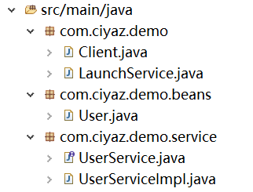

# RMI远程方法调用（Remote Method Invocation）

在分布式系统中，系统之间需要有一种网络通讯的方式，RMI是Java内置的远程方法调用模块，也是EJB的基础。

## RMI的同类技术

实际上，远程调用的方法还有很多种，比如各种基于TCP的远过程调用实现，甚至基于HTTP的SOAP、REST等方式。在所有这些常用的方式中，RMI是最稳定高效的，但缺点是只能Java程序之间使用。

## RMI示例

我们这里直接编写一个例子，来学习如何使用RMI。



### 实现RMI服务端

创建一个实体类`User`，作为RMI传递的对象：
```java
@Data
@Builder
public class User implements Serializable {
	private static final long serialVersionUID = 1L;
	private String username;
	private String password;
}
```

编写一个Service接口：
```java
public interface UserService extends Remote {
	User getUser() throws RemoteException;
}
```

注意：该接口需要继承`Remote`接口，其中方法需要抛出`RemoteException`。

接口实现类：
```java
public class UserServiceImpl extends UnicastRemoteObject implements UserService {

	private static final long serialVersionUID = 1L;

	public UserServiceImpl() throws RemoteException {
		super();
	}

	@Override
	public User getUser() throws RemoteException {
		User user = User.builder().username("tom").password("123456").build();
		return user;
	}
}
```

实现类必须继承`UnicastRemoteObject`，并带有一个默认构造函数。其中，`getUser()`是我们定义的远程调用的方法。

注册RMI服务：
```java
public class LaunchService {
	public static void main(String[] args) throws Exception {
		UserService userService = new UserServiceImpl();
		LocateRegistry.createRegistry(8080);
		Naming.rebind("rmi://127.0.0.1:8080/UserService", userService);
		System.out.println("服务已启动");
	}
}
```

这里我们将`UserService`注册到`rmi://127.0.0.1:8080/UserService`。如果要注册多个服务，使用`Naming.rebind()`多添加几个路径就行了。

绑定路径时，RMI提供了`bind()`和`rebind()`两个方法，区别就是`bind()`会在地址冲突时报错，`rebind()`则不会报错，而是丢弃原来的绑定，使用新的。在实际使用中，正确的代码逻辑一般不会重复绑定一个地址的，所以用哪个都行。

### 实现RMI客户端

RMI客户端直接对服务端注册的RMI地址进行调用即可。

```java
public class Client {
	public static void main(String[] args) throws Exception {
		UserService userService = (UserService) Naming.lookup("rmi://127.0.0.1:8080/UserService");
		User user = userService.getUser();
		System.out.println(user);
	}
}
```
