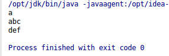
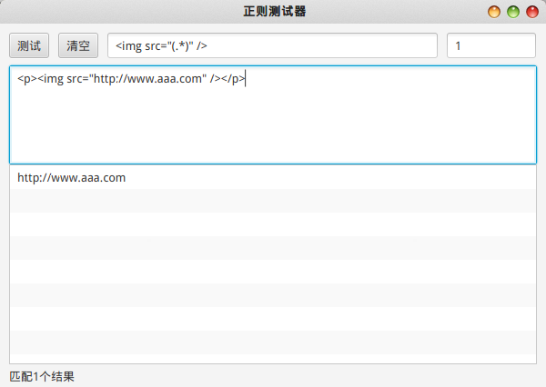
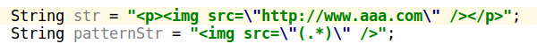

# Java中的正则表达式

Java支持正则表达式，并且具有一组和正则表达式相关的API。我们在Java中使用正则表达式时，经常会使用Pattern和Matcher两个类。它们在`java.util.regex`包下。

* `Pattern` 代表一个正则表达式对象
* `Matcher` 对输入字符串进行匹配操作的工具类

这两个类和String类（字符串）中有若干使用正则表达式的方法，我们不一一介绍了，具体请查阅文档，这里直接写一些例子，方便以后参考。

## 判断一个字符串是否匹配某个正则表达式

```java
String str = "123abc";
System.out.println(str.matches("^[0-9]+[a-z]+$"));
```

## 按一个正则表达式分割字符串

```java
String str = "123|456|789";
String[] strings = str.split("\\|");

for (String s : strings)
{
  System.out.println(s);
}
```

## 从一个长字符串中循环匹配

```java
String str = "a123abc456def";
Pattern pattern = Pattern.compile("[a-z]+");
Matcher matcher = pattern.matcher(str);
while(matcher.find())
{
  System.out.println(matcher.group(0));
}
```

运行结果：



这里要注意，正则表达式如果写成`^[a-z]+$`反倒不对了，这意味着目标字符串整个应该以`[a-z]`开头和结尾，而不是作用于需要截取的部分，这无法和`str`匹配。其次我们发现，Matcher试图匹配的是最长可匹配字符串，这叫做贪婪匹配。相应的也有非贪婪匹配，即每次只匹配最少的字符，如果想使用非贪婪匹配，要在匹配量词后加一个`？`。例如`[a-z]+?`。

## 使用捕获组

上面代码中使用了`Matcher.group(0)`，`group(0)`函数返回捕获组0获得的内容。下面详细介绍一下捕获组的使用。

### group(0)

捕获组0是一个特殊的捕获组，它指整个正则表达式匹配的字符串，例如上面例子中，`group(0)`返回的就是`[a-z]+`匹配的整个字符串。

### 其他group

正则表达式可以使用括号`()`指定额外的捕获组。下面例子从``标签中提取`src`属性：

```java
String str = "<p></p>";
Pattern pattern = Pattern.compile("");
Matcher matcher = pattern.matcher(str);
while(matcher.find())
{
  System.out.println(matcher.group(1));
}
```

正则表达式中使用了一个括号，`group(1)`实际返回的就是这个括号中匹配的内容。注意，由于HTML语法比较随意，上面例子的正则表达式可能并不能匹配所有实际使用中的`img`标签，仅仅用来说明`group()`的用法。

## Java使用正则表达式的注意事项

### 转义字符

例如：`\\.`。正则表达式中`.`是用来匹配的关键字，如果需要匹配字符串中的点，需要转义，即`\.`，这次转义是针对正则表达式的。而在Java中，字符`\`是用来转义的关键字，正则表达式`\.`作为Java字面量需要写成`\\.`，才能以`\.`传给正则表达式引擎。

尤其是如果需要匹配的文本中有若干`\`字符，情况就很复杂了。这种情况下可以使用Intellij IDEA自带的正则表达式测试器。

例如下图，使用正则表达式测试器，正则表达式字符串和测试文本字符串都不需要考虑Java转义字符，只需要考虑正则表达式转义字符，尝试无误后，直接复制到Intellij IDEA中，在需要转义的位置，IDE会自动为我们加上Java的转义字符。



复制到IDE中自动添加转义字符：


