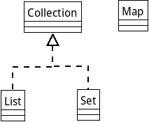

# Java集合详解

使用Java不一定用到数组，但是几乎一定会用到`ArrayList`，`HashMap`等等数据结构。这篇笔记就把Java常用的集合数据结构理清楚。

## Java集合接口的继承层次

Java中Collection接口用于存放单个元素，Map接口用于存放键值对。Collection接口下，分为List接口和Set接口，实现线性数据结构和集合数据结构。

## List

List实现了线性数据结构，元素一个接一个有序的存储在List中。数组是最简单的线性数据结构，但Java中通常使用封装好的List类使用。

### ArrayList

ArrayList是对数组的一个封装，实现了能够动态扩容的数组。初始化ArrayList时，会自动分配一定大小的数组，当数组填满后需要插入新元素时，就申请一个更大的数组并把所有元素拷贝过去。数组线性结构中间插入删除会引起后方元素整体前移或后移，因此插入删除的代价很高，但是随机访问时，只需给出首地址和偏移，直接访问即可，因此随机访问代价较低。

ArrayList不是线程安全的。

### LinkedList

LinkedList就是链表的封装。显然，链表的容量十分易于扩展，同时插入删除代价很低。但是每次随机访问必须从头遍历，因此随机访问的代价很高。

### Vector

Vector和ArrayList的机制相似，都是基于动态数组实现的。但是Vector的插入删除都是`synchronized`，线程同步的。

### Stack

Stack基于Vector实现了栈数据结构。Stack添加了栈操作相关的方法：`push()`，`pop()`，`peek()`，`empty()`。

### Queue

实际上LinkedList实现了Queue接口，但是我们通常使用多态机制，只关心`List`接口。这里我们关心它的`Queue`接口，可以把LinkedList作为队列使用。除了链表实现外，队列还有ArrayDeque的数组实现。

* `offer()` 向队列添加元素
* `peek()` 返回队列头部元素，不从队列移除该元素
* `poll()` 移除并返回队列中头部元素

### Deque

双端队列。我们同样可以使用LinkedList作为双端队列实现。双端队列和队列API差不多。这里就不多解释了。

* `offerFirst()`
* `offerLast()`
* `peekFirst()`
* `peekLast()`
* `pollFirst()`
* `pollLast()`

## Set

集合的特点是无重复。例如`{1,2,3}`，如果向其插入`4`，集合变为`{1,2,3,4}`，如果再次向其插入`1`，则集合还是`{1,2,3,4}`，因为`1`已经在集合中存在的。

由于集合要比较两个对象，因此我们要重写对象的`equals()`和`hashCode()`。

### HashSet

实际上是通过HashMap哈希表实现的。哈希表是无序的。

### TreeSet

实际上是通过TreeMap红黑树实现的。它支持排序操作，实现集合交并差效率较高。但是单纯看内存占用比哈希表高，随机查找效率也不如哈希表。我们通常使用哈希表，特定情况下会用到红黑树。

## Map

Map存储键值对，例如：web开发中的session对象和jessionid就是键值对的关系，这种数据结构非常有用。

### TreeMap和HashMap

前文介绍Set时已经介绍过了。
