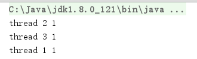
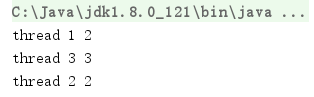
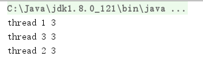

# Thread和Runnable

Java中使用线程，首先创建线程类，然后将其传入Thread类中，执行start()方法。

Java创建线程类的两种方式：继承Thread类和实现Runnable接口

方式1 继承Thread
```java
public class MyThread1 extends Thread
{
	@Override
	public void run()
	{
		System.out.println("hello from thread 1");
	}
}
```

方式2 实现Runnable
```java
public class MyThread2 implements Runnable
{
	@Override
	public void run()
	{
		System.out.println("hello from thread 2");
	}
}
```

创建线程并执行：
```java
public static void main(String[] args)
{
  Thread t1 = new MyThread1();
  Thread t2 = new Thread(new MyThread2());
  t1.start();
  t2.start();
}
```

注意Thread类和Runnable的关系：Thread类实现了Runnable接口，Runnable接口中只有一个方法`run()`，这个方法中的代码就是在新线程中执行的代码。因此使用继承Thread的方式创建线程，就必须重写`run()`方法。

## JDK中的Thread

那么问题来了，虽然Thread实现了Runnable接口，但是上面代码中创建t2线程，既new了自定义的`MyThread2`，又new了已经实现Runnable的`Thread`类，到底哪个类的Runnable被执行？

我们可以看看Thread类的代码：

```java
public class Thread implements Runnable
{
    private Runnable target;

    @Override
    public void run()
    {
        if (target != null)
        {
            target.run();
        }
    }
}
```

原来JDK中Thread类中有个target属性，它就是`new Thread(Runnable target)`时传入的参数，Thread的run会判断这个target，如果它不为null，就会执行target中的`run()`。

那么，我们是不是也可以这样写呢？

Thread1继承Thread类：
```java
Thread t2 = new Thread(new MyThread1());
```

答案是可以的，但是这样写不好，这不符合软件工程。Runnable是接口，接口描述一组行为，这样写传入的是一个具有该行为的对象实例，而这个实例除了表示Runnable的行为以外，毫无意义。

最佳实践：通常情况下，建议使用实现Runnable接口的方式。如果仅仅想创建一个在新线程中执行的函数，可以在`new Thread`时传入匿名类（甚至lambda）实现Runnable。

例子：
```java
Thread t4 = new Thread(new Runnable()
{
  @Override
  public void run()
  {
    System.out.println("hello from thread 4");
  }
});
```

## 线程安全问题

多个线程可以共享变量，也可以不共享。下面以例子形式说明，这里定义一个线程类：

MyThread.java
```java
public class MyThread implements Runnable
{
	private int i = 0;

	@Override
	public void run()
	{
		i++;
		System.out.println(Thread.currentThread().getName() + " " + i);
	}
}
```

### 没有线程安全问题的写法

```java
public class Main1
{
	public static void main(String[] args)
	{
		Thread t1 = new Thread(new MyThread(), "thread 1");
		Thread t2 = new Thread(new MyThread(), "thread 2");
		Thread t3 = new Thread(new MyThread(), "thread 3");

		t1.start();
		t2.start();
		t3.start();
	}
}
```

我们实例化了三个MyThread类，每个MyThread有自己的局部变量，因此三个线程有自己的局部变量。

运行结果：



三个线程都输出1，这是正确的结果。

### 有线程安全问题的写法

```java
public class Main2
{
	public static void main(String[] args)
	{

		MyThread myThread = new MyThread();

		Thread t1 = new Thread(myThread, "thread 1");
		Thread t2 = new Thread(myThread, "thread 2");
		Thread t3 = new Thread(myThread, "thread 3");

		t1.start();
		t2.start();
		t3.start();
	}
}
```

我们只实例化了一个MyThread类，因此三个线程共享同一个变量。但是这就产生了线程安全问题：

运行结果1：



运行结果2：



这种写法，多次运行甚至出现了不同的运行结果，这显然很容易造成问题。线程切换是操作系统决定的，我们并不能控制，不同的线程切换顺序可能造成不同的结果，因为多个线程修改同一个变量会造成冲突。

那么，有时候必须要让多个线程共享一个变量，这该如何解决？答案是使用线程同步。这将在后面章节中介绍。

## Thread.currentThread()

该方法返回当前线程的实例引用。

我们创建线程时，可以给线程命名：

```java
Thread t1 = new Thread(new MyThread(), "thread 1");
```

我们可以在子线程中用这种方式取得当前的线程名：
```java
Thread.currentThread().getName()
```

## Thread.sleep(long millis)

该方法会使当前线程睡眠指定毫秒数。

注意：这是一个静态方法，只能在某个线程中调用并睡眠当前线程。

## isAlive()

该方法返回某个线程是否是活动线程。活动线程：已开始且未执行结束的线程，注意线程sleep时也属于这种状态。

## getId()

返回线程的唯一标识。

## setPriority(int priority)

线程能够设定优先级，优先级取值1-10，或者使用`Thread.MAX_PRIORITY`、`Thread.MIN_PRIORITY`、`Thread.NORM_PRIORITY`预定义的常量。理论上，优先级越高的线程，获得CPU执行的时机越多。

一个线程中启动另一个线程，新线程会继承原来线程的优先级。

## 守护线程

Java中可以创建一个守护线程，守护线程会在主线程结束时自动结束。创建线程时，设置`thread.setDaemon(true);`就可以了。

### 为什么要使用守护线程？

实际开发中通常有这样的需求，例如：编写一个编辑器，有拼写检查功能。这个“拼写检查”显然可以放在子线程中，用一个死循环判断编辑器里的内容。

如果使用普通线程实现拼写检查，普通线程不会在主线程结束时自动结束，子线程不结束，程序无法退出，因此需要主线程手动结束子线程，再退出，虽然也可以做到，这就有点麻烦了。因此出现了守护线程。
