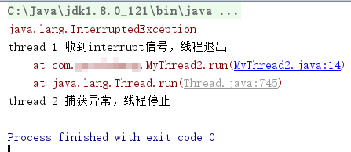

# 停止线程

Java中，线程不能强行停止。需要一个线程停止时，我们应该调用interrupt()方法，向其发送中断信号，子线程则会判断是否收到这个信号，如果收到就退出。退出可以直接return，或者手动抛出`interruptedException`，这个异常是一个受检查异常。

注：虽然JDK提供了stop()方法强行停止线程，但是该方法已经deprecated，并且十分不推荐使用。

## 使用return实现线程停止

MyThread1.java
```java
public class MyThread1 implements Runnable
{
	@Override
	public void run()
	{
		while(true)
		{
			if(Thread.currentThread().isInterrupted())
			{
				System.out.println("thread 1 收到interrupt信号，线程退出");
				return;
			}
		}
	}
}
```

上述代码中，通过isInterrupted()函数判断线程是否收到中断线程的信号，收到直接函数返回。

## 使用异常实现线程停止

MyThread2.java
```java
public class MyThread2 implements Runnable
{
	@Override
	public void run()
	{
		try
		{
			while(true)
			{
				if(Thread.currentThread().isInterrupted())
				{
					throw new InterruptedException();
				}
			}
		}
		catch(InterruptedException e)
		{
			System.out.println("thread 2 捕获异常，线程停止");
			e.printStackTrace();
		}
	}
}
```

上面代码中，收到线程停止的信号，会手动抛出`InterruptedException`，被catch抓到即会退出子线程执行流程。

## 运行结果

Main.java

```java
public class Main
{
	public static void main(String[] args) throws InterruptedException
	{
		Thread t1 = new Thread(new MyThread1());
		Thread t2 = new Thread(new MyThread2());
		t1.start();
		t2.start();
		Thread.sleep(500);
		t1.interrupt();
		t2.interrupt();
	}
}
```

这里我们同时启动了上述两个线程，然后500ms后，同时结束。



## isInterrupted()和interrupted()

实际上判断线程是否收到interrupted信号有两个方法：

* isInterrupted() 线程实例的方法，只判断一个线程对象是否具有线程中断信号，返回布尔值
* interrupted() 静态方法，判断当前线程是否具有线程中断信号，如果有就清除中断信号，返回清除之前的判断结果布尔值

# 对于睡眠的线程

处于睡眠状态的线程，怎样判断线程中断信号呢？实际上sleep()函数已经把这个判断实现了，处于睡眠过程中的线程，如果收到线程中断信号，sleep会主动抛出InterruptedException，我们使用sleep()的时候，也是强制try...catch...的。

# 最佳实践

停止一个线程，最推荐的做法是使用InterruptedException。相对于return的方式，使用异常能够在catch中继续向上抛出异常，使得线程停止事件能够向上传播。

不要使用stop()停止线程。
