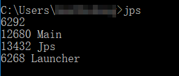
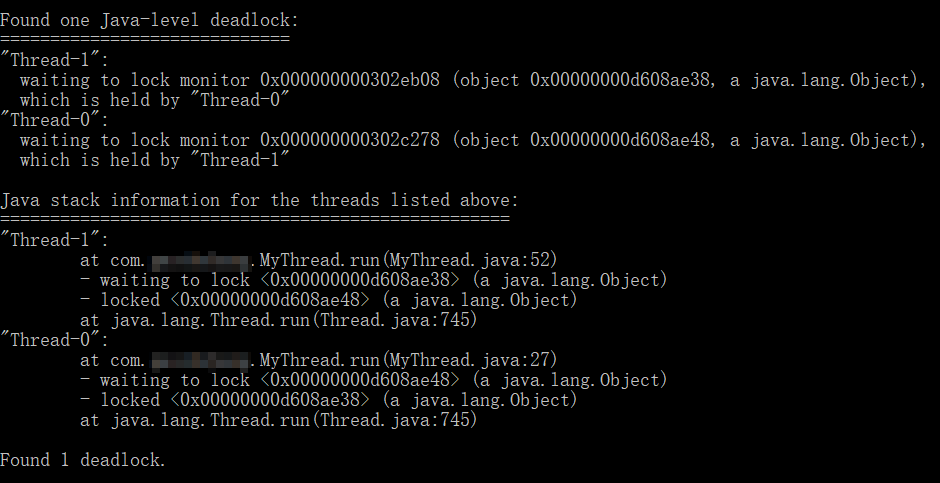

# 线程同步

两个线程同时访问同一个变量时，就会出现线程安全问题，因为两个线程对变量的访问不是原子操作，在线程切换时会造成混乱。解决线程安全问题的办法就是使用线程同步，让一个操作只能串行执行。这种方式的缺点也显而易见，就是影响了并行性能。因此，性能和安全兼顾是需要一个良好的软件架构设计的。

## 同步函数

可能有这样的情况：一个函数封装了一部分对变量的访问操作，我们希望这个函数是线程安全的。在函数定义时加上`synchronized`即可。

例子：

MyThread.java
```java
public class MyThread implements Runnable
{

	private int i = 0;

	@Override
	public void run()
	{
		add();
		System.out.println(i);
	}

	synchronized private void add()
	{
		i++;
	}
}
```

Main.java
```java
public class Main
{
	public static void main(String[] args)
	{
		MyThread myThread = new MyThread();
		Thread t1 = new Thread(myThread);
		Thread t2 = new Thread(myThread);
		Thread t3 = new Thread(myThread);

		t1.start();
		t2.start();
		t3.start();
	}
}
```

上述代码，我们让add()函数变为同步函数，这个函数在不同线程之间就只能串行执行了。两个线程都想要执行这个函数时，后一个线程必须等待前一个线程执行结束才能继续执行。

实际上，线程同步是通过锁实现的，当线程执行到同步函数时，该线程获得对象锁，对象锁锁定保证了同一对象上的其他线程只能等待，不能执行。因此，如果把上述代码Main改为三个线程初始化为三个对象，实际上就并不会发生线程同步，因为锁定的是三个不同对象，但是访问的也是三个不同变量，且并不会发生线程安全问题。

再考虑当一个对象有两个同步函数时，由于锁定了对象，因此即使这两个函数操作的是不同变量，但是他们也会不得不串行执行。不过这在防止数据脏读上十分有用。

注意：同步函数锁定的不是某段代码，没有这样的机制。同步函数锁定的是对象。

### 同步函数的常见问题说明

#### 多次获得一把锁

当一个线程已经通过同步函数获得对象锁时，它再次申请同一个锁时会直接再次得到该对象的锁。也就是说，同步函数内调用同步函数是没有问题的。

这很符合常理，否则同步函数调用同步函数就会死锁了。

#### 出现异常

一个线程出现异常时，如果它持有锁，锁会自动释放。

#### 同步函数不能继承

子类不能继承父类函数的同步属性，因此如果子类也想让继承下来的函数同步，就必须重写该函数并加上`synchronized`关键字。

## 同步语句块

同步语句块比同步函数能够更加精细的控制锁和触发同步的位置。

假如现在有这样一个函数：

```java
synchronized private void add() throws InterruptedException
{
	//假设只是一些耗时操作
	Thread.sleep(1000);
	//真正需要同步的操作
	i++;
}
```

由于是同步函数，因此和变量访问不相关的耗时操作也必须排队执行，这显然是不可接受的。

一种改进方法是分成两个函数，耗时操作异步，访问全局变量操作同步，这是可行的。但是使用同步语句块能更方便的解决这个问题：

```java
private void add() throws InterruptedException
{
	//假设只是一些耗时操作
	Thread.sleep(1000);
	synchronized(this)
	{
		//真正需要同步的操作
		i++;
	}
}
```

同步块由`synchronized`定义，this表示要锁定的对象，这里和同步函数一样锁定我们的自定义线程对象的实例。同步块外的代码会并行执行，一旦进入同步块，就获得了对象锁，其他线程申请锁时就要排队了。

### 同步语句块的常见问题说明

#### 应该锁定谁

上面代码中，我们锁定了this，也就是自定义线程对象的实例。实际上，有些情况下我们不必这样做，有性能更好的解决方案：

例如，有两个需要被多线程修改的对象a和b，它们都在run()函数中，如果我们套上两个`synchronized(this)`语句块，那么修改a和修改b这两个不冲突的操作也是同步执行的，这就不如分别使用`synchronized(a)`和`synchronized(b)`，这样修改a和修改b时，获得的是不同对象的锁，因此就不会同步了，而修改a和另一个线程修改a则是同一把锁，是同步的。

#### 对于锁定对象的要求

首先，锁定对象不能是基本类型。其次，最好使用final修饰。final表示该引用不可更改，实际上，引用如果被更改，其他线程获得的锁就不是原来对象的锁了，那样就做不到线程同步了。

关于String对象，我们知道JVM对于String有常量池，也就是说，new两个String对象，但是其值相同，那么这获得的两个引用很有可能指向同一个对象实例，但也有可能不是。这也是为什么判断String相等必须使用`.equals()`，但是经常"=="结果也正确的原因。如果从String上获得锁，就要尤其注意这个问题。不过也很少这样做。

#### synchronized(MyThread.class)

我在网上看到有些人在区分`synchronized(this)`和`synchronized(MyThread.class)`。我们知道，Java中每个类都有Class对象，这个同步块锁定的就是这个Class对象，其他没有什么特别的，不管锁定的是谁，它们都遵循统一的锁同步原理。在合适的场合下锁定合适的对象即可。

除此之外，对static方法加上`synchronized`锁定的也是class对象。

## 死锁

有两个线程，线程1和线程2，两个锁a和b，线程1获得锁a同时，线程2获得锁b，两个线程并行执行一段时间，线程1未放开锁a同时要请求锁b，线程2未放开锁b同时要请求锁a，好了，死锁发生了。

MyThread.java
```java
public class MyThread implements Runnable
{

	boolean flag = true;

	@Override
	public void run()
	{
		if(flag)
		{
			synchronized(Main.lock1)
			{
				try
				{
					Thread.sleep(1000);
				}
				catch(InterruptedException e)
				{
					e.printStackTrace();
				}
				synchronized(Main.lock2)
				{
					try
					{
						Thread.sleep(1000);
					}
					catch(InterruptedException e)
					{
						e.printStackTrace();
					}
				}
			}
		}
		else
		{
			synchronized(Main.lock2)
			{
				try
				{
					Thread.sleep(1000);
				}
				catch(InterruptedException e)
				{
					e.printStackTrace();
				}
				synchronized(Main.lock1)
				{
					try
					{
						Thread.sleep(1000);
					}
					catch(InterruptedException e)
					{
						e.printStackTrace();
					}
				}
			}
		}
	}
}
```

Main.java
```java
public class Main
{

	static final Object lock1 = new Object();
	static final Object lock2 = new Object();

	public static void main(String[] args)
	{
		MyThread myThread1 = new MyThread();
		myThread1.flag = true;
		MyThread myThread2 = new MyThread();
		myThread2.flag = false;
		Thread t1 = new Thread(myThread1);
		Thread t2 = new Thread(myThread2);
		t1.start();
		t2.start();
	}
}
```

### 检查死锁

有时候死锁发生是不确定的，造成程序一直阻塞也可能不一定是死锁。但是，死锁就是程序的bug，我们怎么发现程序是否死锁了呢？JDK提供给我们了工具。

### jps工具和jstack工具

jps能够得到基于Hotspot虚拟机的Java进程号。我们首先找到我们的进程。



jstack能够附加到正在执行的Java进程，经常用于分析该进程莫名其妙挂起是不是死锁。

```
jstack <pid>
```



如图，果然发现了死锁。
