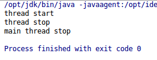

# join

主线程创建并启动子线程，如果子线程是一个耗时操作，而主线程执行却很快，就可能造成主线程先于子线程结束的情况。有时我们需要让主线程等待子线程结束，然后读取一些值，这时就应该使用`join()`方法了。`join()`会阻塞当前线程，直到指定线程销毁。

## 使用join的例子

MyThread.java
```java
public class MyThread implements Runnable
{
	@Override
	public void run()
	{
		try
		{
			System.out.println("thread start");
			Thread.sleep(3000);
			System.out.println("thread stop");
		}
		catch (InterruptedException e)
		{
			e.printStackTrace();
		}
	}
}
```

Main.java
```java
public class Main
{
	public static void main(String[] args) throws InterruptedException
	{
		Thread myThread = new Thread(new MyThread());
		myThread.start();
		myThread.join();
		System.out.println("main thread stop");
	}
}
```

上述代码中，子线程会睡眠三秒，主线程使用`join()`方法，阻塞到子线程结束，然后最后一条语句`System.out.println("main thread stop");`才会执行。

运行结果：



额外需要注意的是，当一个线程因`join()`阻塞时，收到`interrupt`信号，会抛出`InterruptedException`运行时异常并终止。

同`sleep()`和`wait()`一样，`join()`也可以穿入一个long参数表示最长阻塞时间。

## join的底层实现

同样是阻塞线程，`join`和`sleep`有什么区别呢？对于`join()`我们有必要观察一下它的实现代码。

```java
public final void join() throws InterruptedException
{
  join(0);
}
```

```java
public final synchronized void join(long millis) throws InterruptedException
{
  long base = System.currentTimeMillis();
  long now = 0;

  if (millis < 0)
  {
    throw new IllegalArgumentException("timeout value is negative");
  }

  if (millis == 0)
  {
    while (isAlive())
    {
      wait(0);
    }
  }
  else
  {
    while (isAlive())
    {
      long delay = millis - now;
      if (delay <= 0)
      {
        break;
      }
      wait(delay);
      now = System.currentTimeMillis() - base;
    }
  }
}
```

原来，`join`是通过轮询线程状态，通过`wait`实现的，如果`millis == 0`就一直轮询直到线程`isAlive()`返回`false`，如果`millis > 0`则额外进行一个计时的操作。要注意的是，`join`方法的`synchronized`，它在执行时会获得对象锁，锁定当前对象，但是前面一章讲过，`wait()`会立即释放锁。这和`sleep()`阻塞线程是不同的。所以要注意，这里可能会造成一些代码执行顺序上的问题。
