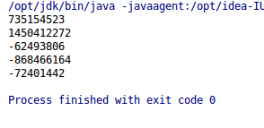

# ThreadLocal 线程局部变量

我们创建一个全局变量时，经常使用`pulic static`，有些情况下，我们需要一个线程局部变量，即只属于一个线程的“全局变量”。这当然可以通过读取线程号+哈希表解决，但是JDK已经内置了这个功能，不需要我们多写什么了。

JDK提供了`ThreadLocal`解决了这个问题。

## ThreadLocal的使用

MyThread.java
```java
public class MyThread implements Runnable
{
	@Override
	public void run()
	{
		Random random = new Random();
		Main.threadLocal.set(random.nextInt());
		System.out.println(Main.threadLocal.get());
	}
}
```

Main.java
```java
public class Main
{

	public static ThreadLocal<Integer> threadLocal = new ThreadLocal<>();

	public static void main(String[] args) throws InterruptedException
	{
		Thread myThread1 = new Thread(new MyThread());
		Thread myThread2 = new Thread(new MyThread());
		Thread myThread3 = new Thread(new MyThread());
		Thread myThread4 = new Thread(new MyThread());
		Thread myThread5 = new Thread(new MyThread());

		myThread1.start();
		myThread2.start();
		myThread3.start();
		myThread4.start();
		myThread5.start();
	}
}
```

我们创建了5个线程，他们都读写了`public static ThreadLocal<Integer> threadLocal`，但显然他们读写的内容都是线程隔离的。

运行结果：



## 实现有默认值的ThreadLocal

`ThreadLocal`默认是没有值的，不`set`直接`get`返回的是null。我们可以继承`ThreadLocal`，覆盖一些方法，编写一个我们自己的线程局部变量类。

```java
public class MyThreadLocal extends ThreadLocal<Integer>
{
	@Override
	protected Integer initialValue()
	{
		return 1;
	}
}
```

## 可继承的线程局部变量

JDK还提供了`InheritableThreadLocal`，子线程可以继承父线程的线程局部变量。不过当然，这两个值是隔离的，也就是说，线程局部变量是从父线程复制了一份给子线程。但是如果线程局部变量的值是一个引用，就要小心了，子线程如果直接使用这个引用，那么它的改动会影响到父线程，这种用法下就要考虑线程安全问题了。如果子线程覆盖了这个引用，那就没什么问题了，这两个引用是隔离的，其指向的对象也完全隔离了。
