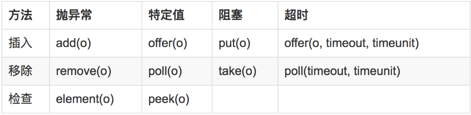

# concurrent 并发工具包

Java5中，引入了concurrent并发工具包，它们位于`java.util.concurrent`中，里面包含了一些并发编程中常用的数据结构，直接使用这些工具类比我们自己实现要方便的多，而且能够减少并发程序出现难以调试的bug的机会。

## BlockingQueue

BlockingQueue（阻塞队列）能够高效安全的实现多线程“生产者-消费者”逻辑，最常见的是需求这样的功能：一个线程中的生产者将对象放入队列，如果队列满了则阻塞，另一个线程的消费者将对象从队列中取出，如果队列为空则阻塞，生产者和消费者都可能有多个。

下面代码使用阻塞队列，实现了一个消费者和两个生产者的多线程关系，生产者每1s产生一个对象存入队列中，消费者每2s消费一个对象，总共启动了2个生产者和1个消费者：

Producer.java
```java
import java.util.concurrent.BlockingQueue;

public class Producer implements Runnable
{
	private BlockingQueue<Integer> blockingQueue;

	public Producer(BlockingQueue<Integer> blockingQueue)
	{
		this.blockingQueue = blockingQueue;
	}

	@Override
	public void run()
	{
		try
		{
			while (true)
			{
				Thread.sleep(1000);
				blockingQueue.put(1);
				System.out.println("producer:" + Thread.currentThread().getId() + " produce 1 data, queue size:" + blockingQueue.size());
			}
		}
		catch (InterruptedException e)
		{
			e.printStackTrace();
		}
	}
}
```

Consumer.java
```java
import java.util.concurrent.BlockingQueue;

public class Consumer implements Runnable
{
	private BlockingQueue<Integer> blockingQueue;

	public Consumer(BlockingQueue<Integer> blockingQueue)
	{
		this.blockingQueue = blockingQueue;
	}

	@Override
	public void run()
	{
		try
		{
			while (true)
			{
				Thread.sleep(2000);
				blockingQueue.take();
				System.out.println("consumer:" + Thread.currentThread().getId() + " consume 1 data, queue size:" + blockingQueue.size());
			}
		}
		catch (InterruptedException e)
		{
			e.printStackTrace();
		}
	}
}
```

Main.java
```java
import java.util.concurrent.ArrayBlockingQueue;
import java.util.concurrent.BlockingQueue;

public class Main
{
	public static void main(String[] args)
	{
		BlockingQueue<Integer> blockingQueue = new ArrayBlockingQueue<>(5);
		new Thread(new Producer(blockingQueue)).start();
		new Thread(new Producer(blockingQueue)).start();
		new Thread(new Consumer(blockingQueue)).start();
	}
}
```

BlockingQueue的一些方法：



## BlockingDeque

和BlockingQueue差不多，BlockingDeque就是阻塞双端队列了，使用方法和BlockingQueue差不多，只不过可以分别从队列头尾进行操作，这里就不多做介绍了。

## ConcurrentMap

ConcurrentMap能够实现线程安全的Map对象，ConcurrentMap在插入对象时并不对把整个Map锁住，因此比单纯的锁住Map对象实现线程安全更加高效。

ConcurrentMap和普通的Map使用起来一样，但是其实现线程安全的底层原理不同JDK版本可能都不一样，这里就不多做介绍了。

参考链接：[http://www.importnew.com/26461.html](http://www.importnew.com/26461.html)
