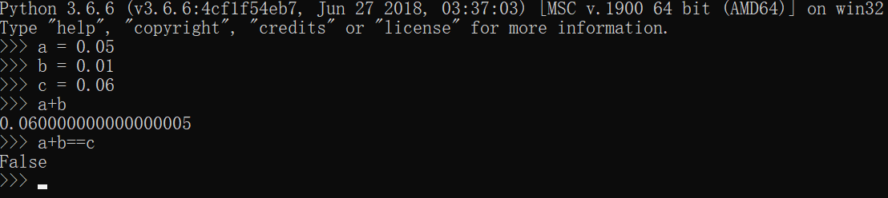
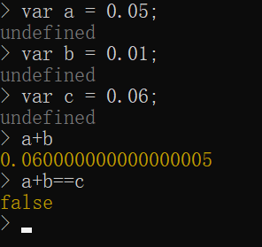

# BigDecimal

BigDecimal类用于表示一个高精度的数字类型，它可以表达一个无限大小的数字（只要内存够），而且表达小数没有精度损失，在需要精确计算的场景很常用，尤其是表达“钱”的时候！！

## 浮点数精度损失

Java中的基本类型`double`，在进行浮点计算会出现精度丢失的现响，稍不注意，就会造成非常严重的问题。看下面例子代码：

```java
double productA = 0.05;
double productB = 0.01;

double money = 0.06;

if (productA + productB <= money) {
    System.out.println("可以购买");
} else {
    System.out.println("钱不够");
}
```

假设现在有一个电商系统，用户有`0.06`元钱，现在要购买一个`0.05`元和一个`0.01`元的商品，显然他有足够的钱可以下单。然而，上面代码的输出却是`钱不够`！！？？

这是因为在在计算机中，浮点数是使用二进制表示的，这和我们十进制不能表达很多无限小数的分数是一样的道理，某些值以浮点数存储，会被处理成一个近似值，也就是说，会有微小的精度损失。但就是这种微小的精度损失，却可能给我们系统造成逻辑错误。

当然，不止Java的浮点数有这个问题，只要是运行在二进制计算机上的“浮点数”，都有精度损失的问题。

Python测试：



Node测试：



## BigDecimal的构造函数

下面代码展示了BigDecimal的构造，记住，绝对不要用浮点数构造BigDecimal。一个浮点数变量或是浮点数字面量，它在内存中实际上已经丢失精度了，即使赋值给BigDecimal，也是一个错误的值！

正确的做法是使用字符串构造BigDecimal。

```java
// BigDecimal典型错误用法1
BigDecimal a = new BigDecimal(0.1);

// BigDecimal典型错误用法2
double num = 0.1;
BigDecimal b = new BigDecimal(num);

// 正确用法
BigDecimal c = new BigDecimal("0.1");

System.out.println(a);
System.out.println(b);
System.out.println(c);
```

输出：
```
0.1000000000000000055511151231257827021181583404541015625
0.1000000000000000055511151231257827021181583404541015625
0.1
```

## BigDecimal运算

```java
BigDecimal a = new BigDecimal("0.1");
BigDecimal b = new BigDecimal("0.3");

BigDecimal addResult = a.add(b);
BigDecimal subResult = a.subtract(b);
BigDecimal mulResult = a.multiply(b);
BigDecimal divResult = a.divide(b, 2, BigDecimal.ROUND_HALF_UP);

System.out.println(addResult);
System.out.println(subResult);
System.out.println(mulResult);
System.out.println(divResult);
```

加法、减法、乘法没什么可说的，我们主要看除法。因为除法可能产生一个无限小数（十进制无法精确表示的分数），因此我们一般使用除法时都指定保留位数和保留算法。上面代码中的`a.divide(b, 2, BigDecimal.ROUND_HALF_UP)`，我们保留两位小数，使用最传统的“四舍五入”。

## 数据库类型

这里额外说一下，Java中BigDecimal类型对应的MySQL数据库类型是`Decimal`，它能表述一个定点小数，当然，也有一些奇葩的用`varchar`等。

假如数据库用的Decimal类型，保留位数不是太多，而Java代码又误用了double，数据入库的时候很可能看不出来什么问题，那这个精度丢失的bug就更加隐匿了。
