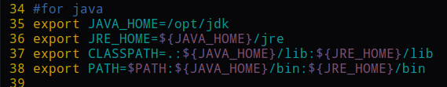
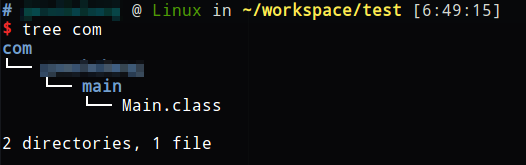
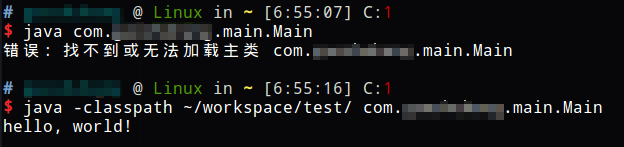

# 什么是CLASSPATH

CLASSPATH是一个环境变量，它的作用就是他的名字，是Java Class（类字节码文件）所在的路径。我们知道，运行一个Java程序至少需要程序本体和JRE，那么就存在一个问题，JVM从哪里加载所需的Class文件呢？

安装JDK时，我们配置了PATH环境变量，但是PATH环境变量指定的是操作系统搜索可执行文件的路径，也就是说，配置PATH后操作系统才能找到`java`和`javac`等命令的路径。此外还配置了CLASSPATH，这个CLASSPATH环境变量其实就是指定了运行Java程序的Class路径，它包括JRE的基础class路径和当前目录。

当需要运行一个Java程序时，如果我们所处的当前路径不是有效的CLASSPATH，我们必须再次指定程序本体的CLASSPATH。程序未打包为jar时，我们通常通过`java`命令的`-classpath`参数执行。

## 指定程序本体CLASSPATH并运行

现在我们有一系列编译好的CLASS

查看一下现在的CLASSPATH环境变量

当前目录是有效的CLASSPATH，我们直接使用主类全名即可运行。

如果我们不在有效的CLASSPATH路径，就要手动指定了。

如图所示，使用`java -classpath <classpath> <类全名>`指定程序本体CLASSPATH和类全名，即可运行程序。这就是CLASSPATH的作用。

## 运行依赖外部jar类库的未打包程序

我们在Intellij IDEA中添加依赖库时，实际上IDE帮我们做了一步操作，就是将依赖库jar的路径作为CLASSPATH，添加到编译时和运行时的CLASSPATH中，这样我们才有依赖库的自动提示，编译才不会报错，运行也能找到依赖库的类路径。

JVM加载类字节码文件时，是懒加载的。运行class时，如果忘了指定某个依赖库的CLASSPATH，可能暂时没什么问题，程序能跑起来，但是一旦需要加载哪个依赖库中的类时，就会出现`NoClassDefFoundError`错误，这点要十分注意。

## 对于已经打包的可执行jar程序

打包这种工作我们通常都是交给构建工具或者是IDE去做，但是我们应该知道可执行jar有一个清单文件，它会指定CLASSPATH。那么如果我们的可执行程序有依赖库呢？其实也很简单，Maven打包带依赖可执行jar的做法是把依赖的class抽出来和我们的class放在一起。这样统一设置一个CLASSPATH就行了。当然无论怎么放class文件，只要能在CLASSPATH中搜索到程序需要的类，就没有问题。

如图所示是maven打包的带依赖可执行jar，fasterxml是依赖库jackson的包，下面是我的程序的包。
