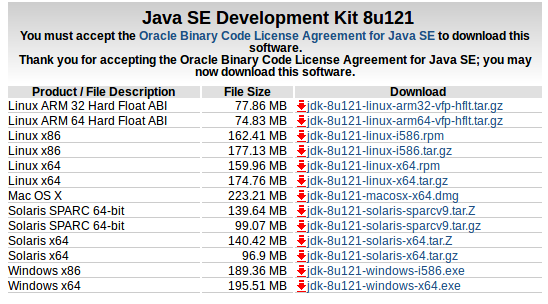
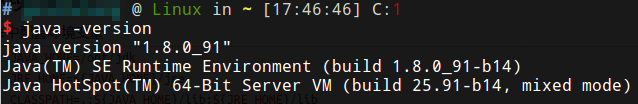

# 安装JDK

在oracle官网下载最新版本的JDK，下载对应Linux平台的.tar.gz包，解压。



# 配置环境变量

使用Ubuntu16.04进行测试，发现系统已经预装了JRE，使用的是OpenJDK8，但是这个预装的JRE仅仅包含最基础的功能，不包含编译器等工具，也不包含JavaFX这样的额外组件（需要单独安装OpenJFX），这比较麻烦，我们最好直接在Oracle官网下载一个完整的JDK，然后为我们自己下载的JDK配置环境变量。

在/etc/profile中配置环境变量

```shell
export JAVA_HOME=/opt/jdk
export JRE_HOME=${JAVA_HOME}/jre
export CLASSPATH=.:${JAVA_HOME}/lib:${JRE_HOME}/lib
export PATH=$PATH:${JAVA_HOME}/bin:${JRE_HOME}/bin
```

由于系统中已经有了Java命令（来自OpenJDK），我们需要使用`update-alternatives`工具进行配置，使两个`java`命令共存，注意不建议卸载系统自带的OpenJDK，因为包管理器依赖树的问题，可能导致一大批软件被自动卸载。

```
sudo update-alternatives --install /usr/bin/java java /opt/jdk1.8.0_144/bin/java 1082
```

注意：

1. 最后的数字是优先级，我的OpenJDK中Java命令优先级的1081，所以这里就写了1082，自动模式下就会使用我们下载的Oracle JDK。
2. 如果OpenJDK中安装了其他工具，比如`javac`，那么我们必须对这些命令都一一进行配置，为了方便可以写成命令切换脚本。

配置完成后，在终端使用source命令，或重启计算机，使`profile`的配置生效。然后可以输入java命令，观察配置是否成功。



## 特别说明

为什么我们既在`/etc/profile`中配置环境变量，又使用`update-alternatives`配置命令链接呢？首先JDK中包含了大量工具，不只有`java`和`javac`，其次让Java程序正确运行必须指定正确的`java`命令位置和CLASSPATH，因此我们要在`profile`中设置环境变量。但是系统自带了OpenJDK，某些命令已经在存在了，我们设置的环境变量中也会包含这些命令，这就冲突了，不一定谁会覆盖谁，通常系统会先搜索`/usr/bin`，因此会导致运行Java程序时使用的OpenJDK的JVM，编译器、其他相关工具和CLASSPATH却是Oracle JDK的，这样是不行的，因此我们既要配好单独安装的JDK的环境，也好配好命令链接。

那么有人又指出，为什么不用ppa安装Oracle JDK呢？Linux的包管理器有些情况下很方便，有些情况下却导致了额外的麻烦，因为程序的模块会被分开存储，我们对JDK的手动修改也会引起很多问题，因此最后摸索出来的最佳实践就是：保留系统的OpenJDK，供系统软件使用，自己单独下载Oracle JDK的压缩包并整体解压，作为开发环境的JDK。

# 安装eclipse

eclipse是Java最常用的集成开发环境，下载eclipse，[官网地址](https://www.eclipse.org/downloads)，解压，在/usr/share/applications创建启动器eclipse.desktop

```shell
[Desktop Entry]
Type=Application
Name=Eclipse
Comment=Eclipse Integrated Development Environment
Icon=/opt/eclipse/eclipse.png
Exec=env SWT_GTK3=0 /opt/eclipse/eclipse
Terminal=false
StartupNotify=true
Categories=Development;
StartupWMClass=Eclipse
```

注：

* env SWT_GTK3=0 禁用GTK3，强制使用GTK2，因为eclipse使用GTK3在1366x768分辨率下标签实在太宽了
* 2017-8-6更新：经测试，最新版的Eclipse Oxygen在Ubuntu16.04下，不需要`env SWT_GTK3=0`，Ubuntu下强制使用GTK2反倒会出现bug

# 安装IntelliJ IDEA

Intellij IDEA是比eclipse体验更好的Java集成开发环境。下载，[官网地址](https://www.jetbrains.com/idea)，解压，运行 安装目录/bin/idea.sh启动程序，根据提示进行配置，Linux版会自动创建启动器。

# 安装NetBeans

NetBeans是Sun公司的开源Java集成开发环境，下载，[官网地址](https://netbeans.org)，运行安装程序即可自动安装。
