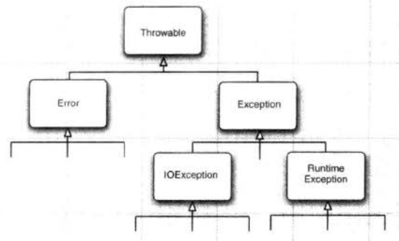

# 异常机制详解

Java中，所有异常都派生自`Throwable`。异常主要分类两类，即`Error`和`Exception`。

* Error 资源耗尽或JVM内部致命错误，应用程序不应该抛出这种异常，这种异常很少出现。一旦出现，程序只能结束。
* Exception 主要分为运行时异常（继承自`RuntimeException`）和其他的受检查异常。
  * 运行时异常 包括空指针，除以零等常见问题。
  * 其他受检查异常 例如`IOException`等。

注意：Java中称派生自`Error`和`RuntimeException`的异常称为未检查（unchecked）异常，其他异常称为受检查异常，受检查异常强制需要`try...catch...`或在方法上声明`throws`。`RuntimeExecption`通常翻译为运行时异常。

异常层次结构



## 运行时异常

抛出运行时异常通常意味着应用程序或当前线程出错，已经不值得继续运行下去，通常是出现空指针，或例如读取配置文件出错等问题由我们的代码手动抛出。运行时异常会结束当前线程。

## 受检查异常

JDK的很多方法都声明抛出受检查异常，我们在使用Intellij IDEA时，忘记处理受检查异常就会有长长的红线提示我们。关于如何处理受检查异常，通常有三种常用方式。

## 受检查异常处理

### 抓取并处理

```java
public void readFile()
{
  File file = new File("aaa.txt");
  InputStream inputStream = null;
  try
  {
    inputStream = new FileInputStream(file);
    //read file...
    inputStream.close();
  }
  catch (IOException e)
  {
    e.printStackTrace();
    //do something to handle this exception
  }
  finally
  {
    //
  }
}
```

`try...catch...`语句块用来抓取受检查异常，被抓取的异常会以参数形式传入`catch`块。注意可选的`finally`，这里通常做一些必要的资源回收工作。无论异常是否发生，`finally`块中的内容都会执行。

### 向上抛出

```java
public void readFile() throws IOException
{
  File file = new File("aaa.txt");
  InputStream inputStream = new FileInputStream(file);
  //read file...
  inputStream.close();
}
```

方法定义中，声明了该方法可能抛出`IOException`，这意味着JDK的API抛出IO异常时，我们的`readFile()`方法也无法处理，需要交给调用`readFile()`的方法处理。像这样将异常层层抛出，可以形成一个受检查异常链，链的终点一般是能够处理这个异常的`try...catch...`块。

如果直到`main()`方法异常都无法处理，那么会和接收到运行时异常一样，导致程序终止。

### 直接抛出运行时异常

```java
public void readFile()
{
  File file = new File("aaa.txt");
  InputStream inputStream = null;
  try
  {
    inputStream = new FileInputStream(file);
    //read file...
    inputStream.close();
  }
  catch (IOException e)
  {
    e.printStackTrace();
    //terminate this application
    throw new RuntimeException("无法继续工作了！！！");
  }
}
```

有时我们抓到受检查异常后，决定终止我们的程序，那么直接在`catch`块中抛出运行时异常即可。

注意`RuntimeException`的构造函数，它可以传入一个字符串参数，抛出异常时会显示在终端上，这样能略微便于调试，否则看着一长串错误栈也是比较难受。

## 编写我们自己的异常类型

尤其是在编写框架的时候，我们不仅仅要考虑我们的代码，还要考虑使用我们框架的用户。编写我们框架自己的异常体系是必要的。

编写一个异常类十分简单，因为异常类除了它的类型意外，通常没有什么具体意义。下面定义了一个运行时异常：

```java
public class StateNotRegisteredException extends RuntimeException
{
	public StateNotRegisteredException()
	{
		super();
	}

	public StateNotRegisteredException(String message)
	{
		super(message);
	}
}
```

实际上我们在自定义的异常中并没有做什么，只是调用了父类的方法，但是，我们可以想象一下，如果所有需要抛出运行时异常的地方全部使用`RuntimeException`那是很糟糕的，而对于不同的出错原因，抛出不同类型的运行时异常子类就比较优雅了。

对于受检查异常，也是一样的道理。

## 使用合适的异常类型

何时应该抛出运行时异常？例如：我们编写的框架依赖一个配置文件，用户（其他程序员）需要正确编写配置文件，框架才能正确工作，当我们的框架读取到这个配置文件时，发现语法有误，此时我们继续运行下去没有任何意义，因为配置文件是错误的，我们无法得知用户的真正目的，那就直接抛出运行时异常，结束程序。

何时应该声明受检查异常？比如我们正在编写网络操作相关框架的一个方法，这个方法会多次调用，大部分情况下都能正常工作。考虑到网络环境不稳定等原因，这个方法有可能某一次不能正常工作，出错会抛出异常，我们此时就应该使用受检查异常，因为这种异常可能是偶然情况，我们可以把这个情况通过受检查异常链通知用户，让用户决定如何处理，用户会选择继续重试还是抛出运行时异常结束程序。

关于如何使用异常，何时抛出合适的异常，使用`try...catch...`还是继续`throws`，亦或是`catch`后`throw new RuntimeException()`，这是需要大量编码才能体会出来，不是三言两语就能说清楚的。
