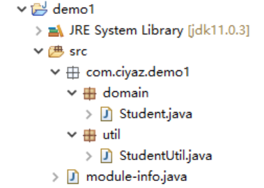
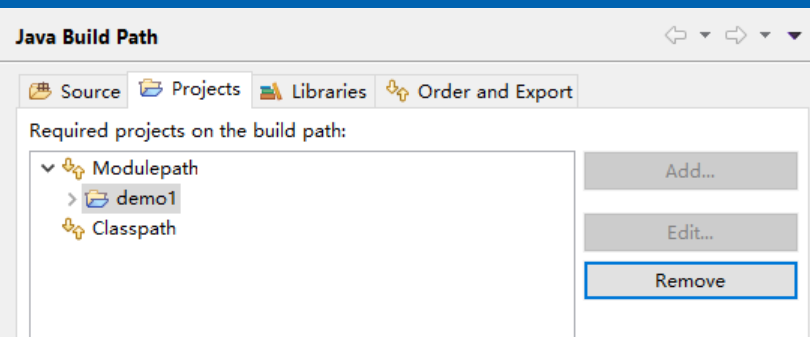

# 模块化

随着Java版本更新，在JDK9中引入了模块化系统，这是一个很重要的改进，这里对Java的模块化系统介绍一下。出于方便考虑，下面介绍使用的IDE是Eclipse，集成开发环境对`javac`、`jar`、`CLASSPATH`等涉及构建的要素做了抽象，你要熟悉IDE中对应操作是如何对应到命令行上的。

## 模块化的基本概念

在JDK8及以前是没有模块化系统的，代码的访问控制是基于`package`的。我们使用JDK或是引入一个Jar包，只要定义了的公有类其实我们都是可以访问的，即使这些类仅用于类库内部。使用模块化机制，明确的定义库用户能使用哪些类不能使用哪些类，这能让我们代码的健壮性更好。

对于JDK本身，现在也已经是模块化的了，这带来的一个好处是我们可以根据自己需要的模块定制JRE（如果运行环境操作系统没有安装全局的JRE，我们可以附带一个精简版的JRE，而不是将整个JRE附带到软件中发布，Jetbrains系列的IDE就有附带JRE的选项）。

## 工程的module-info.java

Java中的模块访问控制是通过`module-info.java`声明的，很多现代语言都有类似的机制，它很容易理解，比如Node中，我们必须用`module.exports`显式声明暴露的方法或对象。

在Eclipse中，可以直接自动创建一个`module-info.java`，只需`在项目上右键 -> Configure -> Create module-info.java`即可。如果项目代码有改动，也可以重新覆盖创建。下面是一个例子：



```java
module com.ciyaz.demo1 {
	requires java.logging;
	exports com.ciyaz.demo1.domain;
	exports com.ciyaz.demo1.util;
}
```

* `module`：指定模块名，这里模块名为`com.ciyaz.demo1`
* `requires`：指定引入的模块，如果不指定对应模块，代码中的引用编译会报错
* `exports`：指定暴露的模块，只有暴露的内容才能被外部访问

## 模块化的访问控制

现在假如我们另一个项目在源码上依赖该项目，只要在`module-info.java`中配置对应的模块引入，就能引入`demo1`中暴露的类了。



```java
module com.ciyaz.demo2 {
	requires com.ciyaz.demo1;
}
```

注：即使将`demo1`打成Jar包效果也是一样的，拥有`module-info.class`的Jar包会按照声明的访问权限实现模块化。
