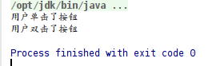
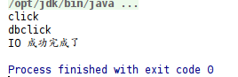

# RxJava响应式编程

本系列笔记主要记录Java中如何实现响应式编程的知识。RxJava是一个实现Java异步回调操作的类库，主要用户客户端（Android）开发中。

后期补充：

1. 现在版本已经到RxJava2了，其中的一些API改了，这篇笔记比较早，用的是RxJava1，所以引入RxJava2的依赖有些函数会找不到。我们这里主要是学习响应式编程模式，不用在意版本。
2. 现在响应式编程的概念也进入服务端了，参考Spring WebFlux和Eclipse Vert.x。

Maven依赖：
```xml
<dependency>
	<groupId>io.reactivex</groupId>
	<artifactId>rxjava</artifactId>
	<version>1.3.8</version>
</dependency>
```

Gradle依赖：
```java
compile group: 'io.reactivex', name: 'rxjava', version: '1.3.8'
```

## Java的回调函数

提起异步回调，通常会想起JavaScript，由于语言最初的用途就是操作DOM（文档对象模型），响应按钮点击事件，发起AJAX等，代码里经常充斥大量回调函数，但是不得不说，这种回调的编码方式是在GUI编程中十分常见的，而且用起来比较方便。

Java应用在GUI上最多的地方就是Android，因此在Android开发中也经常使用回调方式编写代码。除了GUI外，在网络，IO操作上，使用回调也十分方便。

### 回调函数实现

我们写一个简单的模拟按钮类，主函数中实例化按钮对象，为其绑定事件监听器，然后模拟发送事件，观察按钮的响应。

Callback.java
```java
public interface Callback
{
	public void onCall(Event event);
}
```

Event.java
```java
public class Event
{
	private String eventType = null;

	public Event(String eventType)
	{
		this.eventType = eventType;
	}

	public String getEventType()
	{
		return eventType;
	}
}
```

Button.java
```java
public class Button
{
	private Callback callback;

	public void register(Callback callback)
	{
		this.callback = callback;
	}

	public void click()
	{
		Event event = new Event("click");
		this.callback.onCall(event);
	}

	public void doubleClick()
	{
		Event event = new Event("dbclick");
		this.callback .onCall(event);
	}
}
```

App.java
```java
public class App
{
    public static void main( String[] args )
    {
        //实例化按钮
        Button button = new Button();

        //注册事件监听器的回调接口
        button.register(new Callback()
        {
            @Override
            public void onCall(Event event)
            {
                if(event.getEventType().equals("click"))
                {
	                System.out.println("用户单击了按钮");
                }
                else if(event.getEventType().equals("dbclick"))
                {
	                System.out.println("用户双击了按钮");
                }
            }
        });

        //模拟用户操作
        button.click();
        button.doubleClick();
    }
}
```

运行结果：



### 使用lambda改写例子

或许你认为上面例子的匿名类代码太丑了，可以使用Java8新提供的lambda表达式写法改进代码。

App.java
```java
//注册事件监听器的回调接口
button.register((Event event)->{
    if(event.getEventType().equals("click"))
    {
        System.out.println("用户单击了按钮");
    }
    else if(event.getEventType().equals("dbclick"))
    {
        System.out.println("用户双击了按钮");
    }
});
```

这省去了一些冗余的代码，看起来更加简洁了。

## 实现异步回调

异步回调最常见的地方就是网络和文件读写操作，文件描述符IO过程中会阻塞当前线程。应对这种问题，传统的做法是多线程。GUI编程中，通常由一个主线程（UI线程）和用户交互，用户如果执行了一个耗时操作如读取文件，就创建一个新线程取读取文件，UI线程中使用轮询或观察者模式监控子线程是否完成文件读取，如果完成就把结果返回给用户。

上面叙述的过程实际上可以面向应用开发者简单封装一下，应用开发者对读取文件的模块注册一个回调函数，回调函数中的代码是把IO结果展示给用户，最后开发者调用读取文件模块的读取函数即可。

在这个例子中，主函数创建了IOModule和Button类，为IOModule绑定了IO完成的回调函数，为Button绑定了点击事件的回调函数，触发IO操作后，又触发按钮点击，通过结果可以看到多线程模拟的异步回调效果。

IOModule.java
```java
public class IOModule
{
	private Callback callback;

	public void readFile()
	{
		new Thread(()->{
			try
			{
				Thread.sleep(3000);
			}
			catch (InterruptedException e)
			{
				e.printStackTrace();
			}
			Event event = new Event("IOFinish");
			callback.onCall(event);
		}).start();
	}

	public void onFinish(Callback callback)
	{
		this.callback = callback;
	}
}
```

App.java
```java
public class App
{
    public static void main( String[] args )
    {
		IOModule ioModule = new IOModule();
		Button button = new Button();

		button.register((Event event)->{
			System.out.println(event.getEventType());
		});

		ioModule.onFinish((Event event)->{
			if(event.getEventType().equals("IOFinish"))
			{
				System.out.println("IO 成功完成了");
			}
		});

		ioModule.readFile();
		button.click();
		button.doubleClick();
    }
}
```



## 异步回调的用途

在某些情况下，异步回调是理想的编程方式。

异步回调可以简单看做都是用多线程（通常是线程池）模拟的，某些操作系统提供的异步接口，它们实际上就是事件队列+线程池+轮询实现的，这决定了异步的优缺点：优点是编程简单，如果用于服务器端，能实现高并发；缺点是CPU利用率低（运行效率低）。
