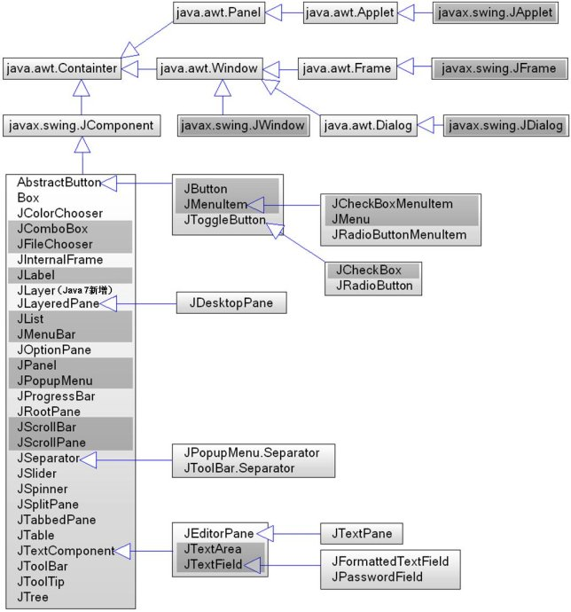

# swing和awt

swing和awt是JDK自带的图形界面库，swing曾经广泛用于企业级系统客户端，不过如今在企业级管理系统领域，客户端已被浏览器端取代。如今，仅有专业软件领域，部分使用swing开发。那么学习swing有什么用呢？网上很多人说学习swing没有，直接学xxxweb框架即可，我想说那些人根本不热爱编程，也不喜欢思考。swing尽管使用场景比较少了，但是它依然是一个设计良好，有很大学习价值的框架。编程是用来解决问题的，先不提操作系统，编译原理这些理论性强的东西，就我们常用的应用软件来说，除了web应用还有桌面应用，游戏等等。我们学习xx框架，除了满足业务需求外，最重要的是学习这个框架设计的思想，这种思想是可以用到任何领域，任何语言的。

除了swing外，Java还内置了一个新的库JavaFX，将在其他章节中介绍。

## awt和swing的产生

awt是基于窗口对等体实现的。因此有不同平台下，表现不同的缺点，而且为了控件的兼容性，不得不保持控件在一个所有平台的最大公约数上，就这很影响跨平台。因此swing产生了，swing不使用窗口对等体，而是重新绘制的，因此不依赖于特定平台的窗体控件，具有良好的跨平台性。

这里要注意，swing是在awt之上开发的，例如swing的JFrame继承了awt的Frame。使用swing的过程中，也同样要使用到awt包的api。

# swing和awt的继承层次

注：图片来自网络
