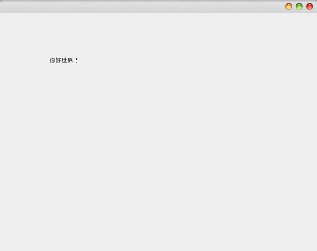
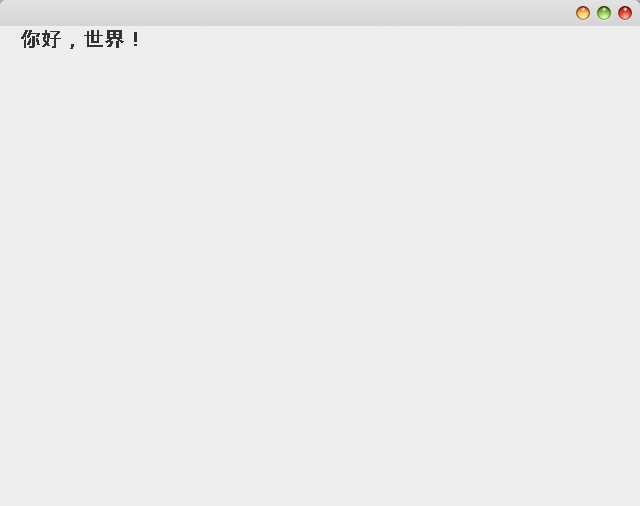
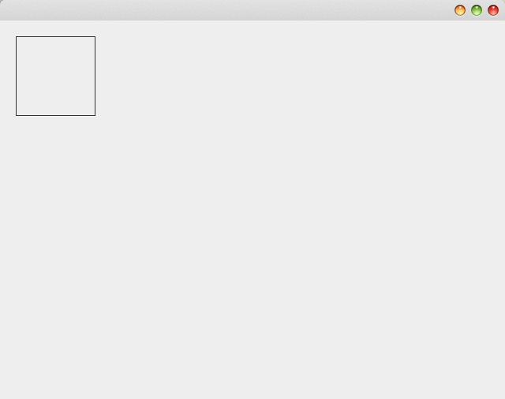
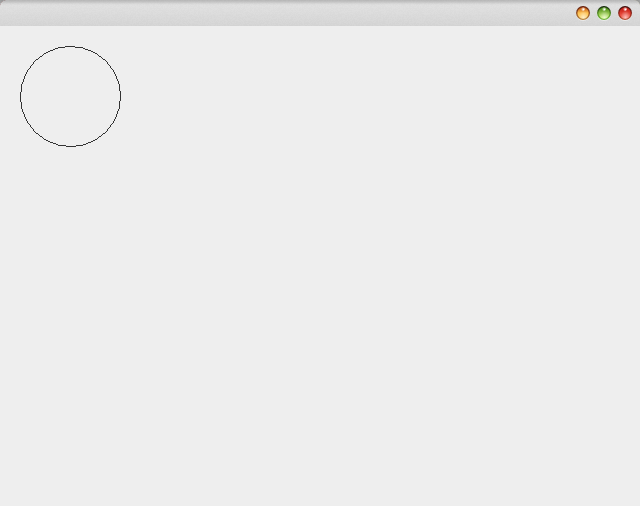
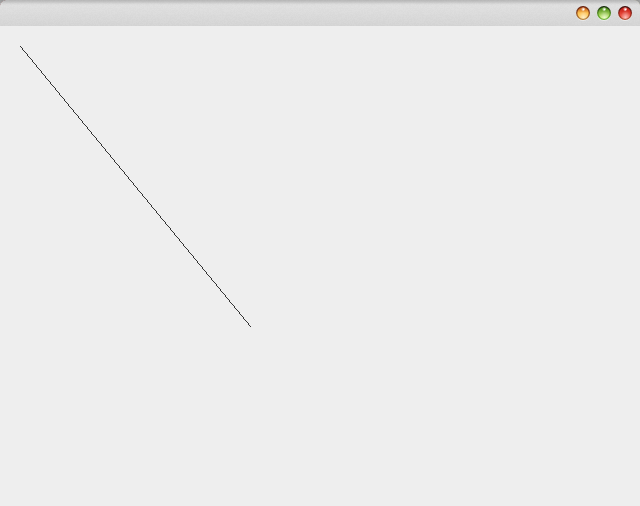
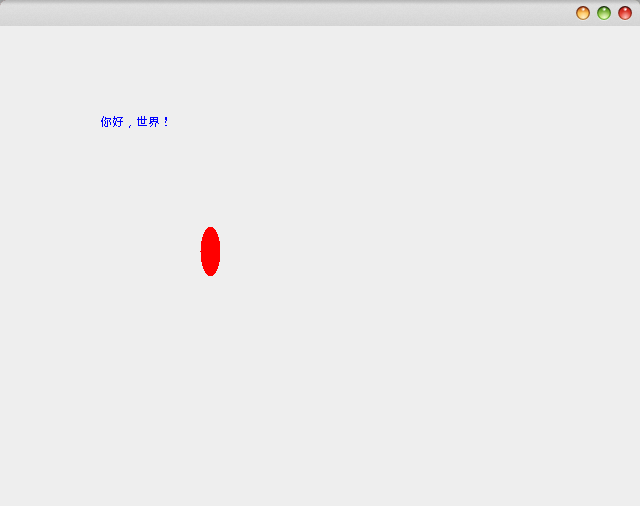
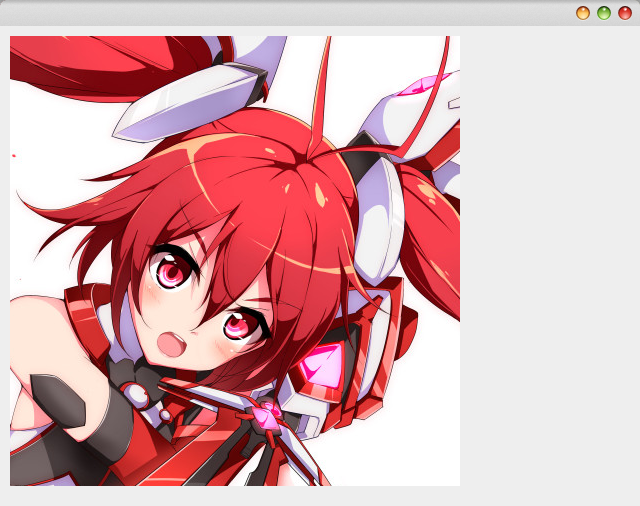

# Java2D库

Java2D库实现了功能强大的2D图形绘制API。我们这里使用扩展`JComponent`的方式，介绍如何使用Graphics2D绘制2D图形。代码框架如下：

```java
class MyComponent extends JComponent
{
	@Override
	protected void paintComponent(Graphics g)
	{
		Graphics2D graphics2D = (Graphics2D) g;
		//绘制我们的图形
	}

	@Override
	public Dimension getPreferredSize()
	{
		return new Dimension(640, 480);
	}
}
```

我们重写了`JComponent`的绘制（paintComponent）和获得预定义大小（getPreferredSize）函数，外层将`MyComponent`放入`JFrame`中即可。我们实验的就是`Graphics2D`这个类。Java2D库采用面向对象的方式将各种几何图形组织了起来，常用的包括：

* Line2D 直线
* Rectangle2D 矩形
* Ellipse2D 椭圆

他们实现了都Shape接口。

# 绘制形状

## 绘制文字

```java
graphics2D.drawString("你好世界！", 100, 100);
```

使用`drawString`函数，参数传入文字和坐标。

运行结果：



### 设置字体和大小

```java
Font font = new Font("Sans", Font.BOLD, 20);
graphics2D.setFont(font);
graphics2D.drawString("你好，世界！", 20, 20);
```

我们可以直接指定字体名称，或者从流加载。

运行结果：



## 画一个矩形

```java
Rectangle2D rectangle2D = new Rectangle2D.Double(20, 20, 100, 100);
graphics2D.draw(rectangle2D);
```

`Rectangle2D`构造函数传入坐标和长宽，调用`draw()`即可绘制。

注意`Rectangle2D.Double`，实际上还有一个`Rectangle2D.Float`，这两个画的都是矩形，但是我们知道绘图时一般都使用单精度浮点数，Graphics2D也是如此，但是这就带来了类型转换的麻烦，因此Graphics2D提供了double版的`Rectangle2D`供我们使用，类型转换在其内部实现了。

运行结果：



## 画一个圆形

```java
Ellipse2D ellipse2D = new Ellipse2D.Double(20, 20, 100, 100);
graphics2D.draw(ellipse2D);
```

构造函数传入的参数和矩形完全相同，只不过绘制的是矩形的内切圆。

运行结果：



## 画一条直线

```java
Line2D line2D = new Line2D.Double(20, 20, 250, 300);
graphics2D.draw(line2D);
```

传入参数为起始点和终止点坐标。

运行结果：



## 获得图形对象的属性

当然，`Rectangle2D`等对象都提供了若干`get`方法获取其关键的属性，这里就不一一介绍了。

# 使用颜色

Graphics2D预定义了一系列颜色，例如`Color.RED`等，我们也可以实例化Color对象，定义自己的颜色。

## 画笔颜色和填充颜色

```java
graphics2D.setPaint(Color.blue);
graphics2D.drawString("你好，世界！", 100, 100);

graphics2D.setPaint(new Color(255, 0, 0));
Ellipse2D ellipse2D = new Ellipse2D.Double(200, 200, 20, 50);
graphics2D.fill(ellipse2D);
```

`setPaint()`函数可以设置一个画笔颜色，注意：这个函数的参数为`Paint`，但是`Color`类实现了`Paint`。设置画笔颜色后，绘制的图形就是新设置的颜色了。

`fill()`函数传入一个`Shape`类型的参数，会为这个图形指定填充颜色。

运行结果：



## 背景颜色

如果我们继承的是`JComponent`，绘制背景颜色时就不得不自己画一个大矩形充当背景了，如果我们继承`JPanel`，可以直接对JPanel对象设置背景颜色：

```java
void setBackground(java.awt.Color bg)
```

这里要注意，如果覆盖了`JPanel`的`paintComponent`方法，方法里要调用`super.paintComponent(g)`才能让背景颜色设置生效。

## 绘制图像

绘制图像需要一个`BufferedImage`，可以通过`ImageIO`从文件中读取，非常简单。

```java
try
{
  Image image = ImageIO.read(new File("1.png"));
  graphics2D.drawImage(image, 10, 10, null);
}
catch (IOException e)
{
  e.printStackTrace();
}
```

运行结果：


