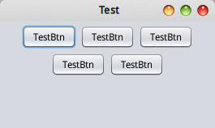
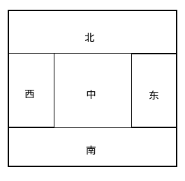
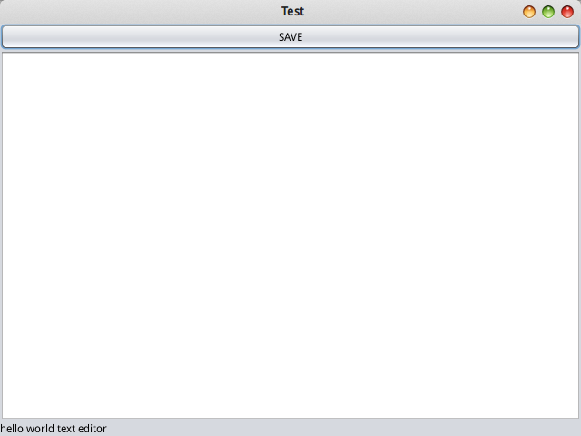
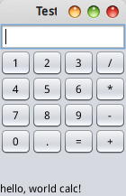

# 布局管理器

尽管swing有window builder等工具可以自动生成界面代码，但是了解具体其实现还是比较重要的。界面上除了控件，一个最重要的部分就是布局管理。

本篇笔记我们使用若干按钮，对布局进行讲解。

## 流式布局 FlowLayout

```java
JFrame jFrame = new JFrame("Test");
jFrame.setDefaultCloseOperation(WindowConstants.EXIT_ON_CLOSE);

JPanel jPanel = new JPanel();
JButton jButton1 = new JButton("TestBtn");
JButton jButton2 = new JButton("TestBtn");
JButton jButton3 = new JButton("TestBtn");
JButton jButton4 = new JButton("TestBtn");
JButton jButton5 = new JButton("TestBtn");
jPanel.add(jButton1);
jPanel.add(jButton2);
jPanel.add(jButton3);
jPanel.add(jButton4);
jPanel.add(jButton5);

jFrame.add(jPanel);
jFrame.pack();

jFrame.setVisible(true);
```

运行结果（注意，两张图是同一个程序，我们通过拖动改变了窗口大小）：




上面代码创建了5个按钮，放入JPanel。实际上，JPanel默认使用流式布局，我们看到的效果就是流式布局的效果。我们也可以通过`setLayout()`显示指定布局。

显示指定流式布局例子：
```java
jPanel.setLayout(new FlowLayout(FlowLayout.CENTER, 20, 20));
```

初始化FlowLayout，第一个参数是对齐模式，后两个参数是横向和纵向的间隔。

## 边框布局 BorderLayout

边框布局是JFrame的默认布局。它的布局模式如下：



我们安排组件时，需要指定布局管理器的方向。

使用边框布局的例子：

```java
JFrame jFrame = new JFrame("Test");
jFrame.setDefaultCloseOperation(WindowConstants.EXIT_ON_CLOSE);

jFrame.add(new JButton("SAVE"), BorderLayout.NORTH);
jFrame.add(new JTextArea(), BorderLayout.CENTER);
jFrame.add(new JLabel("hello world text editor"), BorderLayout.SOUTH);
jFrame.pack();

jFrame.setSize(640, 480);

jFrame.setVisible(true);
```

运行结果：



上面代码十分简单，我们我们使用`add()`添加组件时，同时指定了布局管理器的方向，JFrame默认使用边框布局，因此指定的方向能够生效。

## 网格布局 GridLayout

网格布局，或者叫表格布局，其实就是给父组件指定一个表格，我们的控件按顺序依次填进这个表格即可。

网格布局例子：

```java
JFrame jFrame = new JFrame("Test");
jFrame.setDefaultCloseOperation(WindowConstants.EXIT_ON_CLOSE);

JTextField jTextField = new JTextField();
jFrame.add(jTextField, BorderLayout.NORTH);

JLabel jLabel = new JLabel("hello, world calc!");
jFrame.add(jLabel, BorderLayout.SOUTH);

JPanel jPanel = new JPanel();
jPanel.setLayout(new GridLayout(5, 4));

JButton jButton1 = new JButton("1");
JButton jButton2 = new JButton("2");
JButton jButton3 = new JButton("3");
JButton jButton4 = new JButton("4");
JButton jButton5 = new JButton("5");
JButton jButton6 = new JButton("6");
JButton jButton7 = new JButton("7");
JButton jButton8 = new JButton("8");
JButton jButton9 = new JButton("9");
JButton jButton0 = new JButton("0");
JButton jButtonDot = new JButton(".");
JButton jButtonPlus = new JButton("+");
JButton jButtonMinus = new JButton("-");
JButton jButtonMulti = new JButton("*");
JButton jButtonDiv = new JButton("/");
JButton jButtonEqu = new JButton("=");

jPanel.add(jButton1);
jPanel.add(jButton2);
jPanel.add(jButton3);
jPanel.add(jButtonDiv);

jPanel.add(jButton4);
jPanel.add(jButton5);
jPanel.add(jButton6);
jPanel.add(jButtonMulti);

jPanel.add(jButton7);
jPanel.add(jButton8);
jPanel.add(jButton9);
jPanel.add(jButtonMinus);

jPanel.add(jButton0);
jPanel.add(jButtonDot);
jPanel.add(jButtonEqu);
jPanel.add(jButtonPlus);

jFrame.add(jPanel, BorderLayout.CENTER);
jFrame.pack();

jFrame.setVisible(true);
```

运行结果：



这个例子的代码非常冗长，但是却很简单。JFrame使用边框布局，添加了JTextField，JPanel，和JLabel控件。JPanel中，使用网格布局添加了若干按钮。

注意网格布局中，控件添加的顺序，是从左到右，从上到下的。

总的来说，这个写起来就非常恶心了，我们仅仅是布局，还没指定按钮的Action。通常这样的界面建议使用window builder等工具拖出来比较好，或者想办法编写一个自动添加按钮和Action的函数。这里也不得不提一下JavaFX，能够使用fxml（类似html）文件配合Scene Builder进行布局，以及使用css指定样式是多么方便。

## 更复杂的布局

实际上，上面介绍的几种布局可能并不能完全解决我们的问题，我们通常需要大量嵌套使用多种布局，但是代码就实在太难写了。这种情况下最好使用图形化的布局编辑器。

* Eclipse可以使用window builder，这个插件能够生成良好的布局java源代码
* NetBeans内置了swing的设计器生成界面文件的java代码，netbeans的一个优点是可以在官网找到该IDE详细的中文使用教程
* Intellij IDEA专业版也内置了swing的设计器，它能够直接生成界面文件的字节码，IDEA有最新最好的使用文档，但是基本只有英文的
