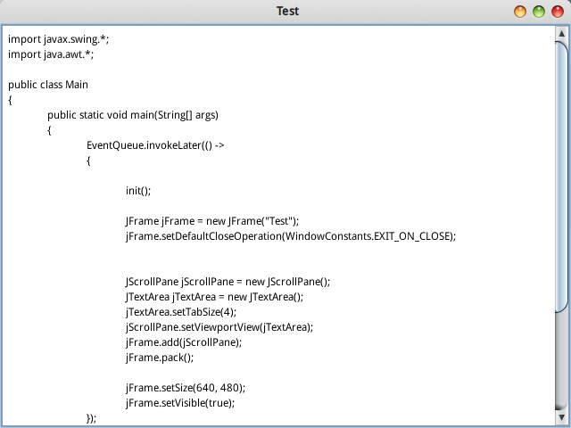
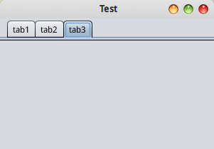

# swing Pane 子窗格控件

Pane是一类独立的控件，中文通常翻译为窗格。窗格中可以容纳另一个或多个组件，实现滚动条，标签页等效果。实际上就这个滚动条而言，JScrollPane设计的就很有争议，因为类似JList这样的控件，显然应该默认带有滚动条，但是swing并没有这样设计，JList必须结合JScrollPane才能实现滚动条，虽然看上去更符合面向对象的设计规范，但我也觉得这样做有点过度设计，显然给程序员带来了麻烦。

swing中，有这样几种Pane：JSplitPane，JScrollPane，JTabbedPane，JLayeredPane，JDesktopPane。我们这里介绍前两种，后几种不太常用，但是Pane的用法基本都相同，需要时查阅文档即可。

## JScrollPane 滚动条页

JScrollPane用来实现滚动条。我们直接看一个例子：

```java
JScrollPane jScrollPane = new JScrollPane();
JTextArea jTextArea = new JTextArea();
jTextArea.setTabSize(4);
jScrollPane.setViewportView(jTextArea);
jFrame.add(jScrollPane);
jFrame.pack();
```

运行结果：



上面代码只是和JScrollPane有关的一小部分，但是足以说明问题了。我们创建了一个JTextArea，但是我们直接使用的话，它是没有滚动条的，这里就不贴没有滚动条的图了。因此我们又创建了一个JScrollPane，将JTextArea控件添加到JScrollPane中，当文本框中的数据行数超过其高度时，滚动条就出现了。

* `void setViewportView(Component view)` 这个方法把一个控件添加到JScrollPane中。

除了文本域，所有继承JComponent的控件也都能使用JScrollPane。

## JTabbedPane 标签页

标签页也比较常用。我们来看标签页的实现代码：

```java
JTabbedPane jTabbedPane = new JTabbedPane();
JPanel jPanel1 = new JPanel();
JPanel jPanel2 = new JPanel();
JPanel jPanel3 = new JPanel();
jTabbedPane.addTab("tab1", jPanel1);
jTabbedPane.addTab("tab2", jPanel2);
jTabbedPane.addTab("tab3", jPanel3);
jFrame.add(jTabbedPane);
jFrame.pack();
```

运行结果：



上面代码创建了一个JTabbedPane，然后使用`addTab()`函数添加了若干了JPanel。实际上，我们向标签页添加的组件通常都是JPanel，因为JPanel还能容纳其他组件。

* `void addTab(String title, Component component)` 添加标签，第一个参数是标签的名字，第二个参数是标签页的组件。
