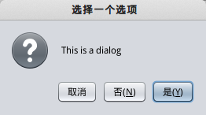
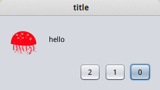
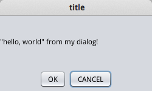
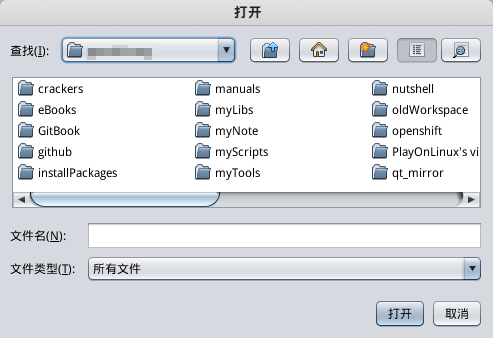

# swing对话框

一个完整的桌面程序通常有一个主界面，和若干对话框。本篇笔记记录swing中各种对话框的使用。

对话框从界面效果上可以分为：

* 模态对话框 用户不关闭这个对话框就不能在主界面上操作
* 非模态对话框 用户不关闭这个对话框也能在主界面上操作

从功能上可以分为：

* 实现简单的通知、确认等功能的对话框
* 实现文件选择的文件对话框
* 实现复杂功能的自定义对话框

## 使用JOptionPane弹出对话框

### 一个简单的例子

JOptionPane是一个很方便的工具类，能够弹出一个简单的对话框，并接受用户返回值，而不需要编写对话框界面的代码。下面演示一下JOptionPane的使用：

```java
JFrame jFrame = new JFrame("Test");
jFrame.setDefaultCloseOperation(WindowConstants.EXIT_ON_CLOSE);

JButton jButton = new JButton("TestBtn");
jFrame.add(jButton);
jFrame.pack();

jButton.addActionListener((e)->{
  int resultState = JOptionPane.showConfirmDialog(jButton, "This is a dialog");
  System.out.println(resultState);
});

jFrame.setVisible(true);
```

运行结果：



我们在JFrame上创建了一个按钮，按钮点击就会用JOptionPane弹出一个确认对话框（ConfirmDialog）。`resultState`则是确认对话框的返回值。

在这里，显然JOptionPane提供的对话框都是模态对话框，因为show方法都具有返回值，该方法会阻塞直到用户关闭模态对话框，最后把用户的操作作为返回值返回。

### JOptionPane提供的对话框

一个对话框通常有标题，图标，一个消息字符串，和一个或若干按钮组成。如图所示，是一个Nimbus观感下的OptionDialog：



上图中，标题为title，消息是hello，图标是我们自定义的。

下面我们详细看一下JOptionPane中可用的的对话框。

* MessageDialog 只有一个确定按钮，无返回值
* ConfirmDialog 有是，否，取消三个按钮，返回值分别是int类型的0,1,2
* OptionDialog 选择对话框，需要传入数组类型的选项，Nimbus观感下，所有选项都会以按钮形式展示出来，返回值是数组索引
* InputDialog 输入框，有一个文本框接收输入信息，返回值是输入的字符串

### 对话框图标

图标可以使用默认的，或者自定义，但是不同观感下，默认图标可能不同。show对话框的方法有多个重载供我们选择。默认图标由对话框的消息类型决定，可用的消息类型：

* JOptionPane.ERROR_MESSAGE 错误消息，通常是一个红色的大叹号或大叉
* JOptionPane.INFORMATION_MESSAGE 通知消息
* JOptionPane.WARNING_MESSAGE 警告消息
* JOptionPane.QUESTION_MESSAGE 询问消息
* JOptionPane.PLAIN_MESSAGE 该类型没有图标

### 对话框显示的消息

我们编码时会注意到，show方法参数传入的消息的Object类型，其实消息可以是：

* String 消息字符串
* Icon 显示一个图标
* Component 显示组件
* Object[] 显示数组中所有对象，依次叠加
* 其他类型 显示该类的toString()结果

通常我们都是用String类型的消息，当然某些情况下，Component类型的消息可能更加适用。

### ConfirmDialog的按钮

我们可以设置ConfirmDialog显示哪组按钮。

* JOptionPane.DEFAULT_OPTION 默认
* JOptionPane.YES_NO_OPTION 是/否按钮组
* JOptionPane.YES_NO_CANCLE_OPTION  是/否/取消按钮组
* JOptionPane.OK_CANCLE_OPTION 确认/取消按钮组

## 自定义对话框

虽然JOptionPane很方便，但是我们经常需要弹出一个比较复杂的自定义对话框，比如整个软件的设置界面对话框，里面可能包含大量按钮，文本框，列表，树状列表等。创建自定义对话框，需要继承JDialog类，和我们的应用程序继承JFrame是一样的。

### 使用自定义对话框的例子

```java
public class MyDialog extends JDialog
{
	public MyDialog(JFrame parent)
	{
		super(parent, "title", true);

		add(new JLabel("\"hello, world\" from my dialog!"), BorderLayout.CENTER);

		JPanel jPanel = new JPanel();

		JButton okButton = new JButton("OK");
		JButton cancelButton = new JButton("CANCEL");
		jPanel.add(okButton);
		jPanel.add(cancelButton);

		add(jPanel, BorderLayout.SOUTH);
		setSize(250, 150);
	}
}
```

调用自定义对话框：

```java
MyDialog myDialog = new MyDialog(jFrame);
myDialog.setVisible(true);
```

运行结果：



实际上自定义对话框非常简单，和使用JFrame一样。但是我们要注意对于对话框对象的管理，一种通常的做法是显示对话框就是`setVisible(True)`，关闭对话框`setVisible(False)`（点击关闭按钮会自动执行），应用启动时，提前初始化对话框类，作为JFrame的成员变量。当然这样做的缺点是可能影响启动速度，内存占用高等等，我们也可以采取别的做法。

关于对话框的关闭按钮行为，和JFrame一样，我们可以通过覆盖`setDefaultCloseOperation()`进行修改。

注意上面代码中的`super()`，我们传入了三个参数：

* 第一个参数是父组件
* 第二个参数是标题
* 第三个参数为是否是模态对话框

#### 对话框和应用交换数据

对于模态对话框，`setVisible(True)`是阻塞的。而非模态对话框则不是。考虑这样的情况：现在我们有一个实体类对象，对话框中的操作界面会修改该对象，而主界面则显示该对象的信息。那么我们修改完该对象后，如何通知主界面呢？

对于模态对话框比较简单，`setVisible(True)`返回后，刷新下主界面数据就行了。但是对于非模态对话框，可能就不得不用观察者模式了。

## 文件对话框

文件对话框也是很常用的，我们打开文件，保存文件都会用到。我们可以使用自定义对话框自己编写，但是这实在太麻烦了，我们似乎要编写一个简易的磁盘文件浏览器才行。但是由于这种需求非常常见，因此基本所有的GUI框架都提供了文件对话框。

* OpenDialog 用于打开文件的对话框
* SaveDialog 用于保存文件的对话框

下面我们来看一个简单的例子代码：

```java
JFileChooser jFileChooser = new JFileChooser();
int result = jFileChooser.showOpenDialog(jFrame);
if(result == JFileChooser.APPROVE_OPTION)
{
  String filename = jFileChooser.getSelectedFile().getAbsolutePath();
  System.out.println(filename);
}
```

运行结果：



上面代码打开了一个文件选择对话框，如果用户选择了文件，就读取这个文件的文件名，并打印到控制台上。

除此之外，文件对话框还有很多实用方法。我们可以设置基于文件后缀名的过滤，可以设置用户可以选择多个文件等。这里就不一一叙述了。

## 其他内置的对话框

文件选择器对话框很复杂，又很常用，因此swing提供了内置的文件对话框。实际上，swing还提供了颜色选择框JColorChooser。感兴趣的同学可以自己研究，这里就不叙述了。
