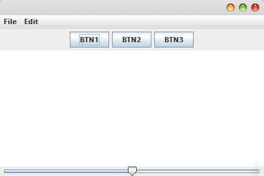
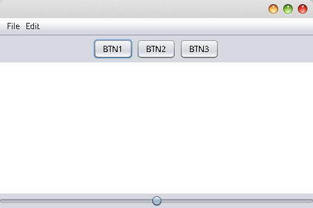
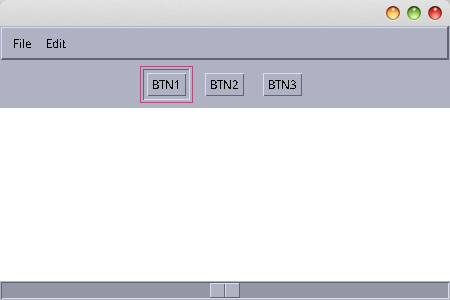
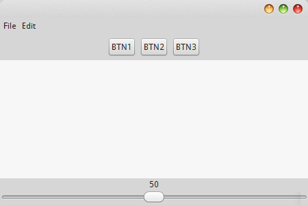
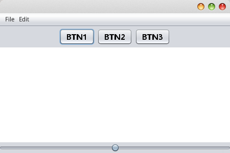

# LookAndFeel 观感

观感，说白了就是控件主题。写网页的时候，经常套个`BootStrap`之类的，swing也是同样道理，可以套用`LookAndFeel`。

JDK自带了一些观感，所有swing程序默认使用Metal观感，在不同平台上，自带的观感不同，我们可以用程序输出所有已经安装的观感。

## 显示所有已安装的观感

```java
UIManager.LookAndFeelInfo[] lookAndFeels = UIManager.getInstalledLookAndFeels();
for(UIManager.LookAndFeelInfo l : lookAndFeels)
{
  System.out.println(l.getName() + ":" + l.getClassName());
}
```

UIManager是一个工具类，可以用它获取已安装的观感。

我使用的操作系统是Ubuntu14.04，运行结果如下：

```
Metal:javax.swing.plaf.metal.MetalLookAndFeel
Nimbus:javax.swing.plaf.nimbus.NimbusLookAndFeel
CDE/Motif:com.sun.java.swing.plaf.motif.MotifLookAndFeel
GTK+:com.sun.java.swing.plaf.gtk.GTKLookAndFeel
```

## 设置观感

例如，我们把观感设为GTK+，还是使用UIManager即可。

```java
UIManager.setLookAndFeel("com.sun.java.swing.plaf.gtk.GTKLookAndFeel");
```

## 几种自带观感的对比

### Metal

```
javax.swing.plaf.metal.MetalLookAndFeel
```



### Nimbus

```
javax.swing.plaf.nimbus.NimbusLookAndFeel
```



### Motif

```
com.sun.java.swing.plaf.motif.MotifLookAndFeel
```



### GTK+

```
com.sun.java.swing.plaf.gtk.GTKLookAndFeel
```



## Linux下的swing程序字体锯齿问题

上面图片中，字体锯齿问题比较严重，很影响视觉效果，我们手动打开字体抗锯齿就好了。

```java
System.setProperty("awt.useSystemAAFontSettings", "on");  
System.setProperty("swing.aatext", "true");
```

其次我们可以调节一下字体。

调节默认字体的函数：
```java
public static void setUIFont(FontUIResource f)
{
  Enumeration<Object> keys = UIManager.getDefaults().keys();
  while (keys.hasMoreElements())
  {
    Object key = keys.nextElement();
    Object value = UIManager.get(key);
    if (value != null && value instanceof FontUIResource)
      UIManager.put(key, f);
  }
}
```

调用`setUIFont()`：
```java
setUIFont (new FontUIResource("微软雅黑",Font.BOLD,15));
```

注意，存储字体的是一个Map，我们向其中添加字体资源FontUIResource即可，如果未找到我们指定的字体资源，就会使用默认的。

实际上，打开抗锯齿后，使用默认的字体效果就足够好了。下面是Nimbus主题，开启抗锯齿，并且使用微软雅黑，粗体，15号字的显示效果：



有关设置观感，设置字体和抗锯齿，我封装了一个工具类，可以直接拷出来试用：

```java
import javax.swing.*;
import javax.swing.plaf.FontUIResource;
import java.util.Enumeration;
/**
*注意：在窗口初始化前调用
*/
public class GoodLookUtil
{

	public static void antiAliasing()
	{
		System.setProperty("awt.useSystemAAFontSettings", "on");
		System.setProperty("swing.aatext", "true");
	}

	public static void setNimbus()
	{
		try
		{
			UIManager.setLookAndFeel("javax.swing.plaf.nimbus.NimbusLookAndFeel");
		}
		catch (Exception e)
		{
			e.printStackTrace();
			throw new RuntimeException("set look and feel error");
		}
	}

	public static void setCDE()
	{
		try
		{
			UIManager.setLookAndFeel("com.sun.java.swing.plaf.motif.MotifLookAndFeel");
		}
		catch (Exception e)
		{
			e.printStackTrace();
			throw new RuntimeException("set look and feel error");
		}
	}

	public static void setGTKPlus()
	{
		try
		{
			UIManager.setLookAndFeel("com.sun.java.swing.plaf.gtk.GTKLookAndFeel");
		}
		catch (Exception e)
		{
			e.printStackTrace();
			throw new RuntimeException("set look and feel error");
		}
	}

	//调用示例：GoodLookUtil.setUIFont(new FontUIResource("微软雅黑",Font.PLAIN,15));
	public static void setUIFont(FontUIResource f)
	{
		Enumeration<Object> keys = UIManager.getDefaults().keys();
		while (keys.hasMoreElements())
		{
			Object key = keys.nextElement();
			Object value = UIManager.get(key);
			if (value != null && value instanceof FontUIResource)
				UIManager.put(key, f);
		}
	}
}
```
