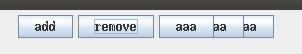

# 动态添加组件

GUI程序中，经常需要动态的添加或删除控件。在swing中，实现起来也是比较容易的。我们知道，swing的所有控件都继承自`java.awt.Container`，Container实现了添加和删除控件的方法。

## 添加删除按钮例子

下面直接看例子代码

```java
import javax.swing.*;
import java.awt.*;
import java.util.ArrayList;
import java.util.List;

public class Main
{
	public static void main(String[] args)
	{
		EventQueue.invokeLater(() -> {

			List<Component> componentList = new ArrayList<>();

			JFrame jFrame = new JFrame();

			JPanel jPanel = new JPanel();

			JButton addButton = new JButton();
			addButton.setText("add");
			jPanel.add(addButton);

			addButton.addActionListener((e) -> {
				JButton newJButton = new JButton();
				newJButton.setText("aaa");
				jPanel.add(newJButton);
				componentList.add(newJButton);

				jPanel.revalidate();
			});

			JButton removeButton = new JButton();
			removeButton.setText("remove");
			jPanel.add(removeButton);

			removeButton.addActionListener((e) -> {
				if (componentList.size() > 0)
				{
					jPanel.remove(componentList.get(componentList.size() - 1));
					componentList.remove(componentList.size() - 1);

					jPanel.setVisible(false);
					jPanel.setVisible(true);
//					jPanel.revalidate();
				}
			});

			jFrame.add(jPanel);
			jFrame.pack();
			jFrame.setDefaultCloseOperation(WindowConstants.EXIT_ON_CLOSE);
			jFrame.setVisible(true);
		});
	}
}
```

上面代码中，设置了两个按钮，一个按钮负责添加，一个按钮负责删除。被添加和删除的控件也是按钮，它们被维护在一个ArrayList中。

注意：单纯的添加或删除后，界面上不会有任何改变，因为我们需要手动调用重绘方法`revalidate()`。但是这里我遇到了一个问题，删除控件时，`revalidated()`的效果不正确。如下图：



具体原因不明，可能是实现上有bug。测试的操作系统是Ubuntu16.04，桌面环境是Unity。

因此，我尝试了另一种更原始的方法，把JPanel先隐藏再显示，这样就会强制JPanel重绘，结果则是正常的。
