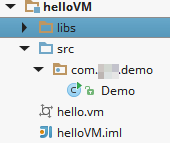
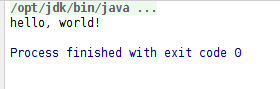
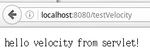
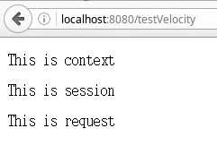

# 什么是velocity

velocity是apache开发的一个基于Java的模板引擎，通过velocity特定的语法VTL，能够在一段文本（模板）中引用Java对象的属性，以达到模板+数据模型（Java对象）生成特定文本的目的。将模板引擎用于web开发，能够实现Java代码从显示的页面中分离，便于界面设计人员和Java程序员的分工。

和JSP相比，velocity用途更加广泛，在许多需要模板的地方都可以使用velocity，而在web开发中，velocity有更简洁易用的语法，适合与美工人员协同开发，遇到较复杂的网页布局，这种优势就会更加明显。

关于Velocity，Apache官方页面[http://velocity.apache.org/可以下载velocity](http://velocity.apache.org/可以下载velocity) engine和velocity tools，同时可以在此查阅文档和英文的使用入门。

本教程主要讨论将velocity用于网页模板，开发工具使用Intellj idea 14，并使用Maven管理工程的依赖，读者事先应了解JavaWeb相关知识，并掌握一种相关开发工具。

# Hello World

先写一个最简单的例子，读取一个Velocity模板文件，然后输出通过模板生成的内容。如图所示，这里创建一个普通的Java工程，然后在工程的根目录创建一个hello.vm。

在工程根目录创建一个libs文件夹，从apache官网下载的velocity、velocity-tools压缩包内lib目录下的jar包拷入我们的libs文件夹。然后将其全部加入build path。



在这里编写一个Demo类。

```java
package com.ciyaz.demo;

import org.apache.velocity.Template;
import org.apache.velocity.VelocityContext;
import org.apache.velocity.app.VelocityEngine;

import java.io.StringWriter;

public class Demo
{
   public static void main(String[] args) throws Exception
   {
      VelocityEngine ve = new VelocityEngine();
      Template template = ve.getTemplate("helloVM/hello.vm");
      VelocityContext velocityContext = new VelocityContext();

      velocityContext.put("txt", "hello, world!");

      StringWriter stringWriter = new StringWriter();
      template.merge(velocityContext, stringWriter);

      System.out.println(stringWriter.toString());
   }
}
```

代码中首先初始化一个velocity引擎，并载入一个`.vm`文件，vm就是velocity模板文件的标准后缀，初始化velocity上下文，将一个叫做`hello, world!`的字符串以一个名为`txt`的键，加入velocity上下文中，然后输出最终结果。

hello.vm的内容为`$txt`

输出结果



可以看到，`hello，world！`字符串通过键值替换了vm中的`$txt`，最终输出结果为`hello，world！`

# Servlet+velocity环境搭建和Demo

下面将正式介绍velocity在web开发中的应用。我们将使用velocity作为视图模板，进行网页内容的展示。

首先搭建一个Java Web工程，这里处于简单起见，我们直接使用Maven的maven-archetype-webapp生成项目骨架，将tomcat的运行环境添加到项目中，然后在pom.xml中添加velocity的依赖。

```xml
<dependency>
   <groupId>org.apache.velocity</groupId>
   <artifactId>velocity</artifactId>
   <version>1.7</version>
</dependency>

<dependency>
   <groupId>org.apache.velocity</groupId>
   <artifactId>velocity-tools</artifactId>
   <version>2.0</version>
</dependency>
```

web.xml配置如下内容
```xml
<?xml version="1.0" encoding="UTF-8"?>
<web-app xmlns:xsi="http://www.w3.org/2001/XMLSchema-instance"
         xmlns="http://java.sun.com/xml/ns/javaee"
         xsi:schemaLocation="http://java.sun.com/xml/ns/javaee http://java.sun.com/xml/ns/javaee/web-app_3_0.xsd"
         id="WebApp_ID" version="3.0">
  <display-name>Demo VM</display-name>
   <servlet>
      <servlet-name>velocity</servlet-name>
      <servlet-class>org.apache.velocity.tools.view.VelocityViewServlet</servlet-class>
   </servlet>
   <servlet-mapping>
      <servlet-name>velocity</servlet-name>
      <url-pattern>*.vm</url-pattern>
   </servlet-mapping>
</web-app>
```

由上述配置可以观察到，我们配置了一个velocity-tools提供的VelocityViewServlet，并拦截了所有对于`.vm`文件的请求。我们可以打开该servlet的源码观看，其实现的功能其实就是拦截对velocity模板的请求，然后读取相应模板，并调用velocity-engine进行输出。因此我们大可不必自己实现一个同样的servlet，用第一节hello world的方式操作velocity engine和velocity上下文。

这里我们编写一个简单的Servlet进行简单的验证。
```java
package com.ciyaz.web.controller;

import javax.servlet.ServletException;
import javax.servlet.annotation.WebServlet;
import javax.servlet.http.HttpServlet;
import javax.servlet.http.HttpServletRequest;
import javax.servlet.http.HttpServletResponse;
import java.io.IOException;

@WebServlet(name = "TestServlet", urlPatterns = "/testVelocity")
public class TestServlet extends HttpServlet
{
   protected void doPost(HttpServletRequest request, HttpServletResponse response) throws ServletException, IOException
   {
      doGet(request, response);
   }

   protected void doGet(HttpServletRequest request, HttpServletResponse response) throws ServletException, IOException
   {
      request.setAttribute("txt", "hello velocity from servlet!");
      request.getRequestDispatcher("/WEB-INF/views/test.vm").forward(request, response);
   }
}
```

代码中，我们仅仅是向request域中放入了一个叫做`txt`的属性，然后指定了vm视图的路径，和使用JSP视图做法是一样的。

在/WEB-INF/views下，创建一个test.vm，内容如下
```html
<!DOCTYPE html>
<html lang="zh">
<head>
   <meta charset="UTF-8">
   <title>Test Velocity</title>
</head>

<body>
   <p>$txt</p>
</body>
</html>
```

和helloworld中做法一样，使用`$txt`输出内容，有所不同的是这里还添加个标准的HTML格式。

启动服务器访问servlet，可以观察到输出结果。



观察网页的源代码：
```html
<!DOCTYPE html>
<html lang="zh">
<head>
   <meta charset="UTF-8">
   <title>Test Velocity</title>
</head>

<body>
<p>hello velocity from servlet!</p>
</body>
</html>
```

通过查看网页源代码，可以看到输出的全部html代码。`$txt`被我们指定的字符串`hello velocity from servlet!`替代。

除了request域，我们还经常使用session输出登录用户，因此还可以试验下除了request域，在其他域中添加属性是否能够正常输出。在servlet中添加以下内容：

```java
this.getServletContext().setAttribute("context", "This is context");
request.getSession().setAttribute("session", "This is session");
request.setAttribute("request", "This is request");
request.getRequestDispatcher("/WEB-INF/views/test.vm").forward(request, response);
```

在test.vm中加入`$context`、`$session`、`$request`，输出结果：



可以发现，和JSP的EL效果是一样的。
