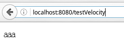

# VTL语法

## 注释

单行注释为 `##`，多行注释为`#* *#`，被注释的内容不会被模板引擎解析，和JSP注释效果相同，这里应和HTML注释加以区分。
除此之外还有文档注释。

```
#**
*@author xxx
*@version 5
*#
```

和Java的标准文档注释比较类似。

## 变量、属性、方法的引用

VTL可以对变量、属性、方法进行引用。

显示输出一个变量时，输出它的toString方法。这和System.out.print()类似。输出一个属性时，该属性必须是可访问的，或者其get方法是可访问的，引用一个方法则会显示该方法的输出结果。

一个输出的例子：

这里定义了一个叫做User的JavaBean

```java
package com.ciyaz.domain;

public class User
{
   private String username;
   private String password;

   public User(String username, String password)
   {
      this.username = username;
      this.password = password;
   }

   public String getUsername()
   {
      return username;
   }

   public void setUsername(String username)
   {
      this.username = username;
   }

   public String getPassword()
   {
      return password;
   }

   public void setPassword(String password)
   {
      this.password = password;
   }

   public String sayHello()
   {
      return "Hello, I am " + this.username + ".";
   }

   @Override
   public String toString()
   {
      return "User{" +
            "username='" + username + '\'' +
            ", password='" + password + '\'' +
            '}';
   }
}
```

下面我们分别输出该对象的一个实例，属性，和sayHello()方法，这里省略了Servlet的代码，请读者自行编写。vm文件内容如下：

```html
<!DOCTYPE html>
<html lang="zh">
<head>
   <meta charset="UTF-8">
   <title>Test Velocity</title>
</head>

<body>
   <p>$user</p>
   <p>$user.password</p>
   <p>$user.sayHello()</p>
</body>
</html>
```

浏览器内分别输出了user.toString()、user.password、user.sayHello()


## `#set()`的用法

除了可以像`$user`这样引用一个对象实例，还可以用`#set()`在模板上下文中设置一个对象。

```
#set($person = "Tom")
$person
```


还可以设置一个List或Map对象，可以调用其get()、isEmpty()等方法

```html
#set($l=["a", "b", "c"])
#set($s={"a":"aaa", "b":"bbb", "c":"ccc"})
<p>$l.get(1)</p>
<p>$l.isEmpty()</p>
<p>$s.get("a")</p>
```

输出结果


当然也可以通过这种方式对List和Map进行访问。
```html
#set($l=["a", "b", "c"])
#set($s={"a":"aaa", "b":"bbb", "c":"ccc"})
<p>$l[1]</p>
<p>#set($l[1]="d")</p>
<p>$l[1]</p>
<p>$s["a"]</p>
```

对于$user.password这种形式的写法，也可能是从一个叫做user的Map中取出一个键为”password”的对象，velocity引擎会自动进行判断。例子如下：

```java
Map<String, User> userMap = new HashMap<>();
userMap.put("tom", new User("Tom", "456"));
request.setAttribute("userMap", userMap);
```

vm文件
```html
<p>$userMap.tom</p>
```

输出结果


引用方法时也可以传入参数。参数可以是另一个对象。例子如下，这里我们从Servlet传入一个叫Bob的User对象，然后把名字改为Hello：

```html
<p>$user</p>
<p>#set($name = "Hello")</p>
<p>$user.setUsername($name)</p>
<p>$user.sayHello()</p>
```

输出结果


对于传入的基本类型int等，velocity会自动进行隐式类型转换。

有时候`$xxx`需要和其他的字符连在一起，比如`$xxxyyy`，我们要输出的变量是`xxx`，但此时和后面的内容连在了一起，此时在待输出的变量套上一个大括号即可，例子如下

```html
#set($x="xxx")
<p>${x}yyy</p>
```


对于方法调用或属性引用也是一样

```html
#set($x=["xxx"])
<p>${x.get(0)}yyy</p>
```


velocity中如果输出一个上下文中不存在的变量，如`$name`，模板引擎会直接原样输出`$name`，这通常不是我们想要的，`$!name`则表示如果name不存在，就什么都不显示。

例子如下：
```html
#set($name1="Tom")
<p>$name1</p>
<p>$!name1</p>
<p>$name2</p>
<p>$!name2</p>
```


如果模板原文需要输出可能因其歧义的关键字符如$，加上转义字符即可，例子如下
```html
#set($a="aaa")
<p>$a</p>
<p>\$a</p>
<p>\\$a</p>
<p>\\\$a</p>
<p>\\\\$a</p>
```


最后还有一点要尤其注意，velocity中如果一个变量被设置为null，原来的只并没有被null覆盖。例子如下，setNull()返回null：

```html
#set($a="aaa")
#set($a=$nullMethod.setNull())
<p>$a</p>
```



这在执行判断逻辑时，尤其容易犯错，应注意避免。

## 判断逻辑`#if()...elseif()...else...#end`的用法

判断逻辑比较简单，和Java的判断比较类似，判断成功则输出相应内容，看一个例子：

```html
#set($a = 10)

#if($a > 0)
   <p>bigger than 0</p>
#elseif($a > 5)
   <p>bigger than 5</p>
#elseif($a == 10)
   <p>equals to 10</p>
#elseif($a > 100)
   <p>bigger than 100</p>
#else
   <p>others</p>
#end
```

输出结果


判断只能比较相同类型的变量，如果==两端变量类型不同，则直接返回false。对于字符串类型，字符串内容相同则返回true。对于由servlet传入的类型，比如一个叫做User的JavaBean，比较实际上是调用其equals()方法，所以如果可以通过重写User的equals()和hashCode()方法改变该判断的行为。

```html
#set($a="aaa")
#set($b="aaa")
#if($a==$b)
   <p>true</p>
#end
```


判断逻辑同样可以使用Java中的`&& || !`进行逻辑的组合。

## 循环逻辑`#foreach($xxx in $xxxList)...#end`的用法

和Java相同，循环可以使用foreach。用foreach迭代输出List和Map

```html
#set($list = ["a", "b", "c"])
#set($map = {"a":"aaa", "b":"bbb", "c":"ccc"})

<ul>
   #foreach($l in $list)
      <li>$l</li>
   #end
</ul>

<ul>
   #foreach($m in $map)
      <li>$m</li>
   #end
</ul>

<ul>
   #foreach($m in $map.keySet())
      <li>$m : $map.get($m)</li>
   #end
</ul>
```

结果如图：


迭代的过程中，velocity给定了一个变量velocityCount来记录迭代次数。当然你也可以自己定义一个变量进行记录。同时还有一个velocityHasNext可以用来判定迭代是否完成。例子如下：

```html
#set($list = ["a", "b", "c"])

<ul>
   #foreach($l in $list)
      <li>$velocityCount</li>
      <li>$l</li>
      <li>$velocityHasNext</li>
   #end
</ul>
```


我们可以利用velocityCount产生格行变色的效果。

```html
<table border="1">
   #foreach($user in $userList)
      <tr style="background-color:

      #if($velocityCount%2==0)
         #c3f3c3
      #else
         #f3c3f3
      #end

      ;">
         <td>$user.username</td>
         <td>$user.password</td>
      </tr>
   #end
</table>
```

效果如下：


不过通常建议应该由CSS和JS进行布局外观的控制控制。

## `#include()`和`#parse()`

`#include()`和`#parse()`都是用于引入一段文本文件，但`#include()`引入的文本不会被模板引擎渲染，`#parse()`则引入一段可以被渲染的文本。

WEB-INF/views/module.vm
```html
#set($list=["aaa", "bbb", "ccc"])
<ul>
   #foreach($l in $list)
      <li>$l</li>
   #end
</ul>
```

/WEB-INF/views/test.vm
```html
#include("/WEB-INF/views/module.vm")
#parse("/WEB-INF/views/module.vm")
```

结果如图：


`#include()`和`#parse()`的参数是包含资源文件路径的字符串，可以不止一个一个参数，例如`#include(“module1.vm”, “module2.vm”)`。

## `#stop`停止解析

该指令可以停止模板引擎，主要用于调试。模板引擎停止后，不会输出任何后面的内容。例子如下：

```html
#set($list=["aaa", "bbb", "ccc"])
<ul>
   #foreach($l in $list)
      <li>$l</li>
      #stop
      <li>$l</li>
   #end
</ul>
<p>test</p>
```


## 宏定义

熟悉C语言就应该知道宏定义的用途，C语言中宏定义就是文本的替换，可以用来设定常量，甚至将一些函数封装到宏定义。velocity的宏定义也是文本替换，但写法则更类似于直接定义函数。

例子如下：

```html
#macro(show_table $list)
   <table border="1">
      #foreach($l in $list)
         <tr>
            <td>$l</td>
         </tr>
      #end
   </table>
#end

#set($list = ["aaa", "bbb", "ccc", "ddd"])
#show_table($list)
```

结果如图：


通过宏定义，我们可以把一些公用的部分抽取出来进行封装，重复利用。宏定义声明的参数可以是变量，List，Map，基本Java类型和字符串。
