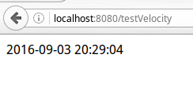
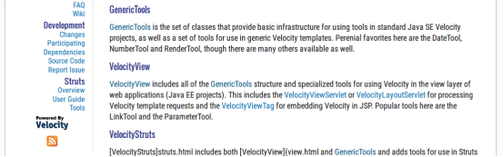
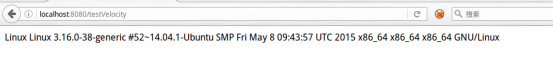

# toolbox.xml工具箱和自定义小工具

velocity-tools提供了很多实用的Java类，使用这些小工具前，需要在`web.xml`中配置`toolbox.xml`文件，在VelocityViewServlet后加入另一个参数：

```xml
<init-param>
   <param-name>org.apache.velocity.toolbox</param-name>
   <param-value>/WEB-INF/toolbox.xml</param-value>
</init-param>
```

这个参数指定了`toolbox.xml`的位置，通常我们把配置文件放在`WEB-INF`下。toolbox可以灵活配置一些apache预先提供的工具类。例子如下：

toolbox.xml
```xml
<?xml version="1.0" encoding="UTF-8"?>
<toolbox>
   <tool>
      <key>date</key>
      <scope>request</scope>
      <class>org.apache.velocity.tools.generic.DateTool</class>
      <parameter name="format" value="yyyy-MM-dd HH:mm:ss"/>
   </tool>
</toolbox>
```

这里我们配置了一个日期工具，从配置的参数就可以看出，这个小工具可以用来执行日期相关的操作。在我们的`test.vm`中加入如下变量：

```html
<!DOCTYPE html>
<html lang="zh">
<head>
   <meta charset="UTF-8">
   <title>Test Velocity</title>
</head>
<body>
   $date
</body>
</html>
```

输出结果：



更多关于velocity-tools的信息可以参看apache的velocity-tools官方主页[http://velocity.apache.org/tools/2.0/index.html](http://velocity.apache.org/tools/2.0/index.html)，官网列出了GenericTools和VelocityViews等分类，点击可以查看具体的文档，文档详述了`toolbox.xml`配置和在`.vm`模板中的具体用法。由于这些预定义的小工具局限性比较大，这里就不再赘述。



# 自定义小工具

我们也可以自定义velocity工具类，相比于预先提供的工具类，可能对于我们手头的项目来说，自定义的工具类更加灵活。这里是一个小例子：

首先定义一个普通Java类作为我们的工具类。

com.ciyaz.web.tools.DemoUtils
```java
package com.ciyaz.web.tools;

import java.io.BufferedReader;
import java.io.InputStream;
import java.io.InputStreamReader;

public class DemoUtils
{

   public String getInfo() throws Exception
   {
      Runtime runtime = Runtime.getRuntime();
      Process p = runtime.exec("uname -a");
      InputStream inputStream = p.getInputStream();
      BufferedReader bufferedReader = new BufferedReader(new InputStreamReader(inputStream));
      String line;
      StringBuffer stringBuffer = new StringBuffer();
      while ((line = bufferedReader.readLine())!=null)
      {
         stringBuffer.append(line);
      }
      bufferedReader.close();
      inputStream.close();

      return stringBuffer.toString();
   }
}
```

这个有趣的小工具类返回了一条系统信息字符串(笔者使用的是Linux操作系统，uname -a是一个查看操作系统内核和CPU架构的命令)。

接下来在`toolbox.xml`中配置该工具。

```xml
<tool>
   <key>myutil</key>
   <scope>application</scope>
   <class>com.ciyaz.web.tools.DemoUtils</class>
</tool>
```

这样我们就能直接在vm模板中引用该小工具了。

```xml
<!DOCTYPE html>
<html lang="zh">
<head>
   <meta charset="UTF-8">
   <title>Test Velocity</title>
</head>
<body>
   $myutil.info
</body>
</html>
```

这里注意调用方式，`$myutil.info`有两种含义，一种是指myutil的可访问字段info，而这里是指myutil的可访问方法`getInfo()`。执行结果如下：


