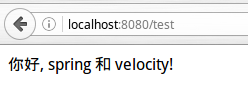
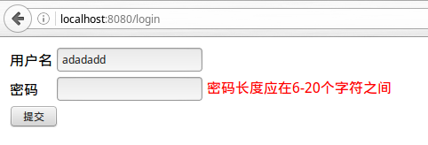
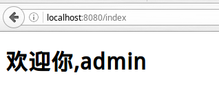

# Spring MVC+velocity环境搭建和Demo

springMVC是时下非常流行的表现层MVC框架，尤其是使用注解驱动配置时，具有简单易用，开发效率高的特点。spring MVC支持使用velocity作为视图模板。这里使用spring3.2.17进行示范，由于本教程重点讲解的是velocity，因此对于spring相关的内容并不会做过多解释，读者可以参阅spring的官方文档，spring的文档非常详细。

## Velocity依赖

首先新建一个Maven工程，使用maven-archetype-webapp模板。在`pom.xml`中添加以下依赖：

```xml
<!--velocity-->
<dependency>
   <groupId>org.apache.velocity</groupId>
   <artifactId>velocity</artifactId>
   <version>1.7</version>
</dependency>
<dependency>
   <groupId>org.apache.velocity</groupId>
   <artifactId>velocity-tools</artifactId>
   <version>2.0</version>
</dependency>
<!--spring framework-->
<dependency>
   <groupId>org.springframework</groupId>
   <artifactId>spring-context</artifactId>
   <version>3.2.17.RELEASE</version>
</dependency>
<dependency>
   <groupId>org.springframework</groupId>
   <artifactId>spring-context-support</artifactId>
   <version>3.2.17.RELEASE</version>
</dependency>
<dependency>
   <groupId>org.springframework</groupId>
   <artifactId>spring-web</artifactId>
   <version>3.2.17.RELEASE</version>
</dependency>
<dependency>
   <groupId>org.springframework</groupId>
   <artifactId>spring-webmvc</artifactId>
   <version>3.2.17.RELEASE</version>
</dependency>
<dependency>
   <groupId>org.springframework</groupId>
   <artifactId>spring-orm</artifactId>
   <version>3.2.17.RELEASE</version>
</dependency>
<!--javaBean验证API-->
<dependency>
   <groupId>javax.servlet</groupId>
   <artifactId>jstl</artifactId>
   <version>1.2</version>
</dependency>
<dependency>
   <groupId>javax.validation</groupId>
   <artifactId>validation-api</artifactId>
   <version>1.1.0.Final</version>
</dependency>
<dependency>
   <groupId>org.hibernate</groupId>
   <artifactId>hibernate-validator</artifactId>
   <version>4.2.0.Final</version>
</dependency>
```

由于使用注解驱动，这里笔者直接将Maven的Java构建和运行的JDK版本设为了1.8

```xml
<build>
   <finalName>springMVCDemo2</finalName>
   <plugins>
      <plugin>
         <groupId>org.apache.maven.plugins</groupId>
         <artifactId>maven-compiler-plugin</artifactId>
         <configuration>
            <source>1.8</source>
            <target>1.8</target>
         </configuration>
      </plugin>
   </plugins>
</build>
```

## 相关配置文件

在WEB-INF/web.xml内配置以下信息：

```xml
<?xml version="1.0" encoding="UTF-8"?>
<web-app xmlns:xsi="http://www.w3.org/2001/XMLSchema-instance"
         xmlns="http://java.sun.com/xml/ns/javaee"
         xsi:schemaLocation="http://java.sun.com/xml/ns/javaee http://java.sun.com/xml/ns/javaee/web-app_3_0.xsd"
         id="WebApp_ID" version="3.0">
    <display-name>springMVCDemo</display-name>

<!--加载spring Ioc容器上下文-->
 <listener>     	<listener-class>org.springframework.web.context.ContextLoaderListener</listener-class>
    </listener>
<!--spring提供的设置编码的过滤器-->
    <filter>
        <filter-name>CharacterEncodingFilter</filter-name>
        <filter-class>org.springframework.web.filter.CharacterEncodingFilter</filter-class>
        <init-param>
            <param-name>encoding</param-name>
            <param-value>utf-8</param-value>
        </init-param>
    </filter>
    <filter-mapping>
        <filter-name>CharacterEncodingFilter</filter-name>
        <url-pattern>/*</url-pattern>
    </filter-mapping>
<!--配置spring mvc核心转发Servlet-->
    <servlet>
        <servlet-name>demo</servlet-name>
        <servlet-class>org.springframework.web.servlet.DispatcherServlet</servlet-class>
        <load-on-startup>1</load-on-startup>
    </servlet>
    <servlet-mapping>
        <servlet-name>demo</servlet-name>
        <url-pattern>/</url-pattern>
    </servlet-mapping>

</web-app>
```

在WEB-INF下建立`demo-servlet.xml`，注意文件名与`web.xml`中核心转发Servlet中配置的servlet-name应保持一直，即`<servlet-name>xxx</servlet-name>`和`xxx-serlvet.xml`保持一致。

demo-servlet.xml
```xml
<?xml version="1.0" encoding="UTF-8"?>
<beans xmlns="http://www.springframework.org/schema/beans"
      xmlns:xsi="http://www.w3.org/2001/XMLSchema-instance"
      xmlns:mvc="http://www.springframework.org/schema/mvc"
      xmlns:context="http://www.springframework.org/schema/context"
      xsi:schemaLocation="
            http://www.springframework.org/schema/context
            http://www.springframework.org/schema/context/spring-context-3.2.xsd
            http://www.springframework.org/schema/beans
            http://www.springframework.org/schema/beans/spring-beans-3.2.xsd
            http://www.springframework.org/schema/mvc
            http://www.springframework.org/schema/mvc/spring-mvc-3.2.xsd">
   <mvc:annotation-driven />
   <mvc:resources location="/resources/" mapping="/resources/**"/>
   <context:component-scan base-package="com.ciyaz.web.controller" />

   <bean id="velocityConfig" class="org.springframework.web.servlet.view.velocity.VelocityConfigurer">
      <property name="resourceLoaderPath" value="/WEB-INF/views/"/>
      <property name="configLocation" value="/WEB-INF/velocity.properties"/>
   </bean>

   <bean id="viewResolver" class="org.springframework.web.servlet.view.velocity.VelocityViewResolver">
      <property name="cache" value="true"/>
      <property name="prefix" value=""/>
      <property name="suffix" value=".vm"/>
      <property name="contentType" value="text/html;charset=utf-8" />
   </bean>

</beans>
```

如上述代码，我们在spring容器中配置了两个类，spring提供的velocity配置器和视图处理器。回忆我们在直接使用servlet时，配置的是一个velocity-tool提供的VelocityViewServlet用于配置模板引擎和拦截请求，这里则是用的spring集成的视图模板配置器和处理器，具体配置内容也基本一致，这里我们同样把视图模板放在`WEB-INF/views`下，`velocity.properties`放在`WEB-INF`下。

`WEB-INF`下创建`applicationContext.xml`。本示例并没有用到该配置文件，但实际项目则一定会用到。这里如图留空即可。

```xml
<?xml version="1.0" encoding="UTF-8"?>
<beans xmlns="http://www.springframework.org/schema/beans"
      xmlns:xsi="http://www.w3.org/2001/XMLSchema-instance"
      xmlns:context="http://www.springframework.org/schema/context"
      xmlns:jee="http://www.springframework.org/schema/jee"
      xmlns:tx="http://www.springframework.org/schema/tx"
      xsi:schemaLocation="http://www.springframework.org/schema/beans
       http://www.springframework.org/schema/beans/spring-beans.xsd
       http://www.springframework.org/schema/tx
       http://www.springframework.org/schema/tx/spring-tx.xsd
       http://www.springframework.org/schema/context
       http://www.springframework.org/schema/context/spring-context.xsd
       http://www.springframework.org/schema/jee
       http://www.springframework.org/schema/jee/spring-jee.xsd">

</beans>
```

在WEB-INF下创建`velocity.properties`，内容这里只设定编码。

```
input.encoding=UTF-8
output.encoding=UTF-8
```

## 代码编写

好了，一切准备就绪。现在编写一个spring MVC的控制器。

```java
package com.ciyaz.web.controller;

import org.springframework.stereotype.Controller;
import org.springframework.ui.Model;
import org.springframework.web.bind.annotation.RequestMapping;
import org.springframework.web.bind.annotation.RequestMethod;


@Controller
public class TestController
{
   @RequestMapping(method = RequestMethod.GET, value = "/test")
   public String getPage(Model model)
   {
      model.addAttribute("txt", "你好, spring 和 velocity!");
      return "test";
   }
}
```

在`WEB-INF/views`下编写`test.vm`

```html
<!DOCTYPE html>
<html lang="zh">
<head>
   <meta charset="UTF-8">
   <title>Test Velocity</title>
</head>
<body>
   $txt
</body>
</html>
```

运行结果：



下面简单介绍一下springmvc和velocity结合的表单处理。springmvc提供了表单的类型绑定，举例来说，获取页面时向request域传递一个User实例，表单post给控制器时，springmvc会自动将表单的字段封装到User对象里，控制器只需要接收一个User参数即可。如果不这样做，虽然控制器也能获得表单提交的字段，但是一旦字段比较多，控制器的参数列表就会非常长，而且没有javabean注解验证的支持。

在velocity中可以通过配置springBind宏进行表单的参数绑定，一个简单的登陆例子如下。

login.vm

```html
<!DOCTYPE html>
<html lang="zh">
<head>
   <meta charset="UTF-8">
   <title>Test Velocity</title>
</head>
<body>
   <form action="/login" method="post">
      <table>
         <tr>
            <td>
               <label for="username">用户名</label>
            </td>
            <td>
               #springBind("user.username")
               <input type="text" value="$!{status.value}" name="${status.expression}"/>
               #foreach($error in $status.errorMessages)<font color="#FF0000">$error<font/> #end
            </td>
         </tr>
         <tr>
            <td>
               <label for="password">密码</label>
            </td>
            <td>
               #springBind("user.password")
               <input type="password" value="$!{status.value}" name="${status.expression}" />
               #foreach($error in $status.errorMessages)<font color="#FF0000">$error<font/> #end
            </td>
         </tr>
         <tr>
            <td colspan="2">
               <input type="submit" value="提交" />
            </td>
         </tr>
      </table>
   </form>
</body>
</html>
```

编写一个叫做User的JavaBean，并使用验证注解进行字段验证

```java
package com.ciyaz.domain;

import org.springframework.stereotype.Component;

import javax.validation.constraints.Pattern;
import javax.validation.constraints.Size;

@Component
public class User
{
   @Size(min = 5, max = 20, message = "用户名长度应在5-20字符之间")
   @Pattern(regexp = "^[a-zA-Z0-9]+$", message = "用户名只应包含字母和数字")
   private String username;
   @Size(min = 6, max = 20, message = "密码长度应在6-20个字符之间")
   private String password;

   public User()
   {
   }

   public User(String username, String password)
   {
      this.username = username;
      this.password = password;
   }

   public String getUsername()
   {
      return username;
   }

   public void setUsername(String username)
   {
      this.username = username;
   }

   public String getPassword()
   {
      return password;
   }

   public void setPassword(String password)
   {
      this.password = password;
   }
}
```

编写一个login控制器

com.ciyaz.web.controller.LoginController

```java
package com.ciyaz.web.controller;

import com.ciyaz.domain.User;
import org.springframework.stereotype.Controller;
import org.springframework.ui.Model;
import org.springframework.validation.BindingResult;
import org.springframework.validation.annotation.Validated;
import org.springframework.web.bind.annotation.RequestMapping;
import org.springframework.web.bind.annotation.RequestMethod;

import javax.servlet.http.HttpSession;


@Controller
public class LoginController
{
   @RequestMapping(method = RequestMethod.GET, value = "/login")
   public String getPage(Model model)
   {
      User user = new User();
      model.addAttribute("user", user);
      return "login";
   }

   @RequestMapping(method = RequestMethod.POST, value = "/login")
   public String login(@Validated User user, BindingResult bindingResult, HttpSession httpSession)
   {
      if(bindingResult.hasErrors())
      {
         return "login";
      }
      else
      {
         httpSession.setAttribute("username", user.getUsername());
         return "redirect:/index";
      }
   }
}
```

观察代码可知，该login控制器接受表单传来的User对象，如果字段验证成功，重定向到`/index`。在这个例子中，简单起见，没有业务层和持久层，当User的字段符合要求，就算作登陆成功。

编写一个Index控制器，用于处理对登陆后主页的访问。

```java
package com.ciyaz.web.controller;

import org.springframework.stereotype.Controller;
import org.springframework.ui.Model;
import org.springframework.web.bind.annotation.RequestMapping;
import org.springframework.web.bind.annotation.RequestMethod;

import javax.servlet.http.HttpSession;

@Controller
public class IndexController
{
   @RequestMapping(method = RequestMethod.GET, value = "/index")
   public String getPage(HttpSession httpSession, Model model)
   {
      String username = (String)httpSession.getAttribute("username");
      if(username == null)
      {
         return "redirect:/login";
      }
      else
      {
         model.addAttribute("username", username);
         return "index";
      }
   }
}
```

这里有一点要说明，spring mvc默认没有把session域中的对象绑定到视图模型。因此，我们在视图模型中显示的添加了一个`username`属性，然后转发到视图模板。如果读者希望vm模板能直接访问session域，可以在初始化VelocityViewResolver时，加入`<property name="exposeSessionAttributes" value="true" />`开启session域自动绑定到视图模型。

同理也可以开启视图模型和request域的自动绑定，但笔者认为没有必要开启这两个属性。

最后编写index.vm作为主页。

```html
<!DOCTYPE html>
<html lang="zh">
<head>
   <meta charset="UTF-8">
   <title>Test Velocity</title>
</head>
<body>
   <h1>欢迎你,${username}</h1>
</body>
</html>
```

运行结果，当表单校验出错时，如图



当校验成功后，成功登陆主页



## 后期补充：关于Spring5

在最新版本的Spring5/SpringBoot中，已经移除了Velocity的API，也就是说，Spring未来不会再支持Velocity这个模板引擎了！

说实话Velocity确实不适合做网页的模板引擎，因为语法太过奇怪而且小众了，前端开发人员肯定是无法接受的，目前来看，Java能够集成的页面模板引擎中，Thymeleaf是最好的选择（JSP就把它丢进历史的博物馆吧）。但是Velocity在其它需要模板的领域，比如作为一个HTML邮件模板，还是无可替代的。
