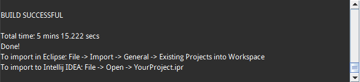

# LibGDX简介

本系列笔记参考《Learning LibGDX Game Development second edition》。

LibGDX是一个跨平台2D/3D游戏开发框架。由Java和C/C++编写而成，使用LibGDX需要熟悉Java语言，使用JVM的高级特性能够使编码更加方便。LibGDX支持桌面平台（Windows，Linux，Mac），移动平台（Android2.2+，IOS），Web平台（HTML5，使用JavaScript和WebGL）。

值得注意的是，LibGDX是一个框架而不是一个游戏引擎。游戏引擎通常包含完整的场景、代码编辑器和一组API，需要使用引擎定义的工作流进行开发。而框架则是更底层的一种开发方式，我们可以使用自己的编辑器按照自己的想法开发，有必要时还可以调用底层OpenGL函数，也就是说，开发者的自由度更高。

## LibGDX特性介绍

[官网](http://libgdx.badlogicgames.com/features.html)

## LibGDX环境搭建

LibGDX提供了创建工程目录的工具，我们直接使用这个工具创建工程就行了。[下载](http://libgdx.badlogicgames.com/download.html)

下载后得到gdx-setup.jar

运行这个jar包，得到项目创建界面，我们简单配置一下，如下图所示。

点击Advance，可以配置Maven仓库镜像和生成idea的配置文件，这里我们准备使用Intellij IDEA开发。

点击Generate即可，gradle等都会自动下载。不过这要等上一阵子，主要是下载gradle比较慢，第二次创建项目就不会再下载了。Maven包走镜像或是本地缓存，一般比较快。创建成功后，如图所示。

我们按照上图提示在Intllij IDEA中引入该工程即可。

可以观察到，对应平台有自己的模块，除此之外还有一个core模块，查看build.gradle，我们会发现实际上特点平台的模块都是依编译赖于core模块的。

## 运行自动生成的项目（desktop）

我们运行一下desktop里的项目，我们的运行环境是Ubuntu14.04。在desktop模块的Main函数上，右键Run即可。但是desktop模块里缺少资源文件夹（也就是图片等）。Android模块里有这个文件夹，我们可以调整idea的Run Configuration->working directory指向Android/assets文件夹。

或者把资源拷贝到工程默认的working directory也可以。

再次点击Run就可以正常运行了。点击Run后，idea会自动调用gradle编译。结果如图：

注意：

1. LibGDX自动创建的工程使用wrapper指定了一个gradle版本，而且自动生成了gradle配置文件和idea的配置文件，我们直接点运行按钮就好了。
2. 创建项目和载入idea都可能要等一阵子时间，如果gradle和maven都能正常访问，一般不会出问题。下载的东西都会本地缓存，第二次创建项目非常快。
