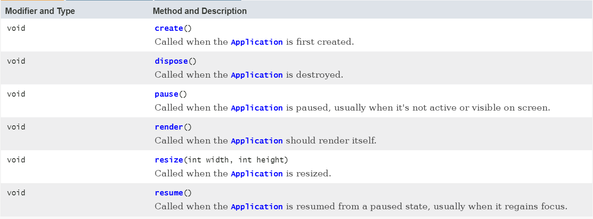
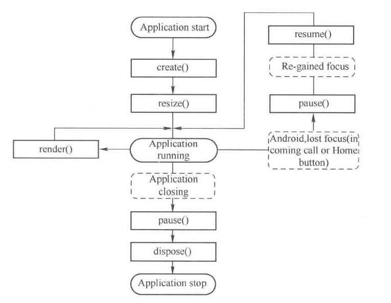

# 应用生命周期

我们使用各种GUI框架的都知道，一个桌面窗口，或是Web、移动端的页面，它们从创建到销毁，都遵循一个生命周期。针对这些生命周期，GUI框架一般都会提供一组可重写的回调（钩子）函数，用来监听窗口的状态，LibGDX其实也相当于这样一个GUI软件的窗口。

## ApplicationListener和ApplicationAdapter

默认创建工程后，`core`模块下`MyGdxGame`类继承`ApplicationAdapter`，间接实现了`ApplicationListener`接口。其中的`render()`函数就是游戏的主循环。

```java
public class MyGdxGame extends ApplicationAdapter { ... }
```

该接口定义了LibGDX应用窗口的生命周期：



各个回调函数都很好理解，我们可以自己写代码测试一下，这里就不多介绍了。

注：这里框架使用了适配器模式，如果我们直接实现`ApplicationListener`，就会造成必须实现接口中所有方法的尴尬状况，所以`LibGDX`又给我们创建了一个`ApplicationAdapter`作为适配器，其中的实现都是空的。

## 窗口的生命周期流程



## ApplicationAdapter和Game类的关系

实际上，真正开发中我们不会写类似上面的代码，类似Unity引擎有`Game->Scene->GameObject`这种层次结构，LibGDX中也有`Game->Screen->Stage->Actor`的层次结构，我们一般继承`Game`作为整个应用的入口类，而`Game`本身也是`ApplicationAdapter`，生命周期都是相似的，但是它提供了方法能直接和场景层次结构集成到一起。
