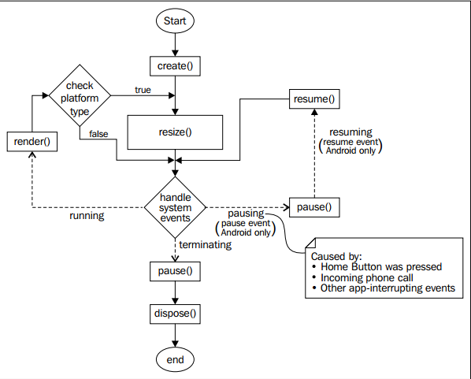

# LibGDX核心模块

下文介绍了一些LibGDX的核心库，但是我们不可能把整个文档翻译一遍，因此下面只是介绍了几个十分常用的方法，通过这些介绍，我们可以大致了解一下核心库结构。我们编写我们自己的代码时，一定要多用F2查看文档，多看看JavaDoc和官网文档。

## Gdx.app

核心模块可以通过`Gdx.app`的属性进行访问。

### 日志

LibGDX提供了日志功能。

#### 设置日志等级

```java
Gdx.app.setLogLevel(Application.LOG_DEBUG);
```

可用的日志登记：

* LOG_NONE：使用该项可屏蔽日志
* LOG_ERROR
* LOG_INFO
* LOG_DEBUG

#### 退出游戏

退出应该使用下面的方法，而不是强行终止。LibGDX包含了大量Native库，退出JVM进程之前应该释放资源。

```java
Gdx.app.exit();
```

### 持久化数据

LibGDX提供Preferences，使用十分类似Android的SharedPreferences，用起来十分简单。

```java
//获得Preferences，如果文件不存在则创建
Preferences prefs = Gdx.app.getPreferences("settings.prefs");
//写数据
prefs.putInteger("sound_volume", 100);
prefs.flush();
//读数据
int soundVolume = prefs.getInteger("sound_volume", 50);
```

除了Preferences，实际上也完全可以用JavaSE读写文件，或者使用数据库驱动读写数据库，但是要注意跨平台性。

### 查询内存使用情况

```java
long memUsageJavaHeap = Gdx.app.getJavaHeap();
long memUsageNativeHeap = Gdx.app.getNativeHeap();
```

### 处理多线程

游戏启动后，OpenGL运行在渲染线程，也就是说，我们实现`ApplicationAdapter`创建的生命周期类中，几个生命周期方法就运行在渲染线程，如render()。

如果要从一个线程向渲染线程传递数据，可以使用Gdx.app.postRunnable()，下一帧调用render()绘图之前，run()方法会在渲染线程被调用。

```java
Gdx.app.postRunnable(new Runnable()
  {
  @Override
  public void run()
    {
      //do something
    }
  });
```

## Gdx.graphics

绘图模块。

### 帧绘制的时间间隔

不同的设备上，硬件性能不同，delta-time值是不同的。我们的游戏逻辑时钟不要依赖帧，那样在不同平台下会造成游戏时钟不同的情况（如角色跑步速度不一样）。

```java
Gdx.graphics.getDeltaTime()
```

### 查询屏幕大小

```java
Gdx.graphics.getWidth()
Gdx.graphics.getHeight()
```

### 查询帧数

结果为每秒帧数。

```java
Gdx.graphics.getFramesPerSecond()
```

## Gdx.audio

声音模块。

### 音效

```java
Gdx.audio.newSound()
```

音效即短促的声音效果，如枪声，支持wav，mp3，ogg，大小应该小于1MB，因为数据会全部载入内存。

### 背景音乐

```java
Gdx.audio.newMusic()
```

背景音乐会流式读取并播放，支持wav，mp3，ogg。

## Gdx.input

输入处理模块。

### 捕捉键盘，鼠标，触摸屏

```java
Gdx.input.setInputProcessor(new InputProcessor()
{
  @Override
  public boolean keyDown(int keycode)
  {
    Gdx.app.log("demoLog", "key down");
    return true;
  }
  //...省略其他回调函数
});
```

调用Gdx.input.setInputProcessor()，传入InputProcessor接口实现即可。其中的方法定义了键盘按下弹起，鼠标、触屏按下弹起，移动，拖动等各种事件。

注意：

1. 回调返回true表示事件已被捕捉
2. LibGDX内置了InputProcessor的适配器InputAdaptor，我们也可以继承这个类，就省得实现一大堆不需要的方法了。

### 移动设备加速度计

```java
Gdx.input.getAccelerometerX()
Gdx.input.getAccelerometerY()
Gdx.input.getAccelerometerZ()
```

支持加速度计的移动设备可以使用，不支持的设备总是返回0。桌面设备不支持。

### 安卓设备的振动器

```java
//启动振动器
Gdx.input.vibrate()
//停止振动器
Gdx.input.cancelVibrate()
```

振动器用于实现可以感觉到的震动效果，比如被怪打一下就震一下。。。

### 捕捉安卓软键盘

捕捉安卓平台特殊按键。

```java
//Back键
Gdx.input.setCatchBackKey(true)
//menu键
Gdx.input.setCatchMenuKey(true)
```

### 桌面鼠标捕捉

```java
Gdx.input.setCursorCatched(true);
```

该方法会把鼠标限制在游戏窗口中，并隐藏指针。但是鼠标坐标还是能够被正常捕捉的。

## Gdx.files

文件处理。

### 获得内部文件句柄

```java
Gdx.files.internal()
```

内部文件对于桌面程序就是应用的根目录，对于安卓和html5，指asset资源文件夹。

返回值是`gdx.files.FileHandle`，这个类表示文件句柄，它包装了`java.io.File`（File是FileHandle的一个属性）。

### 获得外部文件句柄

```java
Gdx.files.external()
```

外部文件对于桌面程序指用户目录，对于安卓指SD卡（即安卓外部存储概念，可参考安卓开发相关章节），html5应用没有外部存储。

## Gdx.net

网络模块。该模块支持http协议和传输层socket。

# LibGDX渲染生命周期

我们工程的core模块下自动生成了一个类，它实现了`ApplicationListener`接口（实际上是ApplicationAdapter适配器，其实是一样的作用），这个接口定义了LibGDX的渲染过程生命周期。

```java
public interface ApplicationListener
{
  public void create ();
  public void resize (int width, int height);
  public void render ();
  public void pause ();
  public void resume ();
  public void dispose ();
}
```

这几个方法都十分易懂，我就不多解释了，具体看文档即可。注意create()和render()，这两个方法比较重要，我们主要就是在修改这两个方法。



# 关于热部署

书上介绍了Java热部署的相关内容，但是我研究了半天也没用上热部署（我用的是Intellij IDEA和gradle）。这个其实也无所谓，等真的需要时再说吧。
