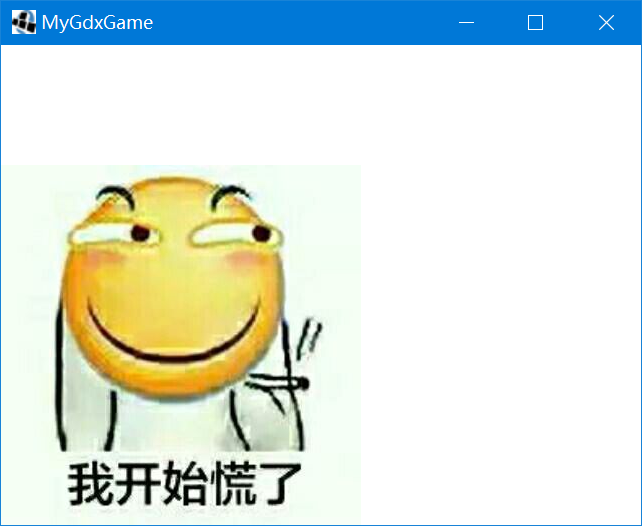
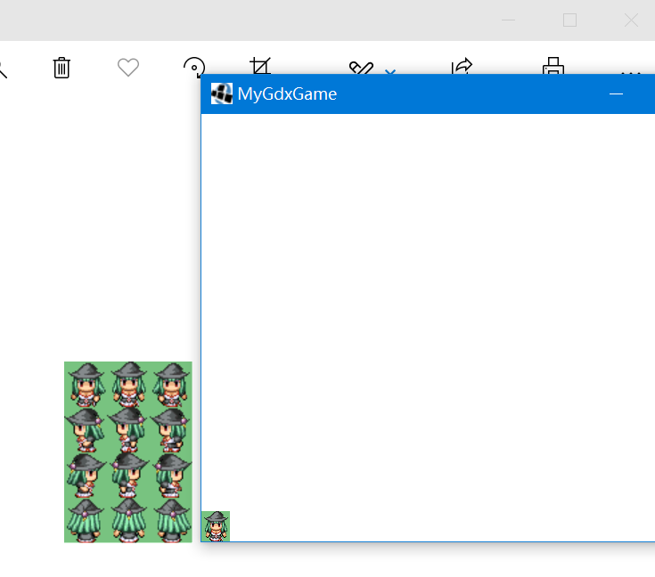
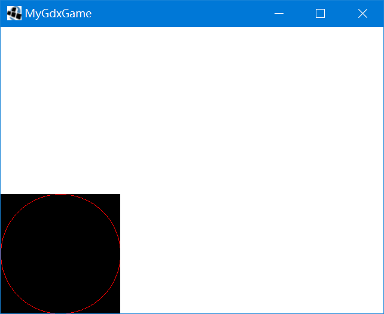

# 纹理和图形绘制

图形渲染一般是游戏软件开发最基本的要素（但也有例外），本篇笔记介绍LibGDX中绘制纹理和图形相关的API。

## SpriteBatch

无论GUI软件还是游戏，渲染界面的过程底层要做的，其实就是根据业务逻辑将内存中的素材资源合成一幅图，最终传递给显示缓冲区。LibGDX底层基于OpenGLES，但是它的API比较复杂，因此LibGDX就在其上进行了封装，`SpriteBatch`就是这样一个用来绘图的组件。

下面代码在`(0, 0)`处绘制了一张图片：

```java
package com.mygdx.game;

import com.badlogic.gdx.ApplicationAdapter;
import com.badlogic.gdx.Gdx;
import com.badlogic.gdx.graphics.GL20;
import com.badlogic.gdx.graphics.Texture;
import com.badlogic.gdx.graphics.g2d.SpriteBatch;

/**
 * @author CiyaZ
 */
public class MyGdxGame extends ApplicationAdapter {
    private SpriteBatch batch;
    private Texture imgTexture;

    @Override
    public void create() {

        batch = new SpriteBatch();

        // 图片大小为360 x 360
        imgTexture = new Texture("1.jpg");
    }

    @Override
    public void render() {
        // 设置清空颜色并清空缓冲区
        Gdx.gl.glClearColor(1, 1, 1, 1);
        Gdx.gl.glClear(GL20.GL_COLOR_BUFFER_BIT);

        // 在(0, 0)处绘制图片纹理
        batch.begin();
        batch.draw(imgTexture, 0, 0);
        batch.end();
    }
}
```



这里有一点要注意，LibGDX中游戏世界的坐标系原点在左下角，向右为`x`轴，向上为`y`轴，实际上底层OpenGLES还存在从屏幕指向我们的`z`轴，因此，绘制纹理指定的坐标也是纹理图片的左下角。这和我们GUI开发中通常使用的屏幕坐标系不一样。

## 纹理 Texture

绘制一张图片时，我们首先要从图片对应的格式文件中读取出位图像素数据，这部分数据我们一般称为纹理（Texture）。将一张图片加载为纹理，然后通过`SpriteBatch`绘制到屏幕上，是LibGDX中最基础的绘制图像的方式。

前面代码已经给出如何使用`Texture`，这里不多做介绍了。

## 区域纹理 TextureRegion

实际开发中，我们一个项目引用的图片可能是非常多的，这些小文件单独加载要比加载一个大文件消耗更多性能。此外，对于一个序列帧动画，我们也经常会要求美术把各个帧合并到一张图上，以免造成混乱。`TextureRegion`能够实现从一张大图上加载一部分区域，作为一个独立的纹理。

下面代码从一组序列帧大图里，截取一帧显示：

```java
package com.mygdx.game;

import com.badlogic.gdx.ApplicationAdapter;
import com.badlogic.gdx.Gdx;
import com.badlogic.gdx.graphics.GL20;
import com.badlogic.gdx.graphics.Texture;
import com.badlogic.gdx.graphics.g2d.SpriteBatch;
import com.badlogic.gdx.graphics.g2d.TextureRegion;

/**
 * @author CiyaZ
 */
public class MyGdxGame extends ApplicationAdapter {
    private SpriteBatch batch;
    private TextureRegion mahouFront1;

    @Override
    public void create() {

        batch = new SpriteBatch();

        // 图片为3x4序列帧，大小为96x136，因此一帧大小为32x34
        Texture mahouTexture = new Texture("mahou.png");
        mahouFront1 = new TextureRegion(mahouTexture, 32, 0, 32, 34);
    }

    @Override
    public void render() {
        Gdx.gl.glClearColor(1, 1, 1, 1);
        Gdx.gl.glClear(GL20.GL_COLOR_BUFFER_BIT);

        batch.begin();
        batch.draw(mahouFront1, 0, 0);
        batch.end();
    }
}
```

原图和截取的一帧：



注意代码中`TextureRegion`构造函数参数，第一个参数是`Texture`，之后的参数是区域纹理的：x坐标、y坐标、宽度、高度，这里的坐标系又和世界坐标系不同了，这里原点位于坐上，`x`轴向右，`y`轴向下，是我们熟悉的屏幕坐标系。

## 位图 Pixmap

和纹理不同，`Pixmap`用于绘制一些几何图形。下面例子用`Pixmap`在屏幕左下角绘制一个圆：

```java
package com.mygdx.game;

import com.badlogic.gdx.ApplicationAdapter;
import com.badlogic.gdx.Gdx;
import com.badlogic.gdx.graphics.Color;
import com.badlogic.gdx.graphics.GL20;
import com.badlogic.gdx.graphics.Pixmap;
import com.badlogic.gdx.graphics.Texture;
import com.badlogic.gdx.graphics.g2d.SpriteBatch;

/**
 * @author CiyaZ
 */
public class MyGdxGame extends ApplicationAdapter {
    private SpriteBatch batch;
    private Texture pixmapTexture;

    @Override
    public void create() {
        batch = new SpriteBatch();
        Pixmap pixmap = new Pixmap(20, 20, Pixmap.Format.RGB888);
        pixmap.setColor(Color.RED);
        pixmap.drawCircle(10, 10, 10);
        pixmapTexture = new Texture(pixmap);
    }

    @Override
    public void render() {
        Gdx.gl.glClearColor(1, 1, 1, 1);
        Gdx.gl.glClear(GL20.GL_COLOR_BUFFER_BIT);

        batch.begin();
        batch.draw(pixmapTexture, 0, 0);
        batch.end();
    }
}
```



除了画圆，`Pixmap`还可以画线和矩形等，具体用到时参考文档即可，这里就不多介绍了。

## 精灵 Sprite

在游戏开发中，Sprite是相对于纹理、位图更加高级的一层抽象，我们可以改变Sprite的位置，对其进行位移、渲染、缩放等操作。实际上，我们很少直接使用`SpriteBatch`去绘制纹理或区域纹理，我们一般都至少将其封装到Sprite级别（或更高级的游戏对象）。

下面代码中，我们让一个Sprite不停旋转：

```java
package com.mygdx.game;

import com.badlogic.gdx.ApplicationAdapter;
import com.badlogic.gdx.Gdx;
import com.badlogic.gdx.graphics.GL20;
import com.badlogic.gdx.graphics.Texture;
import com.badlogic.gdx.graphics.g2d.Sprite;
import com.badlogic.gdx.graphics.g2d.SpriteBatch;

/**
 * @author CiyaZ
 */
public class MyGdxGame extends ApplicationAdapter {
    private SpriteBatch batch;
    private Sprite huaji;
    private float huajiRotateSpeed = 1;

    @Override
    public void create() {
        batch = new SpriteBatch();
        Texture huajiTexture = new Texture("1.jpg");
        huaji = new Sprite(huajiTexture);
    }

    @Override
    public void render() {
        Gdx.gl.glClearColor(1, 1, 1, 1);
        Gdx.gl.glClear(GL20.GL_COLOR_BUFFER_BIT);

        batch.begin();
        huaji.rotate(huajiRotateSpeed);
        huaji.draw(batch);
        batch.end();
    }
}
```

注意：`Texture`绘制时调用`batch.draw(texture, x, y)`，而`Sprite`必须调用`sprite.draw(batch)`。这是因为Sprite本身包含位置、缩放等信息，已经不是一个简单的图像了，它的绘制需要大量的内部处理。实际开发中，我们也很少写直接绘制一个纹理的代码，一般都会对其进行封装。
