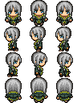

# 序列帧动画

2D游戏中，动画一般有两种实现方式：序列帧动画和骨骼动画，其中前者最为常用。LibGDX中封装了`Animation`类，对实现序列帧动画所需的功能进行了简单封装。

## 序列帧动画例子

下面是一张像素风格的2D四方向行走图，我们这里简单演示一个前向行走动画，也就是循环播放`(0, 0)`和`(0, 2)`这两帧。



例子代码：

```java
package com.mygdx.game;

import com.badlogic.gdx.ApplicationAdapter;
import com.badlogic.gdx.Gdx;
import com.badlogic.gdx.graphics.GL20;
import com.badlogic.gdx.graphics.Texture;
import com.badlogic.gdx.graphics.g2d.Animation;
import com.badlogic.gdx.graphics.g2d.SpriteBatch;
import com.badlogic.gdx.graphics.g2d.TextureRegion;

/**
 * @author CiyaZ
 */
public class MyGdxGame extends ApplicationAdapter {

    private SpriteBatch batch;
    private Animation animation;
    private float stateTime = 0;

    @Override
    public void create() {
        batch = new SpriteBatch();

        Texture texture = new Texture("actor.png");
        TextureRegion[][] allFrames = TextureRegion.split(texture, texture.getWidth() / 3, texture.getHeight() / 4);
        TextureRegion[] frontFrames = new TextureRegion[]{
                allFrames[0][0],
                allFrames[0][2],
        };
        animation = new Animation(0.3f, frontFrames);
        animation.setPlayMode(Animation.PlayMode.LOOP);
    }

    @Override
    public void render() {
        Gdx.gl.glClearColor(1, 1, 1, 1);
        Gdx.gl.glClear(GL20.GL_COLOR_BUFFER_BIT);

        batch.begin();
        stateTime += Gdx.graphics.getDeltaTime();
        TextureRegion tr = animation.getKeyFrame(stateTime);
        batch.draw(tr, 100, 100);
        batch.end();
    }
}
```

这里我们主要关注`Animation`工具的使用。

`Animation`中的帧其实就是一个`TextureRegion`数组，为了加载动画所需的帧，我们需要把行走图分割，然后传入`Animation`中。

这里注意`stateTime`变量，没有游戏开发经验的同学可能乍一看难以理解。游戏开发中，一个常见的错误就是将游戏的动画、逻辑等时序依赖于画面帧频率，《辐射4》中就出现过由于玩家显卡配置太高，导致游戏逻辑时序过快的问题，我们播放一个序列帧动画，不能通过画面帧数来判断现在是第几帧，而需要通过真实时间。`Animation`已经帮我们把这个功能封装好了，我们只要传入从动画开始播放到现在经过了多少真实时间，`Animation`会帮我们计算现在应该显示第几帧。

实际上，不只是序列帧动画，我们实现的游戏逻辑中其他地方，尤其是大量手写的功能，也必须遵循这个原则。

运行效果：


