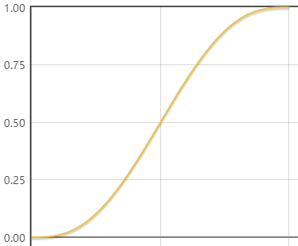

# Action系统

LibGDX中包含一个Action动画系统，其实就是类似Unity中的Tween动画，能够实现Actor的位移、旋转、缩放、淡入淡出等效果。这个乍一看觉得非常简单没什么用，但其实在UI系统中使用场景特别多。比如：游戏起始画面LOGO的入场效果，窗口滑入滑出的特效等等。

## Action的种类

* 效果类Action：产生位移、旋转、缩放、淡入淡出等特效
  * 绝对效果Action：指定一个目标值来计算补间效果，例如`moveTo`，`rotateTo`等
  * 相对效果Action：指定一个偏移量来计算补间效果，例如`moveBy`，`rotateBy`等
* 控制类Action：用于组合效果Action，让效果顺序或并行执行，例如`parallel`，`sequence`等

这些效果理解起来没什么难度，就不具体罗列介绍了。

## 插值

动画如果全是线性的，直来直去会非常难看，LibGDX的Action系统支持插值动画，LibGDX中的Action创建时可以传入一个`Interpolation`参数，我们可以使用内建的插值设置，也可以自己定义。

这里以内建的`fade`效果为例介绍：

```java
static public final Interpolation fade = new Interpolation() {
    public float apply (float a) {
        return MathUtils.clamp(a * a * a * (a * (a * 6 - 15) + 10), 0, 1);
    }
};
```

上述代码是LibGDX自带的实现，我们可以看下`y = x * x * x * (x * (x * 6 - 15) + 10)`的值域在`[0, 1]`之间的函数曲线：



## 例子

下面例子中，实现了一个Actor一边移动一边渐入的效果。

```java
package com.mygdx.game.demo1;

import com.badlogic.gdx.math.Interpolation;
import com.badlogic.gdx.scenes.scene2d.Action;
import com.badlogic.gdx.scenes.scene2d.Stage;
import com.badlogic.gdx.scenes.scene2d.actions.Actions;
import com.badlogic.gdx.utils.viewport.Viewport;

/**
 * @author CiyaZ
 */
public class DemoStage extends Stage {

    private DemoActor demoActor;

    public DemoStage(Viewport viewport) {
        super(viewport);
    }

    public void init() {
        // 初始化Actor
        demoActor = new DemoActor();
        addActor(demoActor);
        demoActor.init();

        // 添加特效，一边移动一边渐入
        Action action1 = Actions.moveTo(206, 224, 1, Interpolation.fade);
        Action action2 = Actions.fadeIn(1);
        Action action = Actions.parallel(action1, action2);
        demoActor.addAction(action);
    }
}
```

```java
package com.mygdx.game.demo1;

import com.badlogic.gdx.Gdx;
import com.badlogic.gdx.files.FileHandle;
import com.badlogic.gdx.graphics.Color;
import com.badlogic.gdx.graphics.g2d.Batch;
import com.badlogic.gdx.graphics.g2d.BitmapFont;
import com.badlogic.gdx.scenes.scene2d.Actor;

/**
 * @author CiyaZ
 */
public class DemoActor extends Actor {

    private BitmapFont font;

    public void init() {
        // 初始化贴图字体
        FileHandle fontPngHandle = Gdx.files.internal("font/mybmfont.png");
        FileHandle fontFntHandle = Gdx.files.internal("font/mybmfont.fnt");
        font = new BitmapFont(fontFntHandle, fontPngHandle, false);
        // 初始化Actor颜色为黑色，全透明
        setColor(0, 0, 0, 0);
    }

    @Override
    public void draw(Batch batch, float parentAlpha) {
        // 获取Actor坐标、颜色并绘制
        Color color = getColor();
        font.setColor(color.r, color.g, color.b, color.a);
        font.draw(batch, "Hello, world!", getX(), getY());
    }

    @Override
    public void act(float delta) {
        super.act(delta);
    }
}
```

注意Actor的代码中，绘制时的写法：我们的Action是附加到Actor上的，改变的也是Actor的参数，绘制Actor时，就要通过Actor提供的方法读取这些参数，如`getX()`、`getY()`、`getColor()`等。
