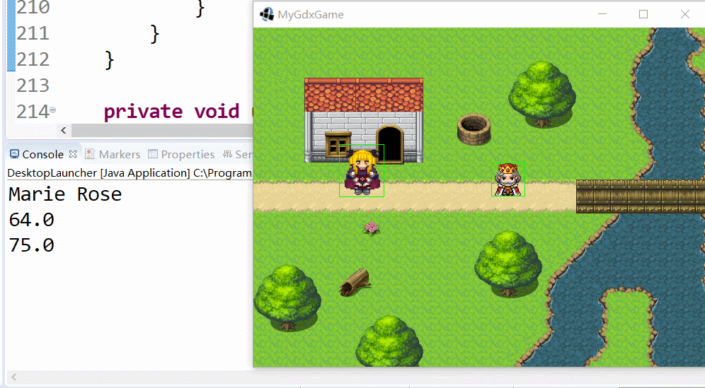

# 碰撞检测

碰撞检测是大部分游戏类型都会用到的技术，是游戏交互的重要基础，在2D游戏中，由于少了一个维度，碰撞检测的实现其实大大简化了。底层数学原理这里不多说，我们高中数学中已经学习过，这里介绍下LibGDX中如何实现碰撞检测。

## 2D游戏中的碰撞检测

以RPG游戏为例，障碍物拦住玩家的判定，ARPG中玩家攻击怪物的判定，玩家射出的子弹是否击中怪物的判定，这些判定都属于碰撞检测。2D游戏开发中，常用的碰撞检测有这么几种：

* 矩形的重合检测
* 圆形的重合检测
* 多边形重合检测
* 射线（线段）相交检测

其中，多边形重合检测比较少用，一般使用物理引擎实现，手动实现可以用现成的pnpoly算法，射线（线段）检测能用矩形检测替代，圆形检测一般是圆形和点之间的检测，判断点到圆心的距离就行了，圆形和多边形之间的检测也可以遍历端点实现，非常简单。所以说白了，碰撞检测其实就一种：矩形重合检测，而且LibGDX已经帮我们实现好了。

注：LibGDX能够集成Box2D和Bullet（主要用于3D）物理引擎，适用于例如多边形检测之类的复杂情况，物理引擎的内容将在后续章节学习，本篇笔记主要介绍如何在不使用物理引擎的情况下实现。

## 矩形碰撞检测

检测两个游戏物体碰撞，其实可以将两个物体简化看作矩形，然后判断两个矩形受否有重叠部分，如果有，认为发生了碰撞，除此之外，点和矩形的碰撞可以看作一种特殊的矩形碰撞。矩形碰撞检测是一种游戏中常用的简化的碰撞检测模型。

### Rectangle 矩形

LibGDX中使用Rectangle表示一个矩形，我们对需要碰撞检测的Actor，其实可以给其初始化一个专用于碰撞检测的Rectangle属性。

PlayerActor.java
```java
Rectangle bounds = new Rectangle(getX(), getY(), getWidth(), getHeight());
```

在Actor中实例化Rectangle对象很简单，传入Actor的坐标、长宽即可，这个矩形可以作为Actor范围的简化表示。

Rectangle实现的重合检测方法主要会用到如下三个：

```
boolean contains(float x, float y)     某点是否在矩形内
boolean	contains(Rectangle rectangle)  某矩形是否在矩形内
boolean	overlaps(Rectangle r)          两个矩形是否有重叠部分
```

### 检测碰撞

具体到游戏代码中，我们获取目标矩形，可以通过遍历所有`Actor`来实现。我们可以将生成的所有`Actor`找个全局变量存储起来，或者直接遍历一个`Stage`下的`Actor`。

下面是一个例子，假设我们的`Stage`中，有一个玩家`Actor`，还有一个敌人`Actor`，下面代码写在玩家的`act()`函数中，遍历判断该`Stage`下所有`Actor`，是否和玩家发生了碰撞，如果是，打印一条信息。

```java
// 检测是否和敌人有碰撞
Array<Actor> actors = getStage().getActors();
for (Actor ac : actors) {
    if (ac instanceof TestEnemyActor) {
        TestEnemyActor enemy = (TestEnemyActor) ac;
        Rectangle enemyRect = enemy.getBounds();
        if (bounds.overlaps(enemyRect)) {
            System.out.println("碰撞了:[" + bounds + "] [" + enemyRect + "]");
        }
    }
}
```

注：上面代码可能有一处容易让人误解，Actor类本身没提供`getBounds()`，上面代码中，我在自己的Actor初始化时，为其设置了一个`Rectangle`属性，需要时通过`actor.getBounds()`返回，实际上碰撞检测时现通过Actor的坐标和大小初始化一个`Rectangle`也可以。Actor提供了一个`setBounds()`函数，这个函数和`Rectangle`没关系，它是用来同时设置Actor的位置和大小的。



## 鼠标点击检测

除了矩形检测，这里再介绍一个稍微不相关的内容。实际上，鼠标点击检测是射线检测的一种，鼠标点击时产生一条射向屏幕里的射线，判断射线是否和游戏对象相交。

但LibGDX是个2D游戏框架，使用的都是正交摄像机，弱化了z轴这个概念，并做了一系列封装。我们判断鼠标是否点击了某个Actor，直接为Actor绑定监听函数就行了，不需要考虑射线检测之类的底层实现，LibGDX会在底层计算点击射线在XY平面上的焦点是否在Actor矩形内。

```java
playerActor.addListener(new ClickListener() {
    @Override
    public void clicked(InputEvent event, float x, float y) {
        System.out.println("玩家被点击了[" + x + " " + y + "]");
    }
});
```

上面代码中，在`playerActor`这个实例初始化时，为其绑定一个监听函数。注意，`click()`回调的`x`和`y`参数是相对于Actor的，而不是世界坐标的，另外，Actor的位置和大小需要被正确初始化。
