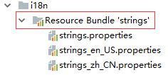

# 其它工具类库

## 文件句柄

因为LibGDX是跨平台的，不同平台对于文件处理有差异，所以LibGDX提供了通用的文件句柄`FileHandle`，它有如下几种类型：

| 类型      | 描述                                         | Desktop | Android | HTML5 | iOS |
| --------- | -------------------------------------------- | ------- | ------- | ----- | --- |
| classpath | Java类路径资源                               | Yes     | Yes     | No    | Yes |
| internal  | 内部路径，其实就可以看作是`assets`文件夹     | Yes     | Yes     | Yes   | Yes |
| local     | 一般和internal相同                           | Yes     | Yes     | No    | Yes |
| external  | 外部路径，如Android的SD卡或Linux的用户目录等 | Yes     | Yes     | No    | Yes |
| absolute  | 绝对路径                                     | Yes     | Yes     | No    | Yes |

其实这么多路径，我们99%的情况使用的是`internal`类型。

`Gdx.files`包含一些创建文件句柄的方法，例如加载一个纹理，我们可以这样写：

```java
FileHandle handle = Gdx.files.internal("actor.png");
Texture texture = new Texture(handle);
```

## 日志

LibGDX提供了一组非常简单的打印日志的方法，日志分为三级，普通、错误、调试：

```java
Gdx.app.log("MyTag", "my informative message");
Gdx.app.error("MyTag", "my error message", exception);
Gdx.app.debug("MyTag", "my debug message");
```

因为LibGDX是跨平台的，这个日志组件会在对应平台上打出日志，便于调试，而`System.out.println()`则只适用于Java平台，而且不能区分日志等级。

## 国际化

国际化对游戏开发至关重要，现在这个时代，已经很难想象一个面向全球玩家的游戏，只有一个语言版本（除了特别简单的益智类游戏或几乎没有文本的游戏表现形式），即使你没有精力开发多语言版本，也要把扩展接口预留给社区，让乐于奉献的玩家能够自己着手开发。

LibGDX对国际化功能进行了封装，使用非常简单。

我们在`assets`文件夹下，创建三个文件：`strings.properties`，`strings_zh_CN.properties`，`strings_en_US.properties`，分别代表默认文本，中文，英文。



注：图中圈出部分不是真实的文件夹，是IntellijIDEA显示的。

strings.properties和strings_en_US.properties
```
msg1=What's this?
msg2=Hi,{0}!
```

strings_zh_CN.properties
```
msg1=这是什么？
msg2=你好，{0}。
```

占位符可以用类似`{0}`的形式编写。

初始化国际化接口代码例子如下，下面代码中，我们初始化了`zh_CN`这个语言：

```java
FileHandle baseFileHandle = Gdx.files.internal("i18n/strings");
Locale locale = new Locale("zh", "CN", "CN");
bundle = I18NBundle.createBundle(baseFileHandle, locale);
```

`Locale`构造函数有三个参数，`language`、`country`、`variant`，第三个参数一般没用，但我们不能传`null`，可以随便传一个。匹配语言时，这三个参数会依次和文本文件名进行匹配，匹配不到时再匹配系统默认语言，全部匹配不到时，使用默认的`strings.properties`。

如上就可以使用`strings_zh_CN.properties`中的文本了。

获取文本：
```java
String msg1 = bundle.get("msg1");
String msg2 = bundle.format("msg2", "Tom");
```

`get()`函数用来获取国际化定义的文本，如果文本中有占位符，可以用`format()`函数进行占位符的替换。

此外，也可以使用AssetManager加载国际化文本接口：
```java
assetManager.load("i18n/strings", I18NBundle.class);
// ... 加载完成后 ...
I18NBundle bundle = assetManager.get("i18n/strings", I18NBundle.class);
```
