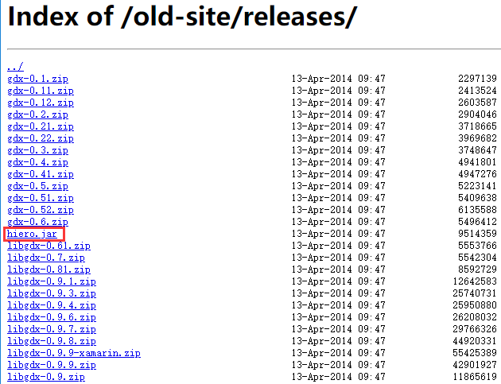
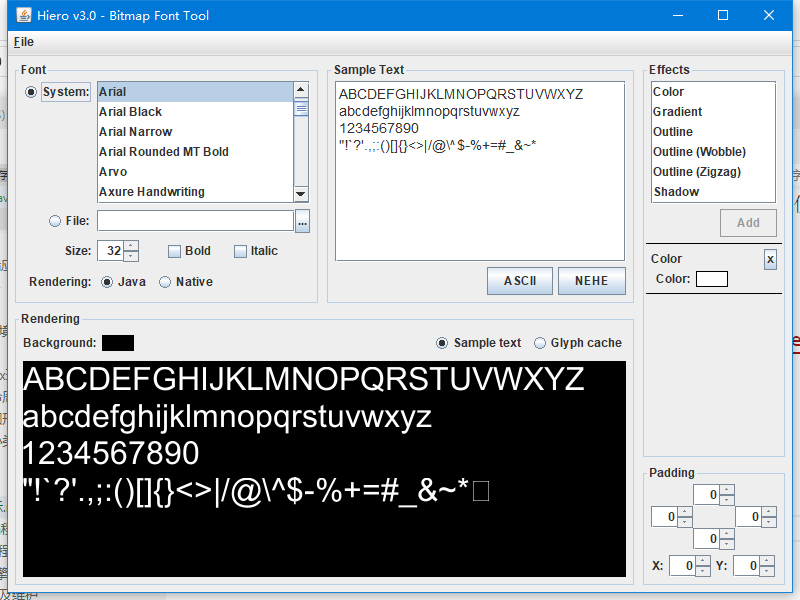
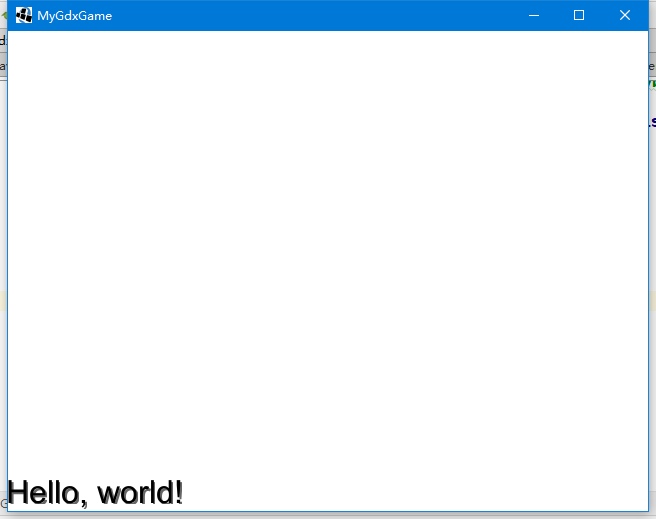

# 字符显示

LibGDX中有两种显示文字的方式：第一种是通过贴图和映射配置文件渲染文字，这种方式需要使用LibGDX提供的Hiero工具来制作所需的文字png贴图和fnt文字映射文件；第二种是使用FreeType扩展来输出ttf格式的字体文件中定义的字体。

本篇笔记我们分别对两种方式进行介绍。

## 使用贴图渲染文字

使用贴图渲染文字，需要png格式的贴图和fnt格式的文字映射文件，然后将其加载到内存中，我们也只能将贴图中有的文字显示到屏幕上。

### 使用Hiero工具

Hiero是LibGDX提供的用于制作字体贴图和映射文件的工具，使用非常简单，这里我们简单介绍下。

我们可以在LibGDX官网的下载页面中，找到这个工具。

[https://libgdx.badlogicgames.com/old-site/releases/](https://libgdx.badlogicgames.com/old-site/releases/)



它是一个可执行jar，下载下来直接运行即可。



我们在Sample Text输入框中，输入我们所需文本包含的全部文字，然后选择字体、特效、颜色、间距等等样式，工具会自动帮我们生成所需的png和fnt文件。

注：颜色这里建议只选择灰度颜色，具体到游戏中，我们再手动指定。否则字体自带的颜色和我们在Java代码中设定的颜色是相加的，不好控制。

操作界面非常简单，这里就不多说了，制作好字体文件后，点击左上角保存即可，我们可以将其放入资源文件夹中。


### 单行显示和多行显示

显示贴图文字需要用到`BitmapFont`这个类，它和Sprite的使用方式类似。

```java
package com.mygdx.game;

import com.badlogic.gdx.ApplicationAdapter;
import com.badlogic.gdx.Gdx;
import com.badlogic.gdx.files.FileHandle;
import com.badlogic.gdx.graphics.Color;
import com.badlogic.gdx.graphics.GL20;
import com.badlogic.gdx.graphics.g2d.BitmapFont;
import com.badlogic.gdx.graphics.g2d.SpriteBatch;

/**
 * @author CiyaZ
 */
public class MyGdxGame extends ApplicationAdapter {

    private SpriteBatch batch;
    private BitmapFont font;

    @Override
    public void create() {

        batch = new SpriteBatch();

        FileHandle fontPngHandle = Gdx.files.internal("font/mybmfont.png");
        FileHandle fontFntHandle = Gdx.files.internal("font/mybmfont.fnt");

        font = new BitmapFont(fontFntHandle, fontPngHandle, false);
    }

    @Override
    public void render() {
        Gdx.gl.glClearColor(1, 1, 1, 1);
        Gdx.gl.glClear(GL20.GL_COLOR_BUFFER_BIT);

        batch.begin();
        font.draw(batch, "Hello, world!", 0, 32);
        font.setColor(Color.BLACK);
        batch.end();
    }
}
```

实例化`BitmapFont`需要贴图字体png和fnt的文件资源，在`render()`函数中，我们像Sprite一样绘制`BitmapFont`对象即可。



注意：我们直到绘制精灵时，精灵坐标和场景的坐标原点都是左下角，但`BitmapFont`的坐标是左上角（这个和Sprite不同，比较奇葩），上面代码中，`font.draw()`最后两个参数是相对场景坐标的偏移，我们的字体大小是32px，这里为了将文字显示在左下角，因此设定偏移量为`0, 32`。

显示文字还涉及一个换行问题，实际上这里BitmapFont已经帮我们把这些逻辑封装好了，我们只需要在文字中间插入`\n`即可实现换行显示。

注：一些参考资料中，换行显示调用的是`drawMultiLine`函数，这个API在新版本中已经废弃了，统一使用`draw`即可。

```java
font.draw(batch, "Hello,\nworld!", 0, 64);
```


### 贴图字体的局限性

贴图字体的绘制效率是最高的，但使用起来其实比较复杂，我们需要单独制作贴图和映射文件，而且以图片的形式来渲染文字，调节大小还需要指定缩放比例，不是很方便。

如果我们使用的是中文，这里就出现了一个更致命的问题：我们没法把中文所有汉字全都导入Hiero做成贴图字体。如果是小游戏还好，如果是RPG等复杂类型的游戏，文本量会非常大，使用贴图字体是不可行的。

## 使用fnt字体文件渲染文字

`FreeType`是一个LibGDX扩展，不包含在默认创建的工程中。它主要解决的问题是手动制作贴图字体非常麻烦，因此能够基于一个`ttf`字体文件来生成`BitmapFont`对象。基于`FreeType`渲染文字的代码中，仅在初始化阶段和加载贴图字体不同，生成的结果还是`BitmapFont。

引入`FreeType`，我们可以在初始化项目时引入该扩展：


或者手动在Gradle中引入依赖，这里注意该扩展包含一些Native的代码（动态链接库），因此需要在`Core`、`Desktop`、`Android`等工程中分别引入，比较麻烦。

Core工程：
```java
project(":core") {
    apply plugin: "java"


    dependencies {
        ...
        compile "com.badlogicgames.gdx:gdx-freetype:$gdxVersion"
    }
}
```

Desktop工程：
```java
project(":desktop") {
    apply plugin: "java"


    dependencies {
        compile project(":core")
        ...
        compile "com.badlogicgames.gdx:gdx-freetype-platform:$gdxVersion:natives-desktop"
    }
}
```

其它种类工程添加类似依赖即可。

### 示例代码

下面代码中，我们引入一个`ttf`字体文件（这里以Windows自带的华文行楷字体为例），然后显示文本`你好，世界！`。

```java
package com.mygdx.game;

import com.badlogic.gdx.ApplicationAdapter;
import com.badlogic.gdx.Gdx;
import com.badlogic.gdx.files.FileHandle;
import com.badlogic.gdx.graphics.Color;
import com.badlogic.gdx.graphics.GL20;
import com.badlogic.gdx.graphics.g2d.BitmapFont;
import com.badlogic.gdx.graphics.g2d.SpriteBatch;
import com.badlogic.gdx.graphics.g2d.freetype.FreeTypeFontGenerator;

/**
 * @author CiyaZ
 */
public class MyGdxGame extends ApplicationAdapter {

    private SpriteBatch batch;
    private BitmapFont font;

    @Override
    public void create() {

        batch = new SpriteBatch();

        FileHandle fontFntHandle = Gdx.files.internal("font/stxingka.ttf");
        FreeTypeFontGenerator generator = new FreeTypeFontGenerator(fontFntHandle);
        FreeTypeFontGenerator.FreeTypeFontParameter parameter = new FreeTypeFontGenerator.FreeTypeFontParameter();
        parameter.characters = FreeTypeFontGenerator.DEFAULT_CHARS + "你好世界，！";
        parameter.size = 32;
        parameter.color = Color.WHITE;
        font = generator.generateFont(parameter);
    }

    @Override
    public void render() {
        Gdx.gl.glClearColor(1, 1, 1, 1);
        Gdx.gl.glClear(GL20.GL_COLOR_BUFFER_BIT);

        batch.begin();
        font.draw(batch, "你好，世界！", 0, 32);
        font.setColor(Color.BLACK);
        batch.end();
    }
}
```


注意：即使使用`ttf`字体文件，我们还是需要把用到的字符在`parameter.characters`中指定以下，我们游戏一般对国际化的要求是非常高的，一般至少也有汉语、英语两种语言版本，因此文本都是提取出来存储的，而不是在Java代码中硬编码的，指定字体所需文本可以通过扫描这些文本库来实现。
