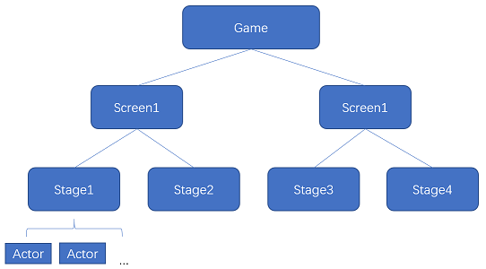
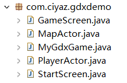

# 框架核心类

这篇笔记主要记述LibGDX中的一些核心概念和对应的Java类。由于代码量较大，直接给出一个完整的Demo进行讲解。

## 基本概念

### 视口（Viewport） 摄像机（Camera）

我们的终端设备屏幕有各种各样的尺寸，不仅如此，每种尺寸屏幕的像素密度还可能不同，导致同样尺寸屏幕也有各种各样的分辨率，这就涉及到屏幕适配的问题。LibGDX引入视口（Viewport）这一中间层的概念，能够一定程度上解决这个问题。我们常用的视口有以下几种：

* FitViewport（常用）：保持原本宽高比的情况下尽量拉伸画面，其余部分填充黑边
* StretchViewport：根据设备宽高比拉伸画面
* FillViewport：保持原本宽高比但填满屏幕，可能会导致画面部分缺失

我们一般都不会希望人物变扁之类的状况出现，因此一般开发中都是使用`FitViewport`。

摄像机的作用不必多说，它用于从游戏场景中取景，展示到屏幕上。LibGDX中，视口是需要结合摄像机使用的。

### 场景（Screen） 舞台（Stage）

之前笔记提到了游戏引擎层次结构的问题，这些概念在各种游戏引擎中都是通用的。LibGDX中，也有一个清晰的层次结构。

前面我们的例子代码中，全部都是一个类直接继承`ApplicationAdapter`，这只是用于测试，实际开发中是不会这样写的。我们一般会继承Game类，然后将Game、Screen、Stage、Actor的层次结构一层层搭建起来。



这里我们主要关注Screen和Stage。

Screen可以理解为一个页面，开始游戏、游戏主界面等等，这些都是不同的页面，因此我们可以在这一层上进行Screen的划分，它包含类似Activity（Android开发中的概念）的生命周期回调函数。

Stage可以理解为包含所有游戏对象的一个容器，一个Screen中可以包含一个或多个Stage。我们的游戏对象（Actor）需要关联添加到Stage上，除此之外，Stage还自带了Camera、SpriteBatch等组件。

### 演员（Actor）

Actor是LibGDX中对游戏对象的一个封装，包含了大量的内置功能，比如设置位置、缩放旋转等，实际上可以理解为Unity中的GameObject，只不过LibGDX表面上没有做组件化，我们为游戏对象封装游戏逻辑有更自由的实现方式。

## 例子代码

这里我们根据LibGDX的层次结构，写一个小例子。


注：素材来源于网络。



MyGdxGame.java
```java
package com.ciyaz.gdxdemo;

import com.badlogic.gdx.Game;

public class MyGdxGame extends Game {

	private StartScreen startScreen;
	private GameScreen gameScreen;

	public static final float GAME_WIDTH = 640;
	public static final float GAME_HEIGHT = 480;
	
	@Override
	public void create() {
		startScreen = new StartScreen(this);
		gameScreen = new GameScreen();
		setScreen(startScreen);
	}

	@Override
	public void render() {
		super.render();
	}

	@Override
	public void dispose() {
		startScreen.dispose();
		gameScreen.dispose();
	}

	public StartScreen getStartScreen() {
		return startScreen;
	}

	public GameScreen getGameScreen() {
		return gameScreen;
	}
}
```

`Game`组件中代码非常简单，就是初始化了两个Screen，另外声明了两个常量：游戏窗口的宽高。

StartScreen.java
```java
package com.ciyaz.gdxdemo;

import com.badlogic.gdx.Gdx;
import com.badlogic.gdx.ScreenAdapter;
import com.badlogic.gdx.graphics.GL20;
import com.badlogic.gdx.graphics.OrthographicCamera;
import com.badlogic.gdx.graphics.Texture;
import com.badlogic.gdx.scenes.scene2d.InputEvent;
import com.badlogic.gdx.scenes.scene2d.Stage;
import com.badlogic.gdx.scenes.scene2d.ui.ImageButton;
import com.badlogic.gdx.scenes.scene2d.ui.ImageButton.ImageButtonStyle;
import com.badlogic.gdx.scenes.scene2d.utils.ClickListener;
import com.badlogic.gdx.scenes.scene2d.utils.TextureRegionDrawable;
import com.badlogic.gdx.utils.viewport.FitViewport;
import com.badlogic.gdx.utils.viewport.Viewport;

public class StartScreen extends ScreenAdapter {
	// Game对象引用，用于Screen切换
	private MyGdxGame game;

	// 舞台
	private Stage stage;

	// 开始游戏按钮
	private ImageButton imageButton;

	public StartScreen(MyGdxGame game) {
		this.game = game;
	}

	@Override
	public void show() {
		Gdx.app.log("app", "StartScreen show");
		
		// 初始化舞台
		Viewport viewport = new FitViewport(MyGdxGame.GAME_WIDTH, MyGdxGame.GAME_HEIGHT, new OrthographicCamera());
		stage = new Stage(viewport);
		Gdx.input.setInputProcessor(stage);

		// 为舞台添加一个按钮
		Texture btn = new Texture("btn_start_game.png");
		Texture btnActive = new Texture("btn_start_game_active.png");
		ImageButtonStyle style = new ImageButtonStyle();
		style.imageUp = new TextureRegionDrawable(btn);
		style.imageDown = new TextureRegionDrawable(btnActive);
		imageButton = new ImageButton(style);
		imageButton.setPosition(260, 100);
		imageButton.addListener(new ClickListener() {
			@Override
			public void clicked(InputEvent event, float x, float y) {
				// 按钮点击切换到GameScreen
				game.setScreen(game.getGameScreen());
			}
		});
		// 添加按钮（UI控件也是Actor）到舞台
		stage.addActor(imageButton);
	}

	@Override
	public void render(float delta) {
		Gdx.app.log("app", "StartScreen render");

		Gdx.gl.glClearColor(1, 1, 1, 1);
		Gdx.gl.glClear(GL20.GL_COLOR_BUFFER_BIT);

		stage.act();
		stage.draw();
	}

	@Override
	public void dispose() {
		Gdx.app.log("app", "StartScreen dispose");
		stage.dispose();
	}
	
	@Override
	public void resize(int width, int height) {
		Gdx.app.log("app", "StartScreen resize");
	}

	@Override
	public void hide() {
		Gdx.app.log("app", "StartScreen hide");
	}

	@Override
	public void pause() {
		Gdx.app.log("app", "StartScreen pause");
	}

	@Override
	public void resume() {
		Gdx.app.log("app", "StartScreen resume");
	}
}
```

由于这里游戏开始`Screen`只包含一个`Stage`，我就写到一起了。`Stage`组件包含一个按钮`ImageButton`，点击按钮跳转到`GameScreen`。代码中也对生命周期的回调函数进行了实验，这个比较简单，我们重点关注下`Screen`切换时的回调：

```
[app] StartScreen render
[app] StartScreen hide
[app] GameScreen show
[app] GameScreen resize
[app] GameScreen render
```

被隐藏的`Screen`其关联的组件，逻辑时钟和渲染都会暂停。

GameScreen.java
```java
package com.ciyaz.gdxdemo;

import com.badlogic.gdx.Gdx;
import com.badlogic.gdx.ScreenAdapter;
import com.badlogic.gdx.graphics.GL20;
import com.badlogic.gdx.graphics.OrthographicCamera;
import com.badlogic.gdx.scenes.scene2d.Stage;
import com.badlogic.gdx.utils.viewport.FitViewport;
import com.badlogic.gdx.utils.viewport.Viewport;

public class GameScreen extends ScreenAdapter {
	// 舞台
	private Stage stage;

	@Override
	public void show() {
		Gdx.app.log("app", "GameScreen show");
		
		// 初始化舞台
		Viewport viewport = new FitViewport(MyGdxGame.GAME_WIDTH, MyGdxGame.GAME_HEIGHT, new OrthographicCamera());
		stage = new Stage(viewport);
		Gdx.input.setInputProcessor(stage);

		// 地图
		MapActor mapActor = new MapActor();
		mapActor.init();
		stage.addActor(mapActor);
		
		// 玩家小人
		PlayerActor playerActor = new PlayerActor(stage.getCamera());
		playerActor.init();
		stage.addActor(playerActor);
	}

	@Override
	public void render(float delta) {
		Gdx.app.log("app", "GameScreen render");
		
		Gdx.gl.glClearColor(1, 1, 1, 1);
		Gdx.gl.glClear(GL20.GL_COLOR_BUFFER_BIT);

		stage.act();
		stage.draw();
	}
	
	@Override
	public void dispose() {
		Gdx.app.log("app", "GameScreen dispose");
		stage.dispose();
	}
	
	@Override
	public void resize(int width, int height) {
		Gdx.app.log("app", "GameScreen resize");
	}

	@Override
	public void hide() {
		Gdx.app.log("app", "GameScreen hide");
	}

	@Override
	public void pause() {
		Gdx.app.log("app", "GameScreen pause");
	}

	@Override
	public void resume() {
		Gdx.app.log("app", "GameScreen resume");
	}
}
```

`GameScreen`中，我们初始化了`Stage`，并添加了小人和地图的`Actor`。

PlayerActor.java
```java
package com.ciyaz.gdxdemo;

import com.badlogic.gdx.Gdx;
import com.badlogic.gdx.Input.Keys;
import com.badlogic.gdx.graphics.Camera;
import com.badlogic.gdx.graphics.Texture;
import com.badlogic.gdx.graphics.g2d.Animation;
import com.badlogic.gdx.graphics.g2d.Animation.PlayMode;
import com.badlogic.gdx.graphics.g2d.Batch;
import com.badlogic.gdx.graphics.g2d.TextureRegion;
import com.badlogic.gdx.math.Vector3;
import com.badlogic.gdx.scenes.scene2d.Actor;

public class PlayerActor extends Actor {

	// 摄像机引用，用于实现摄像机跟随玩家
	private Camera camera;

	// 用于动画组件判断现在是第几帧
	private float stateTime = 0;
	// 当前应显示的帧
	private TextureRegion currentFrame;
	// 玩家四方向的行动、静止动画，共8个动画
	private Animation<TextureRegion> frontWalkAnim;
	private Animation<TextureRegion> backWalkAnim;
	private Animation<TextureRegion> leftWalkAnim;
	private Animation<TextureRegion> rightWalkAnim;
	private Animation<TextureRegion> frontIdleAnim;
	private Animation<TextureRegion> backIdleAnim;
	private Animation<TextureRegion> leftIdleAnim;
	private Animation<TextureRegion> rightIdleAnim;

	enum DIRECTION {
		LEFT, RIGHT, FRONT, BACK
	}
	// 玩家朝向
	private DIRECTION direction = DIRECTION.FRONT;
	// 玩家移动速度
	private float speed = 60;
	// 玩家是否在行走，用来判断播放行走动画还是静止动画
	private boolean isWalking = false;

	public PlayerActor(Camera camera) {
		this.camera = camera;
	}

	public void init() {
		// 初始化位置
		setPosition(288, 100);
		// 初始化动画
		Texture texture = new Texture("player2.png");
		TextureRegion[][] allFrames = TextureRegion.split(texture, 64, 75);
		TextureRegion[] frontWalkFrames = new TextureRegion[] { allFrames[0][1], allFrames[0][3], };
		TextureRegion[] backWalkFrames = new TextureRegion[] { allFrames[3][1], allFrames[3][3], };
		TextureRegion[] leftWalkFrames = new TextureRegion[] { allFrames[1][1], allFrames[1][3], };
		TextureRegion[] rightWalkFrames = new TextureRegion[] { allFrames[2][1], allFrames[2][3], };
		TextureRegion[] frontIdleFrames = new TextureRegion[] { allFrames[0][0], };
		TextureRegion[] backIdleFrames = new TextureRegion[] { allFrames[3][0], };
		TextureRegion[] leftIdleFrames = new TextureRegion[] { allFrames[1][0], };
		TextureRegion[] rightIdleFrames = new TextureRegion[] { allFrames[2][0], };
		frontWalkAnim = new Animation<TextureRegion>(0.2f, frontWalkFrames);
		backWalkAnim = new Animation<TextureRegion>(0.2f, backWalkFrames);
		leftWalkAnim = new Animation<TextureRegion>(0.2f, leftWalkFrames);
		rightWalkAnim = new Animation<TextureRegion>(0.2f, rightWalkFrames);
		frontIdleAnim = new Animation<TextureRegion>(0.2f, frontIdleFrames);
		backIdleAnim = new Animation<TextureRegion>(0.2f, backIdleFrames);
		leftIdleAnim = new Animation<TextureRegion>(0.2f, leftIdleFrames);
		rightIdleAnim = new Animation<TextureRegion>(0.2f, rightIdleFrames);
		frontWalkAnim.setPlayMode(PlayMode.LOOP);
		backWalkAnim.setPlayMode(PlayMode.LOOP);
		leftWalkAnim.setPlayMode(PlayMode.LOOP);
		rightWalkAnim.setPlayMode(PlayMode.LOOP);
		frontIdleAnim.setPlayMode(PlayMode.LOOP);
		backIdleAnim.setPlayMode(PlayMode.LOOP);
		leftIdleAnim.setPlayMode(PlayMode.LOOP);
		rightIdleAnim.setPlayMode(PlayMode.LOOP);
		currentFrame = allFrames[0][0];
	}

	@Override
	public void draw(Batch batch, float parentAlpha) {
		// 在指定位置绘制玩家当前帧
		batch.draw(currentFrame, getX(), getY());
	}

	@Override
	public void act(float delta) {
		super.act(delta);

		stateTime += delta;

		// 计算位置，根据位置偏移量，同步更新玩家Actor和摄像机的位置
		if (Gdx.input.isKeyPressed(Keys.S)) {
			isWalking = true;
			direction = DIRECTION.FRONT;
			float deltaDistance = delta * speed;
			setPosition(getX(), getY() - deltaDistance);
			updateCamPos(0, -deltaDistance);
		} else if (Gdx.input.isKeyPressed(Keys.W)) {
			isWalking = true;
			direction = DIRECTION.BACK;
			float deltaDistance = delta * speed;
			setPosition(getX(), getY() + deltaDistance);
			updateCamPos(0, deltaDistance);
		} else if (Gdx.input.isKeyPressed(Keys.A)) {
			isWalking = true;
			direction = DIRECTION.LEFT;
			float deltaDistance = delta * speed;
			setPosition(getX() - deltaDistance, getY());
			updateCamPos(-deltaDistance, 0);
		} else if (Gdx.input.isKeyPressed(Keys.D)) {
			isWalking = true;
			direction = DIRECTION.RIGHT;
			float deltaDistance = delta * speed;
			setPosition(getX() + deltaDistance, getY());
			updateCamPos(deltaDistance, 0);
		} else {
			isWalking = false;
		}

		// 计算动画当前帧
		switch (direction) {
		case FRONT:
			if (isWalking) {
				currentFrame = frontWalkAnim.getKeyFrame(stateTime);
			} else {
				currentFrame = frontIdleAnim.getKeyFrame(stateTime);
			}
			break;
		case BACK:
			if (isWalking) {
				currentFrame = backWalkAnim.getKeyFrame(stateTime);
			} else {
				currentFrame = backIdleAnim.getKeyFrame(stateTime);
			}
			break;
		case LEFT:
			if (isWalking) {
				currentFrame = leftWalkAnim.getKeyFrame(stateTime);
			} else {
				currentFrame = leftIdleAnim.getKeyFrame(stateTime);
			}
			break;
		case RIGHT:
			if (isWalking) {
				currentFrame = rightWalkAnim.getKeyFrame(stateTime);
			} else {
				currentFrame = rightIdleAnim.getKeyFrame(stateTime);
			}
			break;
		default:
			break;
		}
	}

	private void updateCamPos(float deltaX, float deltaY) {
		Vector3 camPos = camera.position;
		camPos.x += deltaX;
		camPos.y += deltaY;
	}
}
```

玩家小人`Actor`，具体游戏逻辑就不多说了，特别简单，就是四相行走、位置控制和动画控制。我们这里注意`act()`和`render()`两个函数，`act`可以理解为游戏引擎逻辑时钟的回调，`render`单纯是一个渲染回调，这听起来有点像Unity中`FixedUpdate()`和`Update()`的关系，但也不完全一样。

MapActor.java
```java
package com.ciyaz.gdxdemo;

import com.badlogic.gdx.graphics.Texture;
import com.badlogic.gdx.graphics.g2d.Batch;
import com.badlogic.gdx.graphics.g2d.Sprite;
import com.badlogic.gdx.scenes.scene2d.Actor;

public class MapActor extends Actor {

	private Sprite map;

	public void init() {
		Texture mapTexture = new Texture("map.jpg");
		map = new Sprite(mapTexture);
		map.setScale(2);
		map.setPosition(100, 50);
	}

	@Override
	public void draw(Batch batch, float parentAlpha) {
		map.draw(batch);
	}

}
```

地图`Actor`没什么交互内容，就是渲染一张图。如果将`Stage`抽离出来，我们也可以不用将其封装成`Actor`，直接当成背景画到`Stage`上也完全可以。
