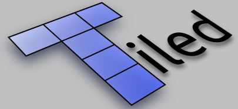
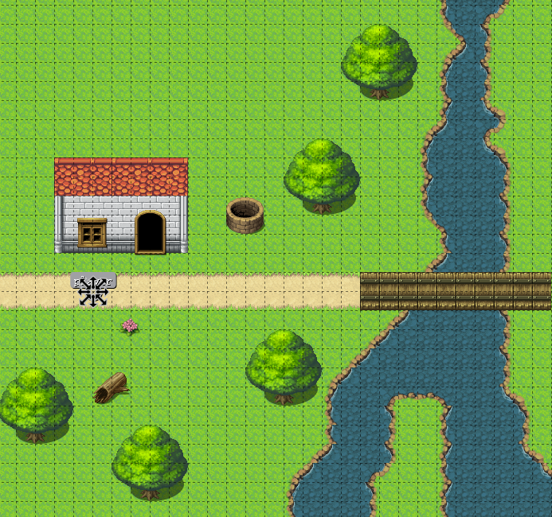
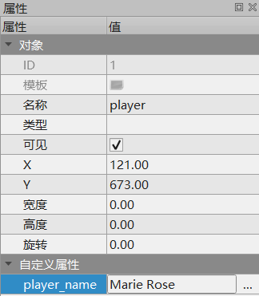
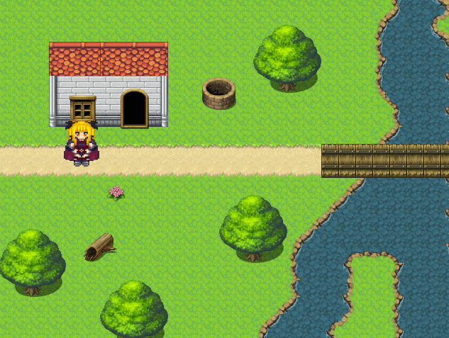

# 集成Tiled地图编辑器

对于传统的RPG、RTS等类型的游戏来说，场景地图非常重要。LibGDX是个纯编程框架，没有自带的场景编辑器，但是内置了对Tiled编辑器的支持。我们可以用Tiled编辑器搭建场景，插入对象层数据，然后由LibGDX负责读取。

## 一些注意事项

LibGDX文档中没有任何关于支持的Tiled版本的描述，目前来看，LibGDX支持的TMX格式对应Tiled编辑器版本为0.18，该版本后对`tmx`格式的更新是没有支持的，但不保证未来LibGDX是否会更新这部分内容。

我在使用当前最新的LibGDX1.9.10和Tiled1.3.1时，就遇到了渲染有Bug的状况，而LibGDX1.9.11-SNAPSHOT又对其进行了修复。

## Tiled编辑器简介

Tiled是一款开源的瓦片地图编辑器，也是同类工具中最好用的之一，其使用的格式`tmx`在很多游戏引擎都通用。

[https://www.mapeditor.org/](https://www.mapeditor.org/)



实际上，TMX文件就是一种XML，LibGDX读取地图文件就是解析XML，然后将地图的数据结构加载到内存中。我们使用时，使用LibGDX提供的API读取这些数据结构即可。

由于在本系列笔记的其它游戏引擎章节也大量用到了Tiled，有关Tiled工具使用的内容这里就不多介绍了。我们这里就随便画点东西测试。



上图中，有若干层背景图块层，还有一个对象层，这里我们用`player`这个对象来标记玩家出生点位置。



Tiled对象层上，我们再为`player`加一个自定义属性`player_name`作为测试。实际开发中，一些NPC的配置数据（或其引用）其实就可以通过这种方式传入。

## 加载TMX地图

LibGDX中加载使用地图非常简单，下面例子由之前`Java应用程序开发/libgdx框架/框架核心类`章节例子修改而来，将其中的固定背景换成了TileMap。

注：此外还修改了`PlayerActor`，之前例子没有实现摄像机位置的地图区域限制，这个实现起来非常简单，就不贴代码了。另外拆分了Screen和Stage，之前是写在一起的，这里给出Stage的代码。



```java
package com.ciyaz.gdxdemo;

import com.badlogic.gdx.graphics.OrthographicCamera;
import com.badlogic.gdx.maps.MapLayer;
import com.badlogic.gdx.maps.MapLayers;
import com.badlogic.gdx.maps.MapObject;
import com.badlogic.gdx.maps.MapObjects;
import com.badlogic.gdx.maps.MapProperties;
import com.badlogic.gdx.maps.tiled.TiledMap;
import com.badlogic.gdx.maps.tiled.TmxMapLoader;
import com.badlogic.gdx.maps.tiled.renderers.OrthogonalTiledMapRenderer;
import com.badlogic.gdx.scenes.scene2d.Stage;
import com.badlogic.gdx.utils.viewport.Viewport;

public class GameStage extends Stage {

	// TileMap渲染器
	private OrthogonalTiledMapRenderer renderer;

	// TileMap地图长宽，存在这里供其它地方调用
	public int mapPixelWidth;
	public int mapPixelHeight;

	public GameStage(Viewport viewport) {
		super(viewport);
	}

	public void init() {
		// TileMap地图
		TiledMap map = new TmxMapLoader().load("map2/map.tmx");
		// TileMap地图渲染器
		renderer = new OrthogonalTiledMapRenderer(map);

		// 获取TileMap宽高等属性
		MapProperties prop = map.getProperties();
		int mapWidth = prop.get("width", Integer.class);
		int mapHeight = prop.get("height", Integer.class);
		int tilePixelWidth = prop.get("tilewidth", Integer.class);
		int tilePixelHeight = prop.get("tileheight", Integer.class);
		mapPixelWidth = mapWidth * tilePixelWidth;
		mapPixelHeight = mapHeight * tilePixelHeight;

		// 玩家小人初始化
		PlayerActor playerActor = new PlayerActor();
		addActor(playerActor);
		playerActor.init();
		// 读取TileMap对象层属性数据 设置小人出生点
		MapLayers layers = map.getLayers();
		outerLoop: for (MapLayer layer : layers) {
			String layerName = layer.getName();
			if ("spawn".equals(layerName)) {
				MapObjects objects = layer.getObjects();
				for (MapObject object : objects) {
					String objectName = object.getName();
					if ("player".equals(objectName)) {
						// 对象层上的player对象坐标
						float x = object.getProperties().get("x", Float.class);
						float y = object.getProperties().get("y", Float.class);
						// 刚才我们设定的自定义数据
						String playerName = object.getProperties().get("player_name", String.class);
						System.out.println(playerName);
						playerActor.setPosition(x, y);
						// 跳出循环
						break outerLoop;
					}
				}
			}
		}
	}
	
	public int getMapPixelWidth() {
		return mapPixelWidth;
	}

	public int getMapPixelHeight() {
		return mapPixelHeight;
	}

	@Override
	public void draw() {
		// 通过摄像机设置地图渲染器的正交投影矩阵，该步骤需要放在render()中循环调用
		renderer.setView((OrthographicCamera) getCamera());
		// 渲染地图全部图层
		renderer.render();

		super.draw();
	}
}
```

TileMap的数据结构分为以下三个主要部分：

* `TiledMap`：TileMap地图对象
* `MapLayer`：TileMap图层对象
* `MapObject`：TileMap对象层上的对象

这里一个比较不方便的地方就是LibGDX没有提供任何“查找”的方法，比如我们要获取一个指定名字的图层，就只能遍历了，实际开发中，我们可以自己封装一下。

另外要注意的是，`renderer.setView()`需要在渲染循环中，每次`renderer.render()`前调用，而不能只写一次在初始化代码中。这个方法的作用是设置地图的显示正交投影矩阵，说白了就是得指定个区域告诉渲染器渲染地图的哪部分，以及渲染多大。这个方法的参数是`Camera`，这个API设计的其实十分具有误导性，它实际需要的参数是摄像机当前的变换矩阵，而不是摄像机，摄像机对象更新，渲染器的参数不会自动更新，实际开发中我们其实可以给它再封装改进一下。这里例子中，我们把跟随主角的摄像机传进去就可以。

另外，关于地图上物件的遮挡排序问题，这里可以通过地图分层渲染实现。`renderer.render()`是渲染所有图层，LibGDX也支持分层渲染，这里就不多说了。
