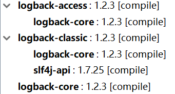

# Logback 日志模块

Java生态中，记录日志有JDK自带的Logger，除此之外，十分常用的第三方日志模块有Log4j，Log4j2，Logback，commons-logging等。

Logback是一个功能丰富的日志库，而且性能不错，是SpringBoot默认集成的日志模块，实际上Logback、Log4j等许多日志库实现了SLF4J的API，我们代码中使用`Logger`等类时，你会发现引入的包都是SLF4J的，它们之间的关系就像接口和实现类一样，使用SLF4J的API而不是直接调用某个日志库的接口也是最为推荐的方式。

这里我们简单介绍一下Logback的使用。

## 添加Maven依赖

```xml
<dependency>
  <groupId>org.slf4j</groupId>
  <artifactId>slf4j-api</artifactId>
  <version>1.7.25</version>
</dependency>
<dependency>
  <groupId>ch.qos.logback</groupId>
  <artifactId>logback-core</artifactId>
  <version>1.2.3</version>
</dependency>
<dependency>
  <groupId>ch.qos.logback</groupId>
  <artifactId>logback-access</artifactId>
  <version>1.2.3</version>
</dependency>
<dependency>
  <groupId>ch.qos.logback</groupId>
  <artifactId>logback-classic</artifactId>
  <version>1.2.3</version>
</dependency>
```



## Logback简单使用

Logback有五个日志级别：严重性`TRACE`<`DEBUG`<`INFO`<`WARN`<`ERROR`。

使用Logback非常简单，首先我们要获得Logger对象，然后在其上调用`debug()`、`error()`等方法即可，和JDK内置的日志工具使用起来是一样的。

```java
package com.ciyaz;

import org.slf4j.Logger;
import org.slf4j.LoggerFactory;

public class Main
{
	public static void main(String[] args)
	{
		Logger logger = LoggerFactory.getLogger(Main.class);
		logger.debug("hello");
	}
}
```

输出
```
16:32:37.233 [main] DEBUG com.ciyaz.Main - hello
```

## 拼接日志参数

我们输出的日志可能带有参数，如果使用`+`进行字符串拼接，不仅代码可读性差，而且可能有性能问题，这种时候我们可以使用拼接日志参数功能。

```java
String name = "Tom";
String age = "18";
logger.debug("My name is {}, I am {} years old", name, age);
```

```
16:42:38.772 [main] DEBUG com.ciyaz.Main - My name is Tom, I am 18 years old
```

## Logback配置

Logback支持XML或groovy脚本格式的配置文件，我们一般使用XML，它默认位于classpath:logback.xml，如果不存在任何配置文件，Logback默认会加载一些默认配置。

logback.xml
```xml
<?xml version="1.0" encoding="UTF-8"?>

<configuration>

	<appender name="stdout" class="ch.qos.logback.core.ConsoleAppender">
		<encoder charset="UTF-8">
			<pattern>%yellow(%date) %highlight(%-5level) %cyan(%logger{5}@[%-4.30thread]) - %msg%n</pattern>
		</encoder>
	</appender>

	<root level="debug">
		<appender-ref ref="stdout"/>
	</root>
</configuration>
```

上面配置的配置和默认差不多，只不过修改了输出格式，加上了输出颜色（需要终端支持）。

### appender

`<appender>`指定日志输出到哪里，以什么格式输出。上面例子中，我们把日志输出到了终端上（标准输出）。我们也可以把日志输出到文件中，或者输出到消息队列中，下面例子我们把日志输出到文件里，使用基于时间的滚动策略：

```xml
<appender name="file" class="ch.qos.logback.core.rolling.RollingFileAppender">

  <!-- 可选：过滤器，只记录ERROR级别的日志 -->
  <filter class="ch.qos.logback.classic.filter.LevelFilter">
    <level>ERROR</level>
    <onMatch>ACCEPT</onMatch>
    <onMismatch>DENY</onMismatch>
  </filter>

  <!-- 按照时间的日志记录策略 -->
  <rollingPolicy class="ch.qos.logback.core.rolling.TimeBasedRollingPolicy">
    <fileNamePattern>E:/%d{yyyy-MM-dd}/error-log.log</fileNamePattern>
  </rollingPolicy>

  <encoder charset="UTF-8">
    <pattern>%d{yyyy-MM-dd HH:mm:ss.SSS} [%thread] %-5level %logger - %msg%n</pattern>
  </encoder>
</appender>
```

除了基于时间的滚动策略，另一种非常常用的是基于文件大小的滚动策略：

```xml
<appender name="file" class="ch.qos.logback.core.rolling.RollingFileAppender">

  <!-- 过滤器，只记录ERROR级别的日志 -->
  <filter class="ch.qos.logback.classic.filter.LevelFilter">
    <level>ERROR</level>
    <onMatch>ACCEPT</onMatch>
    <onMismatch>DENY</onMismatch>
  </filter>
  <file>E:/error.log</file>

  <!--基于文件大小的滚动策略-->
  <rollingPolicy class="ch.qos.logback.core.rolling.FixedWindowRollingPolicy">
    <fileNamePattern>E:/error-%i.log.zip</fileNamePattern>
    <!--窗口大小为1-3，当归档文件数量大于3时，会向后覆盖旧的日志,默认为7-->
    <!--<minIndex>1</minIndex>-->
    <!--<maxIndex>3</maxIndex>-->
  </rollingPolicy>
  <!--设置日志滚动更新的触发策略-->
  <triggeringPolicy class="ch.qos.logback.core.rolling.SizeBasedTriggeringPolicy">
    <maxFileSize>5MB</maxFileSize>
  </triggeringPolicy>

  <encoder charset="UTF-8">
    <pattern>%d{yyyy-MM-dd HH:mm:ss.SSS} [%thread] %-5level %logger - %msg%n</pattern>
  </encoder>
</appender>
```

这样配置后，当`error.log`中的内容大于5MB时，就会归档压缩为一个类似`error-1.log.zip`的形式并清空`error.log`。注意：窗口大小是有默认值7的，也就是说默认情况下，最多出现`error-7.log.zip`，更新的归档会向后覆盖。

### logger

`<logger>`用于设置某个包或某个类的日志输出级别，以及它使用的`<appender>`。下面是一个例子：

```xml
<logger name="com.ciyaz.demo.MainController" level="DEBUG" additivity="false">
  <appender-ref ref="stdout" />
</logger>
```

* `name`指定了一个类全名，日志配置会应用到对应类上
* `additivity`表示子Logger是否继承根Logger配置：true表示继承，根Logger和子Logger配置的所有appender都会生效，false表示只有子Logger配置的appender生效。

### root

`<root>`和`<logger>`相似，只不过它配置的是一个根`<logger>`。
