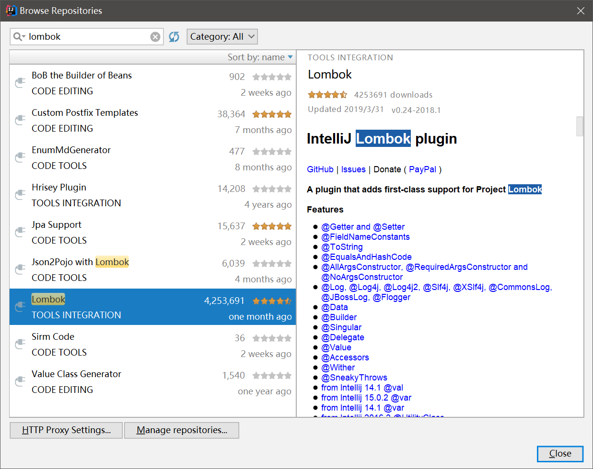

# Lombok 简化冗余代码

Lombok是一个比较神奇的组件，它通过添加了一系列注解，能够简化掉我们写的不厌其烦的`getXX()`，`setXX()`，`equals()`，`hashCode()`等代码。Lombok会在编译过程中生效，我们加上这些注解后，编译生成的字节码和手写的一样。

Lombok项目基于MIT协议开源。地址：[https://projectlombok.org/](https://projectlombok.org/)

## Lombok的优点和缺点

使用Lombok的优点就是极大的简化了Java这门古老的语言中，最最冗余的一部分内容，提升的开发效率。但是相应的缺点，则是对开发人员要求更高了，Lombok引入了额外的学习内容，使用者需要有较强的看文档、解决问题的能力。

因此，Lombok尤其适合个人开发者使用，也非常适合小型并且队员综合素质较高，有极客精神的敏捷团队使用。对于水平参差不齐，人员构成复杂的团队，建议不要使用，以免引入不必要的麻烦。

## 安装和使用Lombok

引入Maven依赖：
```xml
<dependency>
  <groupId>org.projectlombok</groupId>
  <artifactId>lombok</artifactId>
  <version>1.16.22</version>
  <scope>provided</scope>
</dependency>
```

除了Maven依赖，我们还要在集成开发环境中安装相应的插件，否则开发环境是无法识别Lombok的语法的。

在Intellij IDEA中，直接在插件仓库中搜索Lombok插件，安装即可。



在Eclipse中，安装Lombok插件的方式比较特殊，插件仓库中并没有相关的插件，我们需要下载Lombok对应的jar包：[https://projectlombok.org/download](https://projectlombok.org/download)

然后将该jar包放到Eclipse安装的根目录中，修改`eclipse.ini`，加入以下配置：

```ini
-javaagent:lombok.jar
```

## Lombok语法糖

这部分内容可以参考Lombok文档：[https://projectlombok.org/features/all](https://projectlombok.org/features/all)

这里只介绍几个最常用的注解。

### `@Getter`,`@Getter`

该注解能够自动生成Getter/Setter方法。

例子：
```java
public class User
{
	private @Getter @Setter String username;
	private String password;
}
```

### `@ToString`

该注解能够自动生成一个实体类的`toString()`方法。

例子：
```java
@ToString
public class User
{
	private String username;
	private String password;
}
```

可用属性：

* exclude：指定排除字段，一般用于避免循环引用导致栈溢出
* callSuper：指定是否调用父类的`toString()`方法

### `@EqualsAndHashCode`

该注解能够自动生成一个实体类的`equals()`、`hashCode()`、`canEqual()`。

`canEqual()`是Lombok新增的一个方法，据说是用于代理类和基类的比较，这个非常罕见，不太清楚。

例子：
```java
@EqualsAndHashCode
public class User
{
	private String username;
	private String password;
}
```

可用属性基本同`@ToString`。

### `@NoArgsConstructor`,`@RequiredArgsConstructor`,`@AllArgsConstructor`

该注解能够自动生成一些构造方法。

* `@NoArgsConstructor`：生成一个无参数构造函数
* `@RequiredArgsConstructor`：为类中`final`修饰或`@NonNull`注解修饰的字段生成构造函数
* `@AllArgsConstructor`：生成一个带有全部参数的构造函数

例子：
```java
@AllArgsConstructor
public class User
{
	private String username;
	private String password;
}
```

### `@Data`

自动生成无参构造函数，生成各个字段的Getter/Setter方法，生成`equals()`，`canEqual()`和`hashCode()`方法，生成`toString()`方法。非常建议在实体类上使用，能大幅优化代码的可读性。

但是注意，直接使用`@Data`就无法精确控制排除字段等内容了。

例子：
```java
@Data
public class User
{
	private String username;
	private String password;
}
```

### `@Builder`

该注解能够为一个类自动生成Builder构造器。

实体类：
```java
@Builder
@Data
public class User
{
	private String username;
	private String password;
}
```

调用Builder构造器例子代码：
```java
public class Main
{
	public static void main(String[] args)
	{
		User user = User
				.builder()
				.username("tom")
				.password("123456")
				.build();
		System.out.println(user);
	}
}
```

### `@nonNull`

该注解能够为方法指定必须参数，如果该参数为`null`，将抛出异常。

例子：
```java
public class Main
{
	public static void main(String[] args)
	{
		foo(null);
	}

	public static void foo(@NonNull String str)
	{
		System.out.println(str);
	}
}
```

报错：
```
Exception in thread "main" java.lang.NullPointerException: str
	at com.ciyaz.demo.Main.foo(Main.java:16)
	at com.ciyaz.demo.Main.main(Main.java:13)
```

### `@Slf4j`

我们使用日志的时候，一般各处都要写`Logger logger = LoggerFactory.getLogger(<类名>.class);`来获取日志输出需要的工具类，这种写法比较冗余。`@Slf4j`注解能够自动帮我们注入一个静态字段`log`，我们可以直接引用。

例子：
```java
@Slf4j
public class Main
{
	public static void main(String[] args)
	{
		log.debug("test log");
	}
}
```

注：你需要先配置`slf4j`和一个日志实现库，日志要通过`slf4j`API调用，其他方式不建议使用。

### `@Cleanup`

该注解能够自动生成调用资源对象`close`方法的代码。强烈不建议使用该注解，资源泄漏是开发中，必须要着重注意的一个点，而且该类错误不容易重现和调试。使用Lombok的`@Cleanup`，我们可能稍不注意就会出此类严重的bug，资源关闭代码建议手写。

```java
public class Main
{
	public static void main(String[] args)
	{
		try
		{
			@Cleanup InputStream inputStream = Main.class.getClassLoader().getResourceAsStream("logback.xml");
			@Cleanup InputStreamReader inputStreamReader = new InputStreamReader(inputStream);
			@Cleanup BufferedReader bufferedReader = new BufferedReader(inputStreamReader);

			String s = bufferedReader.readLine();
			System.out.println(s);
		}
		catch (IOException e)
		{
			e.printStackTrace();
		}
	}
}
```
