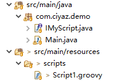

# groovy 整合脚本引擎

我们都知道，Java是一个编译型语言，在JVM运行时动态添加或修改对象、参数变量值、代码执行逻辑等，比较繁琐（尽管这可以实现）。而像游戏引擎，业务规则引擎等，却恰恰需要这种功能。一般这种情况，都是通过整合脚本引擎来实现的。

Java能够和很多脚本语言整合，包括`JavaScript（ES5.1 Nashorn引擎）`、`Jython`、`LuaJ`等，但是相比较而言，`JavaScript（ES5.1）`语法比较混乱，缺失很多重要的语言特性，后两者也几乎不更新了，因此一个较好的选择是整合`Groovy`脚本。

有关`groovy`这里不过多叙述，我们直接看一个Java程序整合脚本的例子。



pom.xml
```xml
<dependency>
    <groupId>org.codehaus.groovy</groupId>
    <artifactId>groovy</artifactId>
    <version>2.5.9</version>
</dependency>
<dependency>
    <groupId>org.codehaus.groovy</groupId>
    <artifactId>groovy-jsr223</artifactId>
    <version>2.5.9</version>
</dependency>
```

Main.java
```java
package com.ciyaz.demo;

import groovy.lang.GroovyClassLoader;
import groovy.lang.GroovyCodeSource;

import java.net.URL;
import java.util.Timer;
import java.util.TimerTask;

/**
 * @author CiyaZ
 */
public class Main {

    /**
     * 脚本文件地址URL
     */
    private URL url;
    /**
     * 脚本加载器
     */
    private GroovyClassLoader groovyClassLoader;
    /**
     * 脚本类
     */
    private Class clazz = null;
    /**
     * 脚本类实例
     */
    private IMyScript instance = null;

    public static void main(String[] args) {
        Main main = new Main();
        main.init();
        main.myService();
    }

    public void init() {
        groovyClassLoader = new GroovyClassLoader();
        url = getClass().getClassLoader().getResource("scripts/Script1.groovy");
        if (url == null) {
            throw new RuntimeException("脚本未找到!");
        }
    }

    public void myService() {
        Timer timer = new Timer(false);
        timer.schedule(new TimerTask() {
            @Override
            public void run() {
                try {

                    long startTime = System.currentTimeMillis();

                    GroovyCodeSource source = new GroovyCodeSource(url);
                    source.setCachable(true);
                    Class currentClazz = groovyClassLoader.parseClass(source);

                    if (clazz != currentClazz || instance == null) {
                        clazz = currentClazz;
                        instance = (IMyScript) currentClazz.newInstance();
                    }
                    String data = instance.getData();

                    long endTime = System.currentTimeMillis();

                    System.out.println("调用耗时" + (endTime - startTime) + "ms 结果: " + data);

                    Thread.sleep(1000);
                } catch (InterruptedException | IllegalAccessException | InstantiationException e) {
                    e.printStackTrace();
                }
            }
        }, 1000, 1000);
    }
}
```

IMyScript.java
```java
package com.ciyaz.demo;

public interface IMyScript {
    public String getData();
}
```

Script1.groovy
```groovy
package scripts

import com.ciyaz.demo.IMyScript

class Script1 implements IMyScript {

    String data = "测试"

    @Override
    String getData() {
        return data
    }
}
```

`Main.java`就是我们的Java程序，其中有一个调用`IMyScript.getData()`的循环。但是，这个方法的实现其实并不在Java程序中，而是在`groovy`脚本中。每次循环时，都会调用脚本引擎进行解析，如果我们修改了`Script1.groovy`，该修改下次解释执行时也会立即生效。
