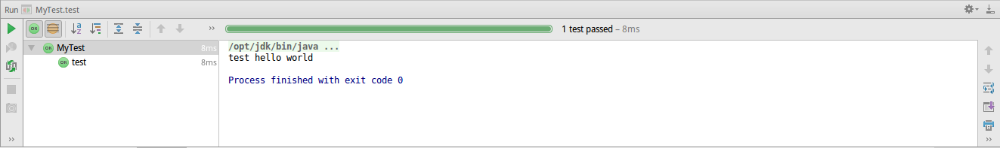

# junit 单元测试框架

junit是Java世界中最流行的单元测试框架，junit能和主流IDE，eclipse和IntellijIDEA整合，点击一个按钮就能运行单元测试。还能和maven，gradle等构建工具结合到一起，使用十分方便。

本篇笔记以Intellij IDEA开发工具和gradle构建工具为例，记录junit的使用方法。

## junit的使用场景

我们的软件中可能有多个模块，程序运行时，主模块会调用其他模块实现某些功能。但是由于软件实在太庞大了，我们直接从主模块开始debug，观察子模块的运行情况，这很难：

1. 子模块的所有程序逻辑未必都测试到
2. 每次都要从主模块调用子模块，调试过程太复杂

单元测试的概念就是解决这个问题的，我们插入一个运行程序的入口作为测试，测试时直接从这个入口运行子模块的函数，这就十分方便了。

多写几个`main()`函数实际也能起到单元测试的效果，但是这不符合软件工程的规范，而且功能也不如专用的单元测试框架强大。

## 添加junit依赖

在Intellij IDEA中，创建一个gradle工程后，默认就会添加最新版本的junit到`dependencies`中，我们直接就可以使用了。

```java
dependencies {
    testCompile group: 'junit', name: 'junit', version: '4.12'
}
```

## Intellij IDEA中使用junit

新建一个gradle工程后，我们创建目录`src/test/java`，编辑器会自动帮我们根据gradle目录格式，将`java`文件夹标为测试源码文件夹。我们可以在里面建立测试类。


MyTest.java
```java
import org.junit.Test;

public class MyTest
{
	@Test
	public void test()
	{
		System.out.println("test hello world");
	}
}
```

我们使用`@Test`注解标注单元测试函数，在Intellij IDEA中，在`test`函数上右键，点击`run test()`或`debug test()`，就能执行或调试这个单元测试函数了。在测试类上，右键点击`run MyTest`或`debug MyTest`，就能执行或调试这个测试类的所有测试函数。

测试用例成功执行后，就会弹出这样的界面，绿色条告知我们执行通过，我们还可以看出执行时间等信息。



如果因某些原因执行失败，则是如图所示：


## 断言

junit有一个`Assert`类，其中包括了实现断言的静态方法。断言如果未实现，就会抛出运行时异常。

* `Assert.assertEquals()` 断言两个对象相等（会调用equals方法进行比较），这个函数有多个重载，能够比较多种Java类型。
* `Assert.assertTrue()`和`Assert.assertFalse()` 断言参数是`true`或`false`。
* `Assert.assertNull()`和`Assert.assertNotNull()` 断言参数是`null`或非空。

## 注解

前面已经使用过了`@Test`，这个注解标注的方法就能作为单元测试的入口。这里介绍一些其他常用的注解。

* `@Before` 在每个测试函数之前运行
* `@After` 在每个测试函数之后运行
* `@BeforeClass` 在整个测试类的所有测试函数之前运行
* `@AfterClass` 在整个测试类的所有测试函数之后运行
