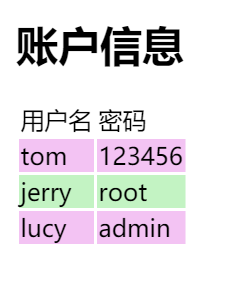

# javax.mail 发送邮件

Java发送邮件一般使用`javax.mail`这个包，由于其历史比较古老，API也是设计的比较繁琐。这里我们简单学习一下如何实现邮件发送。

`javax.mail`实现的其实就是一个邮件客户端，功能类似我们经常使用的`ThunderBird`等，我们在邮件客户端上编写了一封邮件，设定好邮件服务器地址，用户名密码，发送人接收人等信息。当发送时，就会通过SMTP协议和邮件服务器进行通信，具体如何将邮件从一个邮件服务器传输到另一个邮件服务器，则是邮件服务器的工作了。

注：这个组件当然也是可以实现收件的，我们其实可以用它实现一个完整的邮件客户端，但没必要，做的非常好的邮件客户端已经有太多了。实际开发中基本只有发件的需求，比如某定时任务执行成功或报错了，就需要用邮件通知一下相关人员，或者是日报周报之类的信息，需要以定时邮件的形式发给管理部门的人员。

## 添加Maven依赖

```xml
<dependency>
  <groupId>javax.activation</groupId>
  <artifactId>activation</artifactId>
  <version>1.1.1</version>
</dependency>
<dependency>
  <groupId>javax.mail</groupId>
  <artifactId>mail</artifactId>
  <version>1.4.7</version>
</dependency>
```

## 发送邮件基本流程

```java
package com.ciyaz;

import javax.mail.Message;
import javax.mail.Session;
import javax.mail.Transport;
import javax.mail.internet.InternetAddress;
import javax.mail.internet.MimeMessage;
import java.util.Properties;

/**
 * @author CiyaZ
 */
public class App
{
	public static void main(String[] args) throws Exception
	{
		// SMTP服务器设置
		Properties props = new Properties();
		props.setProperty("mail.transport.protocol", "smtp");
    props.setProperty("mail.smtp.host", "邮件服务器SMTP地址");
    props.setProperty("mail.smtp.port", "邮件服务器SMTP端口");
		props.setProperty("mail.smtp.auth", "true");

		// Session
		Session session = Session.getInstance(props);
		session.setDebug(true);

		// Transport
		Transport transport = session.getTransport();
		transport.connect("邮件服务器用户名", "邮件服务器密码");

		// 构造邮件
		Message message = new MimeMessage(session);
		message.setFrom(new InternetAddress("发件人邮件地址"));
		message.setRecipient(Message.RecipientType.TO, new InternetAddress("收件人邮件地址"));
		message.setSubject("测试邮件");
		message.setContent("你好", "text/html;charset=UTF-8");

		// 发送邮件
		transport.sendMessage(message, message.getAllRecipients());
		transport.close();
	}
}
```

代码中实现的基本步骤：

1. 设置一些参数，实际使用时，我们可以将其存储在`.properties`文件中
2. 打开Session
3. 打开Transport
4. 构造一封邮件
5. 发送邮件，关闭Transport

其实我们主要关心的，就是发送的邮件如何构造，也就是步骤4，其他部分的代码都是比较固定的。

## 邮件内容HTML格式

你可能已经发现，邮件内容其实是HTML，但是熟悉前端的开发人员不要高兴的太早，邮件中是没法引入CSS（但可以用一部分内联样式）、JavaScript的，发个图片也要指定图片文件的所在位置，毕竟邮件这种比较严肃的内容，一般不会做太花哨的格式。我们一般都会写一个HTML模板，然后用类似Velocity等引擎生成文件内容。

下面代码用Velocity引擎生成一个表格，然后构造为一个邮件的`Message`对象。

```java
// 测试数据
List<User> userList = new ArrayList<>();
userList.add(new User("tom", "123456"));
userList.add(new User("jerry", "root"));
userList.add(new User("lucy", "admin"));

// Velocity生成HTML
VelocityEngine engine = new VelocityEngine();
Properties veProps = new Properties();
veProps.setProperty(Velocity.INPUT_ENCODING, "UTF-8");
veProps.setProperty(Velocity.OUTPUT_ENCODING, "UTF-8");
engine.init(veProps);
Template template = engine.getTemplate("src/main/resources/template.vm");
VelocityContext context = new VelocityContext();
context.put("userList", userList);
StringWriter stringWriter = new StringWriter();
template.merge(context, stringWriter);
String mailMsg = stringWriter.toString();

// 构造邮件
Message message = new MimeMessage(session);
message.setFrom(new InternetAddress("gaosh20@chinaunicom.cn"));
message.setRecipient(Message.RecipientType.TO, new InternetAddress("gaosh20@chinaunicom.cn"));
message.setSubject("测试邮件");
message.setContent(mailMsg, "text/html;charset=UTF-8");
```

模板内容：
```html
<!doctype html>
<html lang="zh">
<head>
	<meta charset="UTF-8">
	<title>账户信息</title>
</head>
<body>
<h1>账户信息</h1>
<table>
	<thead>
	<tr>
		<td>用户名</td>
		<td>密码</td>
	</tr>
	</thead>
	<tbody>
		#foreach($u in $userList)
		<tr style="background-color:
			#if($velocityCount%2==0)
					#c3f3c3
			#else
					#f3c3f3
			#end
				;">
			<td>$u.username</td>
			<td>$u.password</td>
		</tr>
		#end
	</tbody>
</table>

<p style="color: red;"></p>
</body>
</html>
```

邮件收到的内容：



有关Velocity的内容，参考`Java应用程序开发/Velocity模板引擎`相关章节。

## 发送带图片和附件的邮件

```java
// 测试数据
List<User> userList = new ArrayList<>();
userList.add(new User("tom", "123456"));
userList.add(new User("jerry", "root"));
userList.add(new User("lucy", "admin"));

// Velocity生成HTML
VelocityEngine engine = new VelocityEngine();
Properties veProps = new Properties();
veProps.setProperty(Velocity.INPUT_ENCODING, "UTF-8");
veProps.setProperty(Velocity.OUTPUT_ENCODING, "UTF-8");
engine.init(veProps);
Template template = engine.getTemplate("src/main/resources/template.vm");
VelocityContext context = new VelocityContext();
context.put("userList", userList);
StringWriter stringWriter = new StringWriter();
template.merge(context, stringWriter);
String mailMsg = stringWriter.toString();

// 构造邮件
Message message = new MimeMessage(session);
message.setFrom(new InternetAddress("gaosh20@chinaunicom.cn"));
message.setRecipient(Message.RecipientType.TO, new InternetAddress("gaosh20@chinaunicom.cn"));
message.setSubject("测试邮件");

MimeMultipart multipart = new MimeMultipart();

// 邮件正文部分
MimeBodyPart main = new MimeBodyPart();
main.setContent(mailMsg, "text/html;charset=UTF-8");
multipart.addBodyPart(main);

// 邮件图片加载
MimeBodyPart image = new MimeBodyPart();
DataHandler imgDataHandler = new DataHandler(new FileDataSource("src/main/resources/1.jpg"));
image.setDataHandler(imgDataHandler);
image.setContentID("img_1.jpg");
multipart.addBodyPart(image);

// 邮件附件加载
MimeBodyPart attach = new MimeBodyPart();
DataHandler attachDataHandler = new DataHandler(new FileDataSource("src/main/resources/新建文本文档.7z"));
attach.setDataHandler(attachDataHandler);
attach.setFileName(MimeUtility.encodeText(attachDataHandler.getName()));
multipart.addBodyPart(attach);

message.setContent(multipart);
```

在HTML模板中，使用如下形式引用图片：
```html

```
