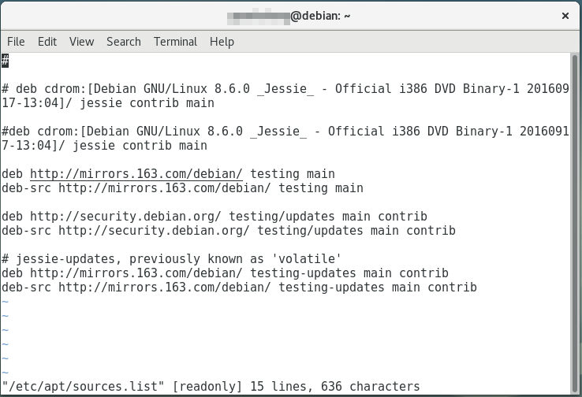

# 安装

在Debian官网下载dvd1镜像，写入引导介质，引导启动即可。安装时选择图形化安装，这样比较方便。其他dvd是软件包，可以不下载，安装基本系统后，通过网络安装。

## 磁盘分区

### 系统目录介绍

* /：系统跟根目录
* /bin：基本二进制文件（程序），包含系统shell，小型编辑器等。
* /boot：启动引导程序的文件，如内核镜像等。
* /dev：设备文件，Linux把设备看成文件，存放在这里。
* /etc：系统配置文件，大部分是纯文本文件。
* /home：用户目录。
* /lib：基本共享库和内核模块。
* /mnt：外来文件系统挂载点。
* /proc：有关系统信息的虚拟目录，是一个内存文件系统，是用户和运行中内核交互的目录。
* /root：root（管理员）用户目录。
* /sbin：用于系统维护管理的程序，system binaries的简称。
* /tmp：临时文件。
* /usr：存放程序、文档等，其下是第二级目录层次，如/usr/bin，/usr/lib等。
* /var：缓冲，日志等。
* /opt：一些附加的程序。
* /swap：交换分区，一般设置为系统物理内存1-2倍。

注：

* / /etc /bin /sbin /lib /dev 必须在一个分区。
* 不同Linux发行版可能稍有不同，但是主要的文件夹都不会变。

### 分区最佳实践

个人计算机或工作站：/swap单独分区，其余一个/分区或/和/home分开，重要文档通常使用云服务备份。个人计算机上软件、各种文档极多，细致分区也没用，计划赶不上变化，除了/swap直接分成一个区，最大化利用磁盘。

服务器：根据实际需要合理分配各个分区。

## 桌面环境的选择

我个人只使用过gnome，对于Ubuntu的Unity和LinuxMint的Cinammon，都是衍生自gnome桌面环境的，虽然我知道KDE也十分流行，但我从未用过。至于更多其他的轻量级桌面环境，窗口管理器，有兴趣的同学可以尝试，谁好谁坏是无法评价的，对于自由软件，我们作为开发者有能力修改，甚至开发我们自己的桌面环境。

## Debian更换testing源

Debian桌面用户建议安装完成Debian系统后，直接更换到testing源，享受较新的软件包。

修改/etc/apt/sources.list，将所有的版本号字符串替换成testing即可。



然后切换到其他tty的login shell，执行

```
apt-get update && apt-get dist-upgrade
```

等该更新完成，重启计算机进入即可。
