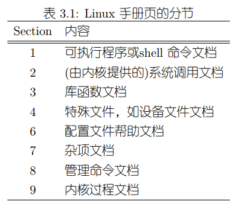

# 基本概念

开始使用前，我们必须了解一些常用的操作系统的基本概念。

## 文件

对Linux来说，一切设备都是文件，可以像文件一样操作，包括所有文件，目录，硬件设备，socket，他们有自己的所有者和访问权限，具备访问权限的进程可以读取、写入这些文件。

## 进程

一个可执行文件运行起来后，它的上下文空间叫做进程。一个进程有自己的PID，创建这个进程的进程叫父进程，使用PPID标志父进程号。

## 环境变量

程序运行过程中可以读取修改的一系列键值对。如LANG表示当前系统的语言。

## 终端和shell

终端通常指显示字符界面shell的那个设备（可以是一个显示器），桌面版Linux的终端通常指一个叫做“终端模拟器”的软件，它运行在图形界面中，但是可以显示字符界面shell。

shell是一个相对于内核（kernel）的概念，Linux是一个内核，软件在内核外围，和内核交互。通常，我们说的shell是指一个叫“bash”的软件，使用它我们就能通过丰富的命令和脚本程序控制我们的系统。我们登入字符界面，输入用户名和密码后，看到的就是“bash”的字符界面。

# 一些基本命令

注意，一些高级的命令用法请参考`/Linux系统维护/命令和工具`章节，这里并没有列出每个命令的详细可用参数，我只是列出了这些命令的常用方式。

## 目录/文件操作

* cd <dir> 切换目录
* ls 列出当前目录
* cp <soucedir> <targetdir> 复制文件
* mv <sourcedir> <targetdir> 移动文件
* mkdir <dir> 创建文件夹
* rm <file> 删除文件
* rm -r <dir> 删除某个目录所有文件
* rmdir <dir> 删除空文件夹
* touch <file> 创建文件

## 文本工具

* cat <file> 显示文件内容
* cat <file1> <file2> <file3> > <file4> 把123文件合并
* less <file> 查看file内容，less查看，空格向下翻屏，回车向下一行，支持上下键，q退出
* vi <file> 使用vi编辑器，编辑文件内容，有关vi/vim请参考命令和工具相关章节

## 查看硬件信息

* lspci 列表PCI总线设备，也可以用cat /proc/pci
* lsusb 列表usb设备，也可以用cat /proc/bus/usb/devices

## 查看操作系统信息

* uname -s 内核名称
* uname -n 主机名
* uname -r 内核发布版本
* uname -v 内核版本号和编译时间
* uname -m 计算机架构，如x86_64
* uname -o 操作系统名（返回GNU/Linux）
* uname -a 返回全部信息

## 帮助

man命令可以查看命令的manpage（帮助文档），Linux编程中，一些系统API函数也会在manpage中。

* man xxx查看帮助手册
* man n xxx 查看对应章节手册

man手册的九个章节

