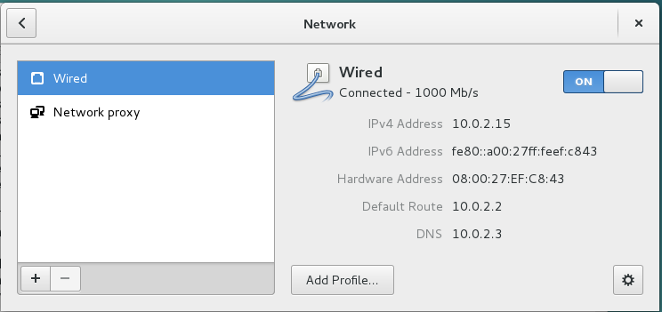

# 系统启动大致过程

我们打开电脑电源，操作系统就开始加载了，大致过程是这样的。

引导程序引导操作系统启动，进入保护模式，加载内核，初始化寄存器，这些学过操作系统的同学都非常熟了。之后：

* 处理器、控制台、内存初始化
* PCI总线初始化
* 内核中网络功能初始化
* 启动idle进程（0号进程），启动kswapd
* 设备驱动初始化
* idle进程启动init进程（1号进程），init进程运行/sbin/init，通过运行/etc/init指定的配置文件继续完成系统初始化。

注：启动过程的输出可以用dmesg命令查看。

# grub引导

grub是一个通用的引导操作系统的程序，它不只能用来引导Linux。我们知道打开电脑电源后，主引导记录存入0x7c00并开始加载操作系统，实际上是这个最小的引导程序先加载grub，grub程序再加载内核。

实际上安装系统时grub已经自动配置好了，打开计算机电源，就出现grub选择菜单，我们选择需要启动的选项，一切就自动完成了。

如何启动时打开grub命令行：重命名/boot/grub/grub.cfg即可。grub引导时找不到这个配置文件，就会出现命令行让你手动引导。

修复grub.cfg：如果弄坏了grub.cfg可以重新生成一份：

1. sudo update-grub
2. sudo grub-install /dev/sda

## 内核参数

grub的kernel命令启动内核时可以加参数（kernel命令也可能是叫linux，这个可以试）。

* ACPI参数：高级配置和电源管理接口，这个和特定平台有关，具体参考文档。
* init：指定初始化程序（第一个用户态程序），用于系统紧急修复的情况。

不常用，就不介绍了。

# init进程

init是Linux启动后的第一个用户态进程。启动时通过执行/sbin/init读取/etc/inittab中的脚本，新版本debian/ubuntu则是读取/etc/init/下的配置文件，下面以新版为例进行讲解。

init的过程：

启动时会首先执行/etc/init目录中配置文件。

配置文件中可以设置启动的时机与顺序，start on startup,start on runlevel [1234],stop on [!3453]。

一般的Linux分8个级别:0-6和一个'S'级别。0代表关机(halt)，6代表重启(restart)；1-5分别是不同功能的级别，其中1级别是单用户模式(single)，2-5各有不同。但是在userlinux(包括ubuntu)中2-5级别是毫无差别的。最后'S'级别是一个比较特殊的级别，他应该是先于其他级别运行的级别。(这一点有待考证)。这里说明一下，0-6级别的运行是互斥的，而不是叠加运行，也就是说如果进入(move into)4级别，不是指0-3都要运行，而只是完成4级别里所规定的服务。

所有的运行服务的脚本存储在/etc/init.d/里面。而在/etc/中有rc'X'.d的文件夹，'X'代表0-6和X，也就对应了这8个启动级别，里面就都是指向/etc/init.d/里面运行服务的脚本的软连接(symbol link)，会发现，软连接的数目少于运行脚本数，这就是说不是所有服务都要在一个级别中运行的。软连接的命名是有规则的：`[K|S][0-90-9][name]`，K代表kill，S代表start，后面是个二位数，最后是对应的运行服务的脚本文件名。这个名字是在运行相应的脚本的时候传递的参数，K是传递stop(就是关闭服务),S是传递start(就是启动服务)，运行顺序：K小数->K大数->S小数->S大数。这里注意文件夹里的所有软连接都会被执行。

rc'x'.d里面的软连接是由/etc/init/rc.conf调用的。

在ubuntu中，可以使用update-rc.d命令去维护rc，语法为：sudo update-rc.d servicename defaults。

# 加载文件系统

操作系统会自动挂载所有系统分区。但是额外的分区，如后插入的第二块硬盘，U盘等则不会自动挂载。使用桌面环境提供的文件管理器点一下就可以挂载了，或者通过命令行进行挂载。

mount命令可以挂在文件系统。`cat /etc/fstab`可以查看系统的文件系统信息。

mount命令：`mount -t 文件系统类型 -o 选项 设备 挂载点`，一般挂在直接类似`mount /dev/sda1 /mnt/usb`即可，`-t`参数会自动选择，`-o`一般不必指定。

# 配置网络

## 新版debian/ubuntu：

新版debian/ubuntu都集成了NetworkManager，可以直接在桌面的系统配置里配置网络，此外也可以通过命令行进行配置。

nmcli命令：是NetworkManager的命令行接口，直接使用nmcli -h和man nmcli可以查看帮助信息，十分易用。

关于`nmcli`，将在`/Linux系统维护/命令和工具`中详细介绍。

对于网络相关信息的查看和配置，还有强大的iproute2工具，它取代了原有的net-tools系列如`ifconfig`等命令。

# 使用浏览器和安装软件

配置好网络后，就可以用系统自带的firefox浏览器上网了。使用和windows版firefox几乎没有差别。

有关软件包的知识，将在后一篇笔记详细介绍。
