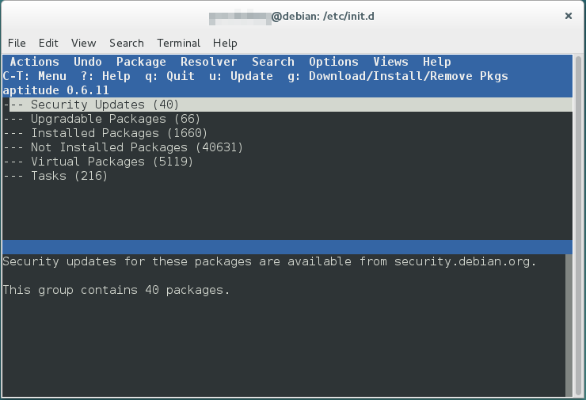
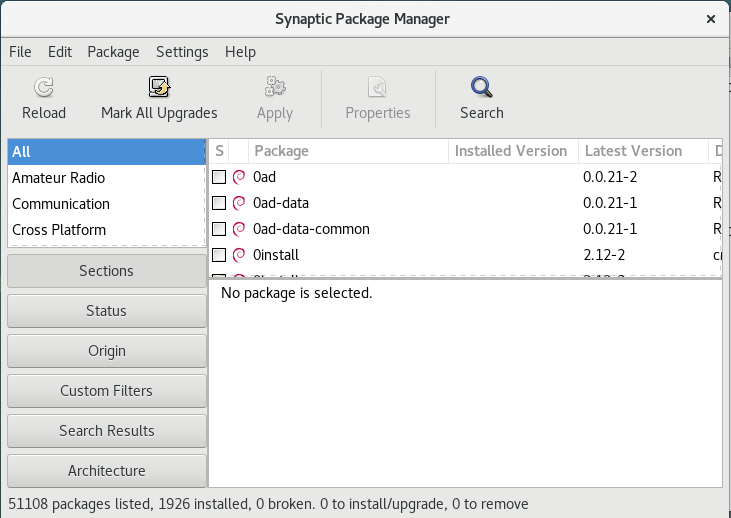
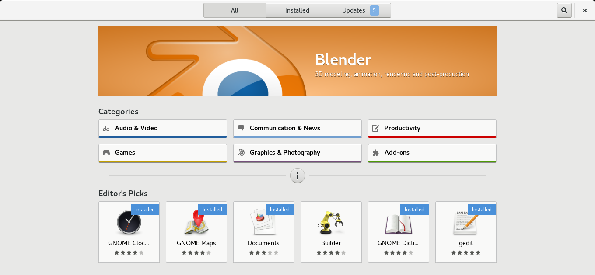
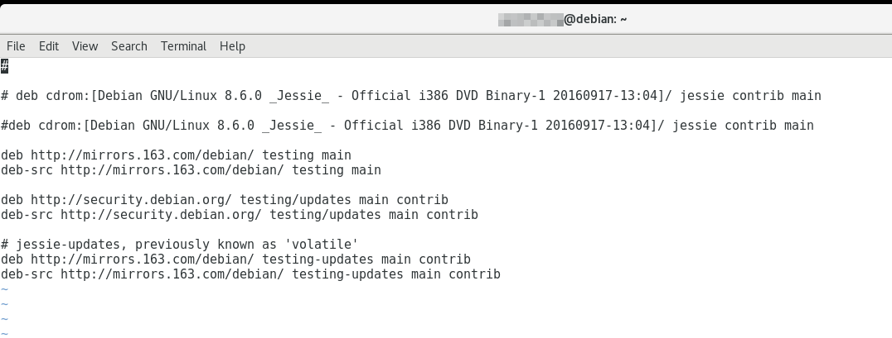

# APT

debian使用apt管理其基础软件包.deb，其设计目的在于解决软件包依赖关系问题。我们的桌面Linux发行版有许多“软件管理器”，“软件中心”，它们都是基于apt的。不过对于开发者而言，最方便的还是apt命令。

首先，我们需要了解一下Linux的包管理机制。Linux发行版的发行社区、公司或者组织，会维护一个软件仓库服务器，我们的桌面电脑会定期下载这个远程软件仓库的索引存在本地，这个索引叫做本地的包管理数据库。我们安装软件时，会查询这个数据库，解析得到软件包的信息呈献给用户，用户如果决定安装，就从远程仓库下载这个软件包的安装包进行安装，当然这一切都是自动化运行的。

有开发经验的同学都知道，不要重复造轮子（指生产环境下。学习的时候推荐多造轮子）。开发者开发的软件包经常依赖许多其他的软件包，类库，框架等。Windows下，通常一个软件会包含大量依赖的动态链接库，或者直接静态编译进应用软件，这虽然完美避免了依赖冲突等问题，但缺点是造成了磁盘空间的极大浪费。Linux下正相反，针对一个软件包，包管理器会解析出一颗依赖树，apt包管理器会自动解析依赖树，下载需要的依赖包，自动解决版本冲突，一般情况下不用我们手动干预，但缺点是包管理器毕竟不是万能的，偶尔出现状况时，就得手动解决了。

## 图形化的软件管理器

### aptitude

aptitude是apt的基于终端的图形化前端。在控制台中输入`aptitude`就可以启动这个软件管理器了。

enter键可以展开/关闭目录树，aptitude主要用于查询已安装，需要安装但未安装的软件包。在软件包上按enter可以查询软件包的详细信息。“/”是查找软件包，“n”是查找下一个。软件包的具体维护，安装卸载依赖修复等。

### synaptic

synaptic（中文译名新立德）软件管理器，是apt的图形化前端，是使用gtk2的桌面程序。在gnome shell中搜索synaptic就可以找到这个程序，或者在终端中键入`synaptic-pkexec`启动synaptic程序。

具体使用方法就不叙述了。如果你是Linux命令不是很熟悉的新手的话，可以使用这个synaptic，或是下面介绍的发行版自带的软件中心。aptitude相对来说不是很方便。

### 发行版特色的软件中心

桌面Linux发行版通常带有这种软件中心，或者叫应用市场。

#### Debian软件中心

#### LinuxMint软件中心

通常我们搜索一个急需的应用的时候，比如找一个3D建模软件，我们一下就能看到首页的Blender。

## apt命令和dpkg命令

虽然Linux有多种图形化的软件管理器可以使用，但是有些时候apt命令还是最为方便的。对于开发者而言，最常见的需求就是搭建开发环境。得益于Linux的包管理机制，apt-get安装一些软件库是十分方便的，举个例子，现在我们要使用C语言开发一个安全应用，当windows用户还在下载openssl，配置他们繁琐的visual studio的时候，我们Linux用户直接一句`apt-get install libssl-dev`（系统自带了libssl，我们只是装一下头文件），稍等片刻后，拿起vim就写，远远把任何人甩在了后面。

那么dpkg命令又是什么呢？有过Linux使用经验的都知道，有时候软件源不能解决我们的所有问题。我们有时候得手动安装一个deb包，这个deb包在远程软件仓库中没有，我们却安装了这个软件包，所以我们也绕过了本地的包管理数据库。实际上，apt是通过包管理数据库管理系统的软件包，而dpkg仅仅是一个deb包的安装卸载程序，我们需要使用这个程序管理非软件源安装的软件包。

有关apt命令和dpkg命令的详细使用，请参看 软件和开发工具/包管理/apt 章节。

## appimage

最近新出现了一种软件的打包方式，appimage，他就想windows下的绿色软件只有一个exe一样，appimage也是单文件，双击即可运行，删除即是卸载。不过似乎使用这种打包方式的软件还是极少的，其实用性尚未经过时间的检验。

## 手动安装/手动编译

手动安装的情况可能并不少见，我们可能有自己的编写的软件，可能由于隐私原因不能分享到软件源仓库，或者想要尝试一个积极的开发者编写的半成品，我们通常需要手动安装。由于编程环境不同，软件的构建工具也通常各异，常见的如C语言的make，cmake，Java的maven，gradle等，我们可能需要自己编译然后打包成deb并安装。

# 使用国内的软件源镜像

国外的软件源主服务器可能因为距离太远，我们下载的速度比较慢，好在国内有大学和企业制作了镜像服务器便于国内用户使用。

使用镜像源，只要修改下`/etc/apt/sources.list`就行了。下面是Debian系统使用网易163镜像源的例子：

有些发行版比如我现在使用的LinuxMint在设置界面提供了修改源的选项，并且还能自动测试源的延迟，十分方便。
