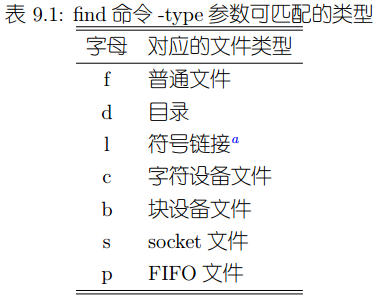

# 用户和用户组

Linux是多用户操作系统，用户代表一个权限，而不是指实际的使用者，例如在Android中，一个应用就是一个用户。使用id命令，可以查看用户的uid（用户id）和gid（组id），一个用户可以对应多个用户组，一个用户组可以有多个用户。使用ls -al查看文件时，可以看到文件对应所有者用户、用户组、其余所有人的权限。

有关Linux权限系统详细文章，请参考/Linux系统维护/Unix操作系统基础/Unix权限系统详解章节。之后介绍的一些命令都可以在/Linux系统维护/命令和工具找到详细介绍的文章。

## 用户/用户组操作

* adduser xxx 该操作会提示创建用户和用户组，提示输入密码，自动创建对应home目录。
* deluser xxx 删除用户，但不会删除其home目录，创建的文件等内容。实际上用户名和uid关联，deluser只是删除了这种关联关系。
* addgroup xxx 创建用户组
* delgroup xxx 删除用户组
* adduser username groupname 添加用户到用户组

具体配置可以观察/etc/passwd这个文件。

# 日志

所有日志存放在/var/log。包含系统日志和一些重要服务如Apache2的日志。

# 查找

* which xxx 确定一个命令的执行路径
* whereis xxx 加强版which，返回除执行路径外更多信息
* locate xxx 查找文件 -i参数：忽略大小写
* find 路径 条件 操作，如find /etc -name 'rc*'，-type条件如图



* grep 文本匹配查找，例：ls | grep rc，在ls的输出文本中查找，-i忽略大小写

# 计划任务

at -f 可执行文件 时间 指定某个时间执行某程序

## cron

cron用于定期执行某个任务。具体参考cron相关手册。

# update-alternatives

配置可执行文件的软链接，具体用法查看文档。常用于简化同种类命令调用，不同版本命令直接切换（最常用的就是切换java版本）。

# checkinstall

自己编译的软件包，如果也想统一通过dpkg维护，可以使用checkinstall。

```shell
./configure
make
checkinstall
```

软件会自动打包成deb。

# tar

tar命令可以用于文件归档。常用命令：

```shell
tar -xvf xxx.tar.gz -C /opt/ #解压tgz包,-C：输出目录
tar --bz2 -cvf #使用bz2压缩为tar归档文件
tar -zcvf xxx.tar.gz #使用gzip压缩为tar归档文件
```
