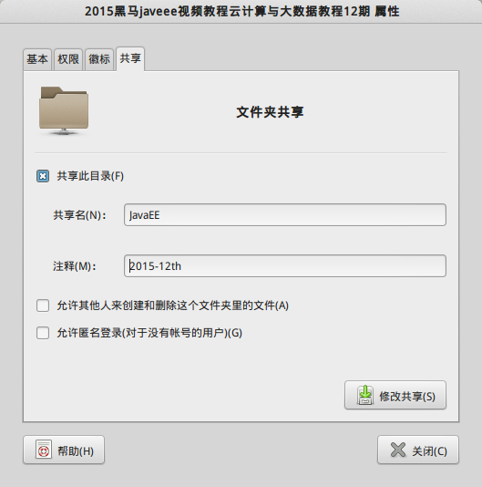
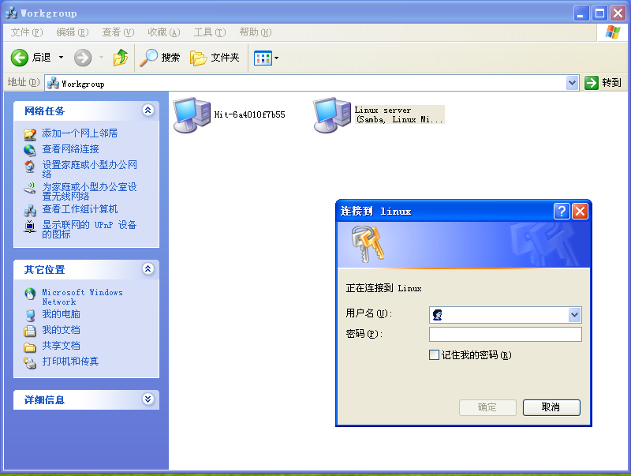
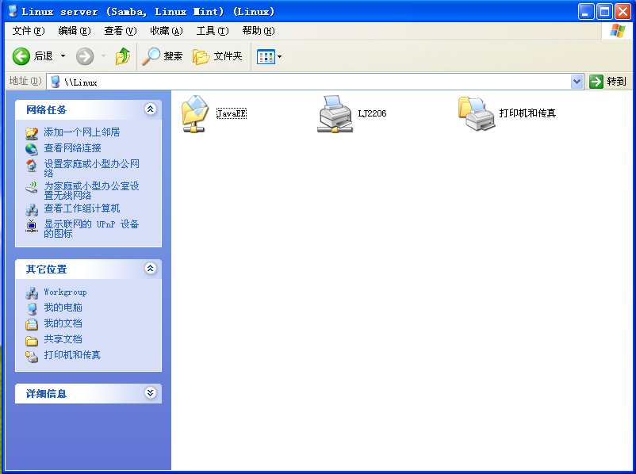

# 使用samba共享文件

samba简称smb，是一种在局域网共享文件和打印机的协议，由Linux上的smb服务器和其他设备上的客户端组成。通过简单的配置，其他设备能够访问服务器上指定的文件和打印机及其他资源。

Ubuntu/LinuxMint桌面发行版内置了samba服务器，并且把配置集成进了文件管理器，十分方便。Debian恐怕要手动配置一下samba的配置文件了，不过也是十分简单的。

## LinuxMint下使用samba

下面的步骤是基于带有图形界面的Linux发行版LinuxMint来说的，和一般的服务器配置有一些区别。

### 添加用户到smbpasswd

使用samba前需要使用`smbpasswd`添加samba用户，被添加的用户必须事先属于/etc/passwd（也就是本计算机可登陆的真实用户）。

```
sudo smbpasswd -a ciyaz
```

### 设置文件夹的共享权限

在文件夹上右键，选择共享设置。



我们按照上面的提示设置就好了，没什么难的。

### 在其他设备上访问共享文件夹

这里演示在Windows操作系统上，访问samba服务器资源。

点击网络邻居，查看工作组计算机，就能看到我们配置的samba服务器了。双机进行连接，输入我们配置的用户名和密码即可。



成功。



## 使用命令行配置samba服务器

真正的`服务器`实际山没有图形界面，我们只需要安装smb-server，然后修改配置文件`/etc/samba/smb.conf`。这里就不详细介绍了，具体请参考软件和开发工具相关章节。
