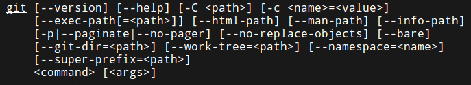

# Linux命令格式

## 命令行规则

Linux下有大量的命令行程序，我们使用这些程序时，经常通过命令行参数传值。比如：

* `ls`：显示当前目录下文件
* `ls /bin`：显示`/bin`下的文件
* `ls -l`：显示当前目录下文件的详细信息
* `ls -l /bin`：显示`/bin`下文件的详细信息

可以发现，这些命令的参数都是遵循一定规范的。Linux命令行参数的规范大致如下：

1. `--`开头代表一个命令行选项，比如`--version`表示让该程序显示版本信息
2. `-`开头代表命令行选项的简写形式，比如很多软件识别`--version`的同时，也识别`-v`
3. 可以带有任意个命令行值，如`ls /bin`，其中`/bin`就是指定给命令行程序的值
4. 命令行选项后面可以紧跟一个命令行值，这个值是为该命令行选项使用的

## 命令写法

我们查看某个命令行程序的帮助信息时，经常看到类似下面这样的说明信息：

```shell
command [options] [arguments]
```

* command：命令，如ls等
* options：选项，通常以`-`和`--`开头，一横通常是简写，两横通常是全名，如：`ls -a`等同于`ls --all`
* arguments：命令行的参数

## 帮助手册的描述格式

在查看man或其他帮助文档时，经常看到[]，<>，|等符号。比如Git命令：



* `[]`：可选的
* `<>`：可变化的
* `x|y|z`：只能选择一个
* `-abc`：表示几个参数混合使用，如：`ls -al`
